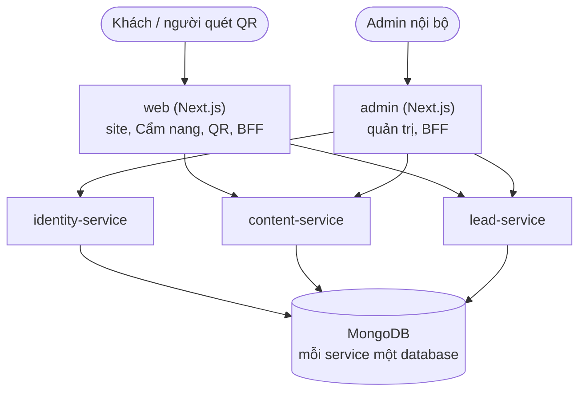

<div align="center">

# LAVIECO

**Green Art Education & Circular Economy**

*Cuộc sống, qua từng nét nghệ thuật.*
<br>
*Make it your life, through art.*

</div>

---

> **Trạng thái:** đang thí điểm (pilot) tại Cần Thơ. Website: đã chốt thiết kế landing page và bộ tài liệu kỹ thuật (v0.2, chờ duyệt), **chuẩn bị dựng khung codebase**.
> Bản định vị đầy đủ nằm trong *Tài liệu định vị & hồ sơ dự án* (v1.1, nội bộ).

## Mục lục

1. [Bộ tài liệu của dự án](#bộ-tài-liệu-của-dự-án)
2. [LAVIECO là gì?](#lavieco-là-gì)
3. [Hai lớp giá trị (đọc trước khi viết bất cứ nội dung nào)](#hai-lớp-giá-trị)
4. [Repo này chứa gì?](#repo-này-chứa-gì)
5. [Kiến trúc & công nghệ](#kiến-trúc--công-nghệ)
6. [Cấu trúc thư mục](#cấu-trúc-thư-mục)
7. [Bắt đầu nhanh](#bắt-đầu-nhanh)
8. [Nhận diện thương hiệu & thiết kế](#nhận-diện-thương-hiệu--thiết-kế)
9. [Lộ trình](#lộ-trình)
10. [Quy ước làm việc](#quy-ước-làm-việc)
11. [Đội ngũ](#đội-ngũ)
12. [Liên hệ & giấy phép](#liên-hệ--giấy-phép)

---

## Bộ tài liệu của dự án

README chỉ tóm tắt. **Chi tiết nằm trong `docs/`**; khi có mâu thuẫn, tài liệu đánh số thắng README.

| Tài liệu | Trả lời câu hỏi | Người đọc |
|---|---|---|
| [`docs/01-nghiep-vu.md`](docs/01-nghiep-vu.md) | Hệ thống làm gì, cho ai, theo quy tắc nào? (vai trò, 29 use case, business rules) | Cả đội |
| [`docs/02-kien-truc.md`](docs/02-kien-truc.md) | Chia thành phần thế nào, giao tiếp ra sao, bảo mật và triển khai thế nào? | Dev, CISO |
| [`docs/03-co-so-du-lieu.md`](docs/03-co-so-du-lieu.md) | Dữ liệu tổ chức thế nào (MongoDB, index, vòng đời, quyền riêng tư)? | Dev |
| [`docs/04-cau-truc-ma-nguon.md`](docs/04-cau-truc-ma-nguon.md) | Code đặt ở đâu, đặt tên ra sao, thêm tính năng/service thế nào? | Dev |
| [`CLAUDE.md`](CLAUDE.md) | Quy tắc cho Claude Code, tóm tắt từ `01`–`04` | Claude Code, dev |

**Quy ước mã:** giả định và câu hỏi mở của mỗi tài liệu có mã riêng để dẫn chiếu không nhầm: `A`/`Q` (01), `AR`/`AQ` (02), `AD`/`DQ` (03), `AC`/`PQ` (04); business rule là `BR-xx`, use case là `UC-xx`.

## LAVIECO là gì?

LAVIECO là thương hiệu **giáo dục mỹ thuật xanh (Green Art Education)**: dùng nghệ thuật làm phương tiện thay đổi nhận thức của cộng đồng, đặc biệt là thế hệ trẻ, về giá trị của môi trường và của những vật liệu bị xem là rác.

Dự án xuất phát từ thực trạng ô nhiễm **vỏ thủy hải sản** tại Việt Nam. Vỏ sò, vỏ ốc được thu gom từ nhà hàng, quán ăn và chợ đầu mối, chuyển hóa thành sản phẩm mỹ thuật và chương trình giáo dục trải nghiệm.

**Tên thương hiệu:** *LAVI* = **L**ife (Sự sống) · **A**rt (Nghệ thuật) · **V**alue (Giá trị) · **I**nnovation (Đổi mới sáng tạo), cộng với *Eco* (ecological / economy / ecosystem).

> *"Giá trị của một thứ không nằm ở bản chất của nó, mà nằm ở cách con người sáng tạo và trao ý nghĩa cho nó."*

**Giá trị cốt lõi:** Giáo dục (Edutainment) · Môi trường (Circular) · Trải nghiệm (Hands-on) · Cộng đồng (Micro-community).

## Hai lớp giá trị

Đây là nguyên tắc quan trọng nhất của thương hiệu, và ảnh hưởng trực tiếp đến cách thiết kế sản phẩm số lẫn cách viết nội dung. **LAVIECO không phải một shop đồ thủ công tái chế.**

| | Lớp Chứng minh & Vốn | Lớp Giáo dục (cốt lõi) |
|---|---|---|
| **Gồm** | Móc khóa, décor mini, combo quà tặng xanh từ vỏ hải sản | Cẩm nang xanh số, workshop, gói ngoại khóa, gói tài trợ giáo dục ESG |
| **Vai trò** | Tạo dòng tiền ngắn hạn, là *bằng chứng* cho triết lý thương hiệu | Tài sản thương hiệu, doanh thu dài hạn, là *thông điệp* thật sự |
| **Đối tượng** | Người tiêu dùng cá nhân, khách mua quà | Trường học, tổ chức giáo dục, doanh nghiệp CSR/ESG |

Hai lớp bổ trợ nhau. Mã QR trên combo quà tặng là cầu nối trực tiếp giữa hai lớp, và cũng là use case kỹ thuật quan trọng nhất của hệ thống (xem [Luồng chính](#luồng-chính-qr--cẩm-nang-số)).

**Khi làm UI/copy (BR-01):** sản phẩm được nhắc như *minh chứng*, không đặt làm trung tâm; thông điệp giáo dục và câu chuyện luôn đi trước.

## Repo này chứa gì?

Nền tảng số của LAVIECO, phát triển theo từng giai đoạn:

- **Website thương hiệu** (trang chủ, Câu chuyện, Chương trình, Bộ sưu tập, Tác động, Hợp tác)
- **Cẩm nang xanh số**: nội dung giáo dục truy cập qua mã QR trên sản phẩm
- **Thu thập liên hệ** có phân loại: trường học, doanh nghiệp ESG, khu du lịch/homestay, nhà hàng/quán ăn, và cá nhân mua quà
- **Quản trị nội bộ** (Giai đoạn 1): quản lý lead, soạn và duyệt nội dung, sản phẩm, mã QR, cấu hình site, phân quyền
- Về sau: đặt lịch workshop, đơn hàng combo B2B, báo cáo tác động ESG, ứng dụng cộng đồng tích điểm, hỗ trợ thu gom nguyên liệu

Bản thiết kế và prototype HTML của landing page nằm ở [`docs/design/`](docs/design/).

## Kiến trúc & công nghệ

> Đây là **định hướng đề xuất**, sẽ được chốt dần bằng các ADR trong `docs/adr/`. Chi tiết: [`docs/02-kien-truc.md`](docs/02-kien-truc.md).

**Nguyên tắc:** microservices nhưng **tách dần theo giai đoạn**. Giai đoạn 1 chỉ có **5 thành phần** (2 ứng dụng + 3 service); mỗi service sở hữu database riêng và **không mở ra Internet**, chỉ `web` và `admin` (qua lớp biên) nhận lưu lượng từ ngoài.



| Lớp | Lựa chọn | Ghi chú |
|---|---|---|
| Frontend | **Next.js 16+** (App Router) + **TypeScript** | SSG/ISR cho SEO và tốc độ; Route Handlers làm BFF; `src/proxy.ts` thay `middleware.ts` |
| Styling | **Tailwind CSS v4** (cấu hình CSS-first) | Design token tập trung ở `packages/ui` |
| Backend | **NestJS** (TypeScript) + **Mongoose** | Cùng ngôn ngữ với FE, module hóa tốt |
| Cơ sở dữ liệu | **MongoDB** (replica set) | Database riêng mỗi service, tài khoản truy cập riêng |
| Validation | **Zod** (`packages/shared`) | Một nguồn sự thật cho FE và BE |
| Xác thực | JWT (JWKS) + **2FA TOTP bắt buộc** cho admin | Phân quyền RBAC theo permission, kiểm tra ở mọi service |
| Giao tiếp | REST nội bộ; sự kiện qua message broker từ Giai đoạn 2 | Outbox cho việc bất đồng bộ (audit, email, làm mới cache) |
| Monorepo | **npm workspaces** + **Turborepo** | |
| Kiểm thử | Vitest · Testing Library · Testcontainers · Playwright | |
| Hạ tầng | Docker Compose; GĐ1 đề xuất **một máy chủ + Cloudflare phía trước**, MongoDB quản lý | Chốt ở ADR-006 |
| CI/CD | GitHub Actions | lint · typecheck · ranh giới gói · test · build · smoke QR |

**Thành phần theo giai đoạn:**

| Giai đoạn | Thành phần triển khai |
|---|---|
| **1** | `web`, `admin`, `identity-service`, `content-service`, `lead-service` |
| **2** | + `program-service` (kèm số liệu tác động), `order-service`, `notification-service`, message broker, API Gateway *(nếu đủ điều kiện)*; tài khoản Member/Partner |
| **3** | + `rewards-service`, `collection-service`; tách số liệu tác động; ứng dụng cộng đồng; tài khoản Supplier |

Điều kiện để tách hoặc thêm thành phần nằm ở [`docs/02-kien-truc.md`](docs/02-kien-truc.md) mục 14.

### Luồng chính: QR → Cẩm nang số

1. Combo quà tặng có story card kèm **mã QR** in cố định trên bao bì.
2. Người dùng quét → mở `/c/{code}` trên website → `302` tới trang đích (tác phẩm hoặc chương cẩm nang).
3. `web` dựng nội dung từ `content-service` (có cache; khi lỗi vẫn hiện trang thân thiện).

> **QR đã in không thể sửa.** Vì vậy: `{code}` **không bao giờ đổi** và không đoán được; chuyển hướng dùng **`302`, không dùng `301`**; địa chỉ nằm trên **tên miền lâu dài** của LAVIECO; đích đến chỉ đổi ở phía server. Xem `docs/02` §7.1.

### Bảo mật & dữ liệu cá nhân

Hệ thống thu thập thông tin liên hệ của phụ huynh, giáo viên, trường học, doanh nghiệp. Nguyên tắc ngay từ đầu: validate mọi đầu vào ở phía server, chống spam (Turnstile, giới hạn tần suất), **không commit bí mật**, **không ghi dữ liệu cá nhân vào log**, **không thu dữ liệu học sinh** (chỉ số lượng), nội dung có cấu trúc chứ không nhận HTML thô, và tuân thủ quy định bảo vệ dữ liệu cá nhân của Việt Nam. Yêu cầu chi tiết do **CISO** rà soát (`docs/02` §9, `docs/03` §8).

## Cấu trúc thư mục

Bản rút gọn; đầy đủ và giải thích ở [`docs/04-cau-truc-ma-nguon.md`](docs/04-cau-truc-ma-nguon.md).

```
lavieco/
├── apps/
│   ├── web/                     # Next.js: site công khai, Cẩm nang, phân giải QR
│   │   ├── src/                 #   toàn bộ mã nguồn (app/, features/, lib/, shared/, proxy.ts)
│   │   ├── public/              #   ảnh tĩnh cứng trong code: logo, ảnh thành viên, hình trang trí
│   │   └── .env.local           #   giá trị thật ở máy dev (gitignore)
│   └── admin/                   # Next.js: quản trị nội bộ (cùng bố cục: src/, public/)
├── services/
│   ├── identity-service/        # tài khoản admin, vai trò, 2FA, audit
│   ├── content-service/         # cẩm nang, tác phẩm, QR, media, cấu hình site
│   └── lead-service/            # lead, yêu cầu quà, danh sách chờ
├── packages/                    # shared · ui · api-clients · service-kit · observability · config
├── e2e/                         # kiểm thử end-to-end
├── infra/                       # compose, script MongoDB, tiện ích vận hành
├── docs/                        # 01–04, adr/, design/, brand/, runbooks/, api/
├── CLAUDE.md                    # quy tắc cho Claude Code
└── README.md
```

**Bố cục project** (chi tiết: [`docs/04`](docs/04-cau-truc-ma-nguon.md) §2.1):

- **Mã nguồn của mỗi project nằm gọn trong `src/`** (kể cả test); ngoài `src/` chỉ có cấu hình, `public/`, `Dockerfile`, tệp `.env*` và `migrations/` của service.
- **`docs/` ở gốc repo**; **`public/` ở gốc mỗi app Next.js** (chứa ảnh tĩnh như logo, ảnh thành viên; ảnh do đội nội dung tải lên đi qua object storage).
- **Next.js 16+ dùng `src/proxy.ts`**, không dùng `middleware.ts`. Proxy chỉ điều hướng/gắn header, **không phải hàng rào bảo mật**.
- **`.env.local`** chứa giá trị thật cho máy dev và **không bao giờ commit**; `.env.example` là bản mẫu được commit.

## Bắt đầu nhanh

> Codebase đang được khởi tạo; các lệnh dưới đây là **quy trình dự kiến** (theo `docs/04` §3, §11) và sẽ được cập nhật khi dựng khung xong.

**Yêu cầu:** Node.js LTS · npm · Docker

```bash
# 1. Clone và cài dependency
git clone <repo-url> lavieco && cd lavieco
npm install

# 2. Tạo .env.local từ .env.example ở mọi project (không ghi đè), rồi điền giá trị. KHÔNG commit
npm run env:init

# 3. Bật hạ tầng cục bộ: MongoDB (replica set), MinIO, Mailpit
npm run dev:infra

# 4. Migration và dữ liệu khởi tạo
npm run db:migrate && npm run db:seed

# 5. Chạy toàn bộ ở chế độ phát triển
npm run dev
```

| Thành phần | Cổng |
|---|---|
| `web` | 3000 |
| `admin` | 3001 |
| `identity-service` · `content-service` · `lead-service` | 4001 · 4002 · 4003 |

Tài khoản Super Admin đầu tiên tạo bằng **lệnh khởi tạo một lần** và bắt buộc thiết lập 2FA ở lần đăng nhập đầu. **Không có mật khẩu mặc định** (`docs/03` §10.1).

## Nhận diện thương hiệu & thiết kế

> Bộ nhận diện dưới đây là **bản tạm thời đã chốt** cho giai đoạn tái thiết kế; bộ nhận diện chính thức sẽ hoàn thiện trước lúc ra mắt. Token khai báo tập trung ở `packages/ui/src/styles/theme.css`; **không dùng mã màu rời rạc trong component**.

**Cảm giác:** xanh tái sinh, sáng tạo, thân thiện và chuyên nghiệp, phát triển từ màu Emerald hiện có, kết hợp nền sáng và xanh navy để tạo chiều sâu.

| Vai trò | Tên màu | Hex | Lớp token |
|---|---|---|---|
| Primary | Emerald | `#10B183` | `emerald-brand` |
| Primary Soft | Mint Mist | `#EAF8F3` | `mint-mist` |
| Heading | Deep Blue | `#20345F` | `deep-blue` |
| Accent | Canary | `#E7DD6A` | `canary` |
| Background | Soft White | `#F8FAF6` | `soft-white` |
| Text | Charcoal | `#1E2A32` | `charcoal` |

**Font:** tiêu đề **Fraunces** (serif display, mềm và giàu cảm xúc, hợp storytelling) · nội dung **Be Vietnam Pro** (hỗ trợ tiếng Việt tốt, dễ đọc). Cả hai nạp bằng cơ chế tự lưu trữ của Next.js.

**Ngôn ngữ thiết kế** (theo prototype đã chốt):

- Khung **vòm (arch)** cho ảnh và thẻ, gợi hình vỏ sò / phòng triển lãm
- Đường kẻ mảnh (hairline), họa tiết vỏ sò (scallop) và film grain rất nhẹ
- Điểm nhấn "hạt ngọc" **Canary** (logo, con trỏ tùy biến, chỉ báo điều hướng)
- Thanh điều hướng dạng viên nang nổi (*Tide Dock*), thanh tiến trình cuộn ở đầu trang
- Khối `impact` và `contact` dùng nền xanh navy (deep-sea) để tạo nhịp tương phản
- Mọi hiệu ứng chuyển động phải tắt/giảm khi người dùng bật `prefers-reduced-motion`

**Tone of voice:** ấm áp, truyền cảm hứng, giàu chất văn học/storytelling, tinh tế nhưng thực tế và đáng tin cậy. Áp dụng thống nhất trên mọi giao diện và ấn phẩm.

## Lộ trình

**Giai đoạn 1: Sản phẩm minh chứng & nền tảng số** *(hiện tại)*, theo lộ trình dựng khung ở [`docs/04`](docs/04-cau-truc-ma-nguon.md) §15:

- [x] Chốt bộ nhận diện tạm thời và thiết kế các trang
- [x] Bộ tài liệu `01`–`04` (v0.2, chờ duyệt)
- [ ] Khung repo: tooling, `shared`, token `ui`, `identity-service` tối thiểu, `content-service` (phân giải QR) + `web` khung
- [ ] Soạn, duyệt, xuất bản nội dung; media; giao diện `admin`
- [ ] `lead-service`: form hợp tác / đăng ký khóa học / yêu cầu quà / nhận tin; quản lý lead; email thông báo
- [ ] Hoàn thiện `web` theo landing đã chốt (SEO, hiệu năng, truy cập được)
- [ ] Staging, giám sát QR, sao lưu và diễn tập khôi phục

**Giai đoạn 2: Thương mại hóa giáo dục**
- [ ] Workshop và gói ngoại khóa cho trường học (đặt lịch, duyệt, quản lý)
- [ ] Combo quà tặng B2B cho doanh nghiệp ESG, đơn hàng
- [ ] Số liệu tác động và báo cáo ESG
- [ ] Thông báo đa kênh (email/Zalo), tài khoản Member/Partner, API Gateway nếu cần

**Giai đoạn 3: Hệ sinh thái**
- [ ] Cẩm nang xanh số dạng Freemium
- [ ] Ứng dụng cộng đồng tích điểm
- [ ] Hệ thống hỗ trợ thu gom nguyên liệu có phân loại

## Quy ước làm việc

Đầy đủ ở [`docs/04`](docs/04-cau-truc-ma-nguon.md) §7. Tóm tắt:

- **Nhánh:** `main` (phát hành) · `develop` (tích hợp) · `feat/<phạm-vi>-<mô-tả>`, `fix/...`. Mọi thay đổi qua Pull Request, cần CI xanh và ít nhất một review.
- **Commit:** [Conventional Commits](https://www.conventionalcommits.org/) với phạm vi là tên gói/ứng dụng, ví dụ `feat(content-service): add QR resolve endpoint`.
- **Ngôn ngữ:** giao diện và nội dung người dùng bằng **tiếng Việt** (thêm tiếng Anh sau); code, tên biến, commit và comment kỹ thuật bằng **tiếng Anh**; tài liệu bằng tiếng Việt.
- **Chữ giao diện** nằm trong file constants của tính năng, không viết cứng trong JSX. **Màu, font** chỉ lấy từ design token. **Đường dẫn ảnh tĩnh** khai báo ở constants, không viết rải rác trong JSX.
- **Cấu trúc theo tính năng** (`features/<tên>/`); ranh giới giữa các gói được kiểm tra tự động ở CI.
- **Quyết định kiến trúc** quan trọng ghi bằng ADR trong `docs/adr/`. **Đổi mã thì đổi tài liệu trong cùng PR.**
- **Trước khi merge:** lint, typecheck, kiểm tra ranh giới, test và build đều phải pass.

### Làm việc với Claude Code

Repo có [`CLAUDE.md`](CLAUDE.md) ở gốc: Claude Code tự nạp file này ở mỗi phiên để làm theo đúng kiến trúc, quy ước và quy tắc bảo mật của dự án. Khi đổi quy ước ở `docs/04` hoặc luật nghiệp vụ ở `docs/01`, **cập nhật `CLAUDE.md` trong cùng PR**.

## Đội ngũ

Sáu thành viên sáng lập, bao phủ bốn mảng: Công nghệ, Thiết kế/Mỹ thuật, Truyền thông, An toàn thông tin.

| Thành viên | Vai trò | Phụ trách |
|---|---|---|
| **Võ Chí Trọng** | CTO, Công nghệ & Vận hành | Website/e-commerce, số hóa vận hành, hạ tầng công nghệ |
| **Ngô Chúc Quỳnh** | Product & R&D Lead | R&D khuôn mẫu, màu đúc bột vỏ sò, chuẩn hóa sản xuất |
| **Lê Đỗ Minh Vy** | Brand & Design Manager | Nhận diện thương hiệu, bao bì, UI/UX website |
| **Nguyễn Đình Xuân Anh** | Head of Edutainment Experience | Thiết kế trải nghiệm giáo dục, học liệu, workshop |
| **Trần Ngọc Thi** | CCO, Communications & Storytelling Lead | Câu chuyện thương hiệu, nội dung, mạng xã hội |
| **Tiểu Phụng** | CISO, Data & Security Lead | Bảo mật dữ liệu người dùng, hạ tầng an toàn thông tin |

## Liên hệ & giấy phép

- Email: hello@lavieco.art *(lấy từ bản thiết kế; xác nhận trước khi công bố, xem A5 ở `docs/01`)*
- Facebook · TikTok: *(cập nhật liên kết chính thức)*

© LAVIECO. Bảo lưu mọi quyền. *(Chưa chọn giấy phép mã nguồn; cập nhật mục này khi quyết định.)*