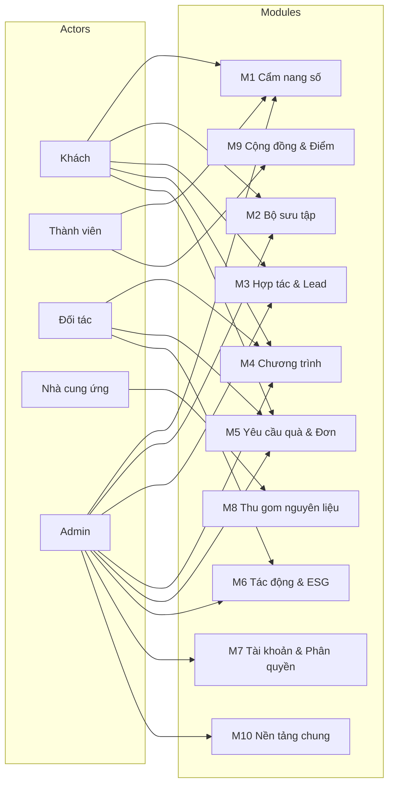
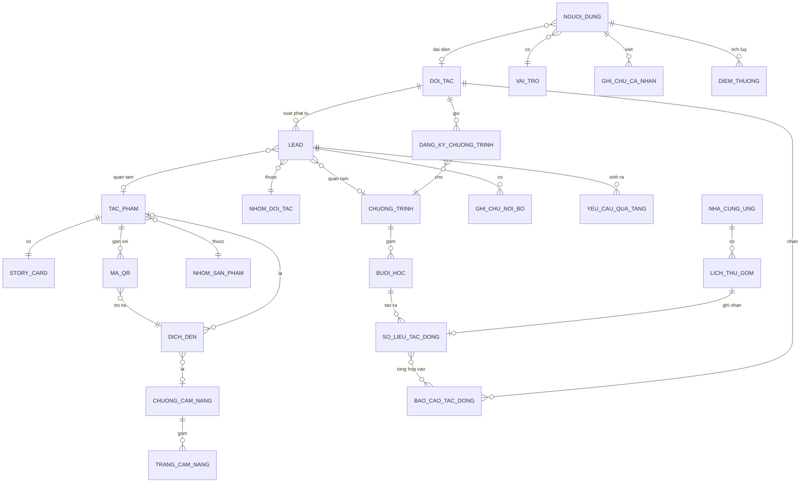
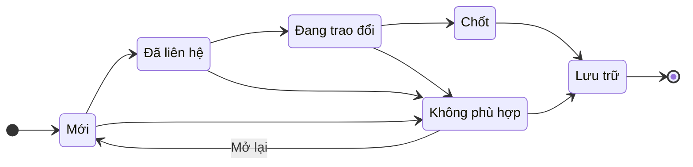
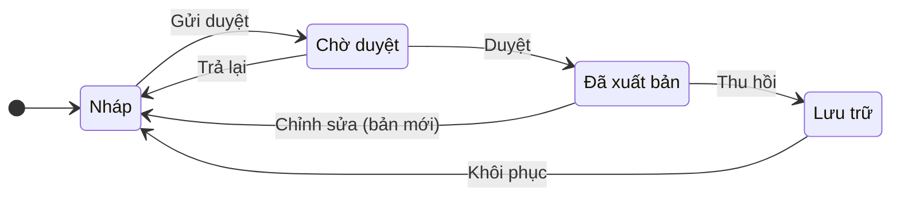
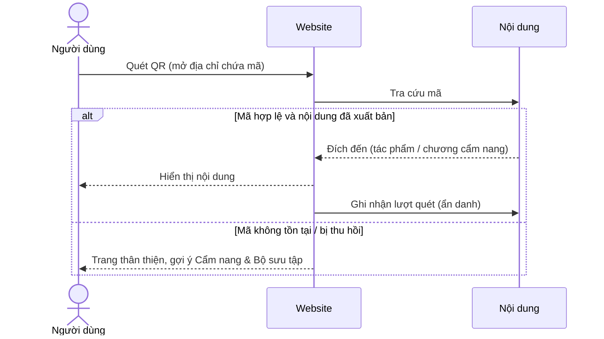

# LAVIECO: Tài liệu nghiệp vụ (Business & Use Case)

| | |
|---|---|
| **Phiên bản** | v0.3 (bản nháp, chờ duyệt) |
| **Cập nhật** | 20/09/2026 |
| **Phụ trách** | Võ Chí Trọng (CTO) |
| **Đối tượng đọc** | Toàn bộ đội sáng lập, mentor, đối tác kỹ thuật |
| **Tài liệu liên quan** | `README.md` · *Tài liệu định vị & hồ sơ dự án v1.1* · `02-kien-truc.md` · `03-co-so-du-lieu.md` · `04-cau-truc-ma-nguon.md` · `CLAUDE.md` (quy tắc cho Claude Code) |

> **Phạm vi tài liệu:** mô tả **cái gì** và **vì sao** (nghiệp vụ, vai trò, use case, quy tắc). Tài liệu **không** mô tả cách xây dựng (công nghệ, schema, API, cây thư mục). Phần đó nằm ở các tài liệu `02`–`04`.

## Mục lục

1. [Tổng quan & mục tiêu](#1-tổng-quan--mục-tiêu)
2. [Bối cảnh nghiệp vụ](#2-bối-cảnh-nghiệp-vụ)
3. [Phạm vi & phân giai đoạn](#3-phạm-vi--phân-giai-đoạn)
4. [Vai trò (Actors) & phân quyền](#4-vai-trò-actors--phân-quyền)
5. [Module nghiệp vụ](#5-module-nghiệp-vụ)
6. [Use case](#6-use-case)
7. [Quy tắc nghiệp vụ (Business Rules)](#7-quy-tắc-nghiệp-vụ-business-rules)
8. [Thực thể khái niệm & vòng đời](#8-thực-thể-khái-niệm--vòng-đời)
9. [Yêu cầu phi chức năng (mức nghiệp vụ)](#9-yêu-cầu-phi-chức-năng-mức-nghiệp-vụ)
10. [Giả định & câu hỏi mở](#10-giả-định--câu-hỏi-mở)
11. [Thuật ngữ](#11-thuật-ngữ)
12. [Lịch sử phiên bản](#12-lịch-sử-phiên-bản)

---

## 1. Tổng quan & mục tiêu

### 1.1 Hệ thống là gì?

Nền tảng số của LAVIECO, thương hiệu giáo dục mỹ thuật xanh. Hệ thống gồm hai mặt:

- **Mặt công khai:** website thương hiệu, bộ sưu tập, chương trình giáo dục, **Cẩm nang xanh số** (đọc qua mã QR trên sản phẩm), và các form hợp tác.
- **Mặt quản trị nội bộ:** công cụ để đội LAVIECO quản lý nội dung, sản phẩm, mã QR, đối tác tiềm năng, chương trình và số liệu tác động.

### 1.2 Vấn đề cần giải quyết

| # | Vấn đề | Hệ thống giải quyết bằng |
|---|---|---|
| 1 | Sản phẩm (Lớp Chứng minh & Vốn) đang là điểm chạm chính với khách nhưng **thông điệp giáo dục nằm ở nơi khác**. Khách mua xong là hết câu chuyện. | Mã QR trên sản phẩm dẫn thẳng vào Cẩm nang xanh số. |
| 2 | Trường học, doanh nghiệp ESG, homestay quan tâm chương trình nhưng chưa có kênh tiếp nhận có cấu trúc. Nguy cơ **rơi rớt cơ hội hợp tác**. | Form phân loại nhóm đối tác + quản lý lead có trạng thái, người phụ trách. |
| 3 | Đội nội dung (truyền thông, thiết kế) cần tự cập nhật cẩm nang, sản phẩm mà không phụ thuộc lập trình viên. | Công cụ quản trị nội dung có quy trình duyệt. |
| 4 | Doanh nghiệp ESG cần **bằng chứng tác động** để báo cáo. Đội cần số liệu thật để kể chuyện. | Ghi nhận & công bố số liệu tác động có kiểm soát (giai đoạn 2). |
| 5 | Nguồn vỏ hải sản dựa vào nhiều điểm thu gom rời rạc. | Quản lý nhà cung ứng và lịch thu gom (giai đoạn 3). |

### 1.3 Mục tiêu

1. **Kết nối hai lớp giá trị:** khách quét QR là đọc được câu chuyện giáo dục ngay, không cần cài ứng dụng, không cần đăng nhập.
2. **Tạo pipeline hợp tác:** mọi liên hệ từ trường học, doanh nghiệp, homestay, nhà hàng đều được ghi nhận, phân loại, theo dõi đến khi có kết quả.
3. **Tự chủ nội dung:** đội không chuyên kỹ thuật tự soạn và xuất bản nội dung.
4. **Nền tảng cho giai đoạn sau:** thiết kế để mở rộng sang đặt lịch workshop, đơn B2B, cộng đồng tích điểm mà không phải làm lại từ đầu.

### 1.4 Chỉ số theo dõi (chưa đặt ngưỡng)

Ngưỡng mục tiêu sẽ đặt sau khi có 1–2 tháng dữ liệu thực tế; trước mắt hệ thống cần **đo được** các chỉ số sau:

- Số lượt quét QR, tỷ lệ quét → đọc hết một chương
- Số lead mỗi tháng theo nhóm đối tác; tỷ lệ chuyển từ Mới → Chốt; thời gian từ khi nhận lead đến lần liên hệ đầu tiên
- Số email đăng ký nhận tin khi ra mắt
- Số yêu cầu quà tặng (cá nhân / số lượng lớn)

## 2. Bối cảnh nghiệp vụ

### 2.1 Hai lớp giá trị

Nguyên tắc cốt lõi của thương hiệu, và là **nguyên tắc thiết kế xuyên suốt** hệ thống này:

| | Lớp Chứng minh & Vốn | Lớp Giáo dục (cốt lõi) |
|---|---|---|
| Gồm | Móc khóa & charm, décor mini, combo quà tặng xanh | Cẩm nang xanh số, workshop, gói ngoại khóa, gói tài trợ giáo dục ESG |
| Vai trò | Dòng tiền ngắn hạn, bằng chứng cho triết lý | Tài sản thương hiệu, doanh thu dài hạn |
| Khách hàng | Cá nhân, người mua quà | Trường học, tổ chức giáo dục, doanh nghiệp CSR/ESG |

**Hệ quả cho phần mềm:** sản phẩm luôn được trình bày như *minh chứng*; mọi trang sản phẩm phải dẫn được về nội dung giáo dục (xem BR-01).

### 2.2 Phễu chương trình giáo dục

| Nấc | Gói | Đối tượng | Vai trò trong phễu |
|---|---|---|---|
| 1 | Cẩm nang xanh số | Người dùng cuối | Miễn phí lúc ra mắt, thu hút và xây cộng đồng |
| 2 | Workshop trải nghiệm (2–3 giờ) | Học sinh, sinh viên, nhóm cộng đồng | Trải nghiệm thử, doanh thu theo buổi |
| 3 | Gói ngoại khóa (3–5 buổi/khóa) | Trường học (B2B) | Hợp đồng lặp lại theo năm học |
| 4 | Tài trợ giáo dục ESG | Doanh nghiệp (B2B2C) | Giá trị hợp đồng cao nhất |

### 2.3 Nhóm đối tác & khách hàng

| Nhóm | Họ muốn gì | Điểm chạm chính trên hệ thống |
|---|---|---|
| Người dùng cá nhân (Gen Z, sinh viên 18–24) | Sản phẩm có ý nghĩa, dễ chia sẻ | Bộ sưu tập, Cẩm nang qua QR |
| Phụ huynh & giáo viên | Trải nghiệm thực hành cho con em | Chương trình, workshop |
| Trường học | Nội dung ngoại khóa module hóa | Form đăng ký khóa học, (GĐ2) cổng đối tác |
| Doanh nghiệp ESG | Bằng chứng tác động để truyền thông và báo cáo | Form hợp tác, (GĐ2) báo cáo tác động |
| Khu du lịch / homestay | Quà tặng địa phương có câu chuyện | Combo quà tặng số lượng lớn |
| Nhà hàng, quán ăn, chợ đầu mối | Giảm chi phí xử lý phế phẩm | Form hợp tác (đối tác nguyên liệu), (GĐ3) cổng nhà cung ứng |

### 2.4 Các trang giao diện đã thiết kế

Bản thiết kế hiện có 8 màn hình. Bảng dưới ánh xạ giao diện với use case để đội thiết kế và đội phát triển cùng hiểu một ngôn ngữ.

| Màn hình | Nội dung chính | Use case |
|---|---|---|
| Trang chủ (landing) | Hero, Từ vỏ đến tác phẩm, Bốn nấc thang giá trị, Bằng chứng nhỏ, Tác động, Sáu người kể chuyện, Liên hệ | UC-03, 05, 08 |
| Câu chuyện | Ý niệm LAVI + ECO, sứ mệnh, bốn trụ cột, nguồn vỏ sò, đội ngũ | UC-08 |
| Chương trình | Bốn nấc thang giá trị, "Dành cho trường học / doanh nghiệp", form đăng ký | UC-06 |
| Bộ sưu tập | Lọc 3 nhóm, thẻ tác phẩm, banner quà tặng doanh nghiệp | UC-03, 04 |
| Chi tiết tác phẩm / combo | Thư viện ảnh, "Trong hộp có gì", story card, mã QR, tác phẩm liên quan, CTA | UC-03, 04 |
| Cẩm nang xanh số | Giao diện sách lật trang, mục lục chương, ghi chú, đánh dấu, dark mode, cỡ chữ, tiến độ | UC-01, 02 |
| Hợp tác / Liên hệ | 5 nhóm đối tác, form thông tin | UC-05 |
| Sắp ra mắt · 404 | Thu email nhận tin; trang không tìm thấy | UC-07, UC-01 (ngoại lệ) |

## 3. Phạm vi & phân giai đoạn

Bám theo lộ trình 3 giai đoạn trong tài liệu định vị.

### 3.1 Giai đoạn 1: Sản phẩm minh chứng & nền tảng số *(hiện tại)*

**Trong phạm vi:**
- Website công khai (các trang ở mục 2.4), Cẩm nang xanh số qua QR
- Form hợp tác, form đăng ký khóa học, form yêu cầu quà tặng, thu email "sắp ra mắt"
- Quản trị nội bộ: lead, cẩm nang, sản phẩm & story card & QR, người dùng admin, cấu hình site
- Ghi chú/đánh dấu cẩm nang lưu **trên thiết bị** (không cần tài khoản)

**Ngoài phạm vi:** thanh toán online, tài khoản người dùng công khai, cổng đối tác, đặt lịch tự động, quản lý tồn kho, ứng dụng di động.

### 3.2 Giai đoạn 2: Thương mại hóa giáo dục

Tài khoản Member; cổng Partner (theo dõi yêu cầu, khai số lớp/học sinh, xin lịch workshop); duyệt lịch & đăng ký; đơn hàng combo B2B; số liệu tác động & báo cáo ESG; thông báo email/Zalo.

### 3.3 Giai đoạn 3: Hệ sinh thái

Cẩm nang freemium; tích điểm cộng đồng; cổng Supplier, lịch thu gom & khối lượng nguyên liệu.

## 4. Vai trò (Actors) & phân quyền

### 4.1 Danh sách vai trò

| Vai trò | Là ai | Xác thực | Giai đoạn |
|---|---|---|---|
| **Khách (Guest)** | Bất kỳ ai truy cập website hoặc quét QR | Không | 1 |
| **Thành viên (Member)** | Người dùng đã đăng ký tài khoản | Email/mật khẩu hoặc đăng nhập mạng xã hội | 2 |
| **Đối tác (Partner)** | Đại diện trường học, doanh nghiệp ESG, khu du lịch/homestay, đã được LAVIECO xác nhận | Tài khoản do LAVIECO cấp/duyệt | 2 |
| **Nhà cung ứng (Supplier)** | Đại diện nhà hàng, quán ăn, chợ đầu mối cung cấp vỏ hải sản | Tài khoản do LAVIECO cấp/duyệt | 3 |
| **Admin** (4 mức) | Đội LAVIECO | Tài khoản nội bộ, **bắt buộc xác thực 2 lớp** | 1 |

**Quy ước:** *Member là vai trò nền.* Partner và Supplier kế thừa mọi quyền của Member (ghi chú, yêu thích...) cộng thêm cổng riêng. **Học sinh không có vai trò riêng**; họ tham gia thông qua giáo viên hoặc nhà trường (xem BR-08).

### 4.2 Bốn mức Admin

| Mức | Thường là | Phụ trách |
|---|---|---|
| **Super Admin** | CTO | Toàn quyền; người dùng & phân quyền; cấu hình hệ thống; duyệt báo cáo tác động |
| **Content Editor** | Truyền thông, thiết kế | Soạn và duyệt nội dung: cẩm nang, sản phẩm, story card, QR, banner |
| **Coordinator** | Người điều phối vận hành | Xử lý lead, lịch chương trình, yêu cầu/đơn quà tặng, nhập số liệu tác động |
| **Auditor** | CISO | Chỉ đọc: nhật ký hoạt động, dữ liệu cá nhân, giám sát tuân thủ |

> Ai giữ mức nào do đội quyết định (câu hỏi mở Q6). Một người có thể giữ nhiều mức.

### 4.3 Ánh xạ nhóm trên form hợp tác

| Nhóm chọn trên form | Trở thành | Ghi chú |
|---|---|---|
| Trường học | Lead loại *Partner (Trường học)* | |
| Doanh nghiệp ESG | Lead loại *Partner (Doanh nghiệp)* | |
| Khu du lịch & homestay | Lead loại *Partner (Du lịch)* | |
| Nhà hàng / Quán ăn | Lead loại *Supplier* | Chợ đầu mối chưa có nhóm riêng (Q4) |
| Khác | Lead thông thường | Admin phân loại lại khi xử lý |

Khi lead ở trạng thái **Chốt** và đối tác cần cổng riêng (GĐ2/3), Coordinator tạo tài khoản Partner/Supplier từ lead đó.

### 4.4 Ma trận phân quyền

Ký hiệu: **✓** được làm · **đọc** chỉ xem · **—** không có quyền.

| Chức năng | Guest | Member | Partner | Supplier | Super Admin | Content Editor | Coordinator | Auditor |
|---|:-:|:-:|:-:|:-:|:-:|:-:|:-:|:-:|
| Xem website, đọc cẩm nang | ✓ | ✓ | ✓ | ✓ | ✓ | ✓ | ✓ | ✓ |
| Ghi chú, đánh dấu, tiến độ đọc | ✓ (trên thiết bị) | ✓ (đồng bộ) | ✓ | ✓ | — | — | — | — |
| Gửi form (hợp tác, đăng ký, quà tặng, nhận tin) | ✓ | ✓ | ✓ | ✓ | — | — | — | — |
| Theo dõi yêu cầu/đơn của mình | — | ✓ | ✓ | ✓ | — | — | — | — |
| Cổng đối tác (số lớp, xin lịch, báo cáo) | — | — | ✓ | — | — | — | — | — |
| Cổng nhà cung ứng (lịch thu gom, khối lượng) | — | — | — | ✓ | — | — | — | — |
| Xem & xử lý lead | — | — | — | — | ✓ | — | ✓ | đọc |
| Xuất danh sách lead | — | — | — | — | ✓ | — | ✓ | — |
| Soạn nội dung (cẩm nang, sản phẩm, story card) | — | — | — | — | ✓ | ✓ | đọc | đọc |
| Duyệt & xuất bản nội dung | — | — | — | — | ✓ | ✓ (*) | — | — |
| Quản lý mã QR | — | — | — | — | ✓ | ✓ | đọc | đọc |
| Chương trình, lịch, duyệt đăng ký | — | — | — | — | ✓ | đọc | ✓ | đọc |
| Yêu cầu/đơn quà tặng | — | — | — | — | ✓ | — | ✓ | đọc |
| Nhập số liệu tác động | — | — | — | — | ✓ | — | ✓ | đọc |
| Duyệt & công bố báo cáo tác động | — | — | — | — | ✓ | — | — | đọc |
| Quản lý người dùng & phân quyền | — | — | — | — | ✓ | — | — | đọc |
| Cấu hình site (liên hệ, banner) | — | — | — | — | ✓ | ✓ | — | đọc |
| Chế độ "sắp ra mắt", cấu hình hệ thống | — | — | — | — | ✓ | — | — | đọc |
| Nhật ký hoạt động, xử lý yêu cầu xóa dữ liệu | — | — | — | — | ✓ | — | — | đọc |

(*) Content Editor duyệt nội dung **do người khác soạn** (BR-05, câu hỏi mở Q1).

### 4.5 Tổng quan vai trò và module

## 5. Module nghiệp vụ

| # | Module | Mô tả | Giai đoạn |
|---|---|---|---|
| M1 | **Cẩm nang xanh số** | Chương, trang, khối tương tác, story card, phân giải mã QR, ghi chú/đánh dấu | 1 |
| M2 | **Bộ sưu tập & sản phẩm** | Tác phẩm, nhóm sản phẩm, "Trong hộp có gì", tác phẩm liên quan | 1 |
| M3 | **Hợp tác & lead** | Tiếp nhận, phân loại, theo dõi liên hệ từ mọi form | 1 |
| M4 | **Chương trình giáo dục** | Mô tả chương trình (GĐ1); đặt lịch, duyệt, khai số lớp (GĐ2) | 1–2 |
| M5 | **Yêu cầu quà tặng & đơn hàng** | Yêu cầu chọn quà/số lượng lớn (GĐ1); đơn, thanh toán (GĐ2) | 1–2 |
| M6 | **Tác động & báo cáo ESG** | Số liệu (kg vỏ, số học sinh, số buổi), báo cáo cho doanh nghiệp | 2 |
| M7 | **Tài khoản & phân quyền** | Admin (GĐ1); Member, Partner (GĐ2); Supplier (GĐ3) | 1→3 |
| M8 | **Thu gom nguyên liệu** | Nhà cung ứng, lịch thu gom, khối lượng, chứng nhận đóng góp | 3 |
| M9 | **Cộng đồng & tích điểm** | Điểm thưởng, nội dung freemium | 3 |
| M10 | **Nền tảng chung** | Thông báo, thư viện media, cấu hình site, nhật ký hoạt động, danh sách chờ ra mắt | 1+ |

## 6. Use case

**Quy ước:** *GĐ* = giai đoạn. Use case giai đoạn 1 mô tả chi tiết; giai đoạn 2–3 mô tả ở mức tóm tắt, sẽ chi tiết hóa khi đến lượt.

### 6.1 Danh mục use case

| Mã | Tên | Vai trò | Module | GĐ |
|---|---|---|---|:-:|
| UC-01 | Quét QR để mở đúng nội dung | Guest | M1 | 1 |
| UC-02 | Đọc Cẩm nang xanh số | Guest | M1 | 1 |
| UC-03 | Duyệt bộ sưu tập, xem chi tiết tác phẩm | Guest | M2 | 1 |
| UC-04 | Gửi yêu cầu chọn quà / đặt số lượng lớn | Guest | M5 | 1 |
| UC-05 | Gửi form hợp tác | Guest | M3 | 1 |
| UC-06 | Đăng ký khóa học cho trường | Guest | M3, M4 | 1 |
| UC-07 | Đăng ký nhận tin khi ra mắt | Guest | M10 | 1 |
| UC-08 | Xem trang giới thiệu (Câu chuyện, Tác động, Đội ngũ) | Guest | M10 | 1 |
| UC-09 | Đăng ký, đăng nhập | Member | M7 | 2 |
| UC-10 | Đồng bộ ghi chú, đánh dấu, tiến độ đọc | Member | M1 | 2 |
| UC-11 | Lưu tác phẩm yêu thích | Member | M2 | 2 |
| UC-12 | Xem lịch sử yêu cầu và đơn | Member | M5 | 2 |
| UC-13 | Nhận điểm khi đọc hoặc tham gia | Member | M9 | 3 |
| UC-14 | Mở khóa nội dung freemium | Member | M9 | 3 |
| UC-15 | Theo dõi trạng thái yêu cầu hợp tác | Partner | M3 | 2 |
| UC-16 | Trường học: chọn module, xin lịch, khai số lớp/học sinh | Partner | M4 | 2 |
| UC-17 | Doanh nghiệp ESG: đặt gói tài trợ, tải báo cáo tác động | Partner | M4, M6 | 2 |
| UC-18 | Homestay/du lịch: đặt combo số lượng lớn, đặt lại | Partner | M5 | 2 |
| UC-19 | Đăng ký điểm thu gom, hẹn lịch thu gom | Supplier | M8 | 3 |
| UC-20 | Xem khối lượng đã giao, chứng nhận đóng góp | Supplier | M8 | 3 |
| UC-21 | Quản lý lead | Admin | M3 | 1 |
| UC-22 | Soạn & xuất bản cẩm nang | Admin | M1 | 1 |
| UC-23 | Quản lý tác phẩm, story card, mã QR | Admin | M1, M2 | 1 |
| UC-24 | Quản lý chương trình, lịch, duyệt đăng ký | Admin | M4 | 2 |
| UC-25 | Xử lý yêu cầu/đơn quà tặng | Admin | M5 | 2 |
| UC-26 | Nhập số liệu tác động, xuất báo cáo ESG | Admin | M6 | 2 |
| UC-27 | Quản lý người dùng & phân quyền | Admin | M7 | 1 |
| UC-28 | Cấu hình site & chế độ "sắp ra mắt" | Admin | M10 | 1 |
| UC-29 | Xem nhật ký hoạt động, xử lý yêu cầu xóa dữ liệu cá nhân | Admin | M10 | 2 |

### 6.2 Use case giai đoạn 1: Khách (công khai)

#### UC-01: Quét QR để mở đúng nội dung

| | |
|---|---|
| **Vai trò** | Guest (hoặc Member) |
| **Kích hoạt** | Người dùng quét mã QR trên story card / bao bì combo |
| **Tiền điều kiện** | Mã QR đã được tạo và gắn đích đến (UC-23) |
| **Quy tắc** | BR-02, BR-05 |

**Luồng chính**
1. Người dùng quét QR bằng camera điện thoại; trình duyệt mở địa chỉ chứa mã của tác phẩm.
2. Hệ thống tra cứu mã.
3. Hệ thống xác định đích đến: trang chi tiết tác phẩm hoặc chương/trang cẩm nang gắn với tác phẩm đó.
4. Hệ thống hiển thị nội dung, kèm điều hướng sang các chương khác và bộ sưu tập.
5. Hệ thống ghi nhận một lượt quét (ẩn danh, không lưu định danh cá nhân).

**Luồng ngoại lệ**
- *Mã không tồn tại hoặc đã bị thu hồi:* hiển thị trang thân thiện theo tone thương hiệu (tương tự trang 404 đã thiết kế), gợi ý về Cẩm nang và Bộ sưu tập. **Không** hiển thị lỗi kỹ thuật.
- *Nội dung đích đến chưa xuất bản:* hiển thị trang "đang tác tạo", vẫn cho phép để lại email (UC-07).
- *Mạng yếu:* nội dung chữ hiển thị trước, ảnh và hiệu ứng nặng tải sau.

**Kết quả:** người dùng đọc được nội dung đúng tác phẩm mà **không cần đăng nhập, không cần cài ứng dụng**.

#### UC-02: Đọc Cẩm nang xanh số

| | |
|---|---|
| **Vai trò** | Guest (hoặc Member) |
| **Kích hoạt** | Từ QR (UC-01), từ menu, hoặc từ trang Chương trình |
| **Tiền điều kiện** | Có ít nhất một chương đã xuất bản |
| **Quy tắc** | BR-03, BR-05, BR-11 |

**Luồng chính**
1. Người dùng mở cẩm nang; hệ thống hiển thị mục lục chương (thiết kế hiện tại có 6 chương: *Câu chuyện của tác phẩm · Vỏ sò đến từ đâu · Rác thải đại dương · Kinh tế tuần hoàn trong một phút · Tự tay làm · Ghi chú của bạn*; danh sách có thể thay đổi).
2. Người dùng chọn chương và đọc theo trang.
3. Người dùng tương tác với khối đặc biệt (ví dụ "chạm để lật mở bí mật phế phẩm", sơ đồ minh họa).
4. Người dùng tùy chỉnh trải nghiệm: **cỡ chữ**, **chế độ tối**.
5. Người dùng **đánh dấu trang** và **viết ghi chú**; dữ liệu lưu **trên thiết bị**.
6. Hệ thống hiển thị **tiến độ đọc** và ghi nhớ vị trí gần nhất trên thiết bị.

**Luồng phụ**
- *Xóa dữ liệu trình duyệt / đổi thiết bị:* ghi chú trên thiết bị sẽ mất. Từ giai đoạn 2, người dùng đăng ký tài khoản để đồng bộ (UC-10).
- *Chương chưa xuất bản:* không hiển thị công khai (BR-05).

**Kết quả:** người dùng hoàn thành một hoặc nhiều chương; hệ thống thống kê tỷ lệ đọc (ẩn danh).

#### UC-03: Duyệt bộ sưu tập, xem chi tiết tác phẩm

| | |
|---|---|
| **Vai trò** | Guest |
| **Quy tắc** | BR-01, BR-10 |

**Luồng chính**
1. Người dùng mở Bộ sưu tập; hệ thống liệt kê tác phẩm đã xuất bản.
2. Người dùng lọc theo nhóm: *Tất cả · Móc khóa & charm · Décor mini để bàn · Combo quà tặng xanh*.
3. Mỗi thẻ hiển thị: mã tác phẩm (N°), chất liệu, tên, **khoảng giá niêm yết**, phần tóm tắt story card.
4. Người dùng mở chi tiết: thư viện ảnh, mô tả ngắn, **"Trong hộp có gì"** (sản phẩm chính, story card, bao bì giấy kraft, mã QR số hóa, tùy loại), nội dung story card, hướng dẫn quét QR mở Cẩm nang.
5. Cuối trang hiển thị *"Những câu chuyện liên quan khác"*.
6. Từ chi tiết, người dùng có thể đi tiếp UC-04 hoặc UC-02.

**Ngoại lệ:** nhóm không có tác phẩm nào → hiển thị thông báo thân thiện, gợi ý nhóm khác.

#### UC-04: Gửi yêu cầu chọn quà / đặt số lượng lớn

| | |
|---|---|
| **Vai trò** | Guest |
| **Kích hoạt** | Nút "Chọn quà này", "Đặt số lượng lớn cho doanh nghiệp" ở trang chi tiết, hoặc banner "Bạn cần quà tặng cho doanh nghiệp hoặc sự kiện?" |
| **Quy tắc** | BR-04, BR-06, BR-07, BR-10 |

**Luồng chính**
1. Hệ thống mở form, tự điền tác phẩm đang xem.
2. Người dùng nhập: số lượng, họ tên, đơn vị (nếu có), số điện thoại/email, dịp hoặc ghi chú, thời điểm cần nhận (không bắt buộc).
3. Người dùng đồng ý xử lý dữ liệu cá nhân (BR-06) và gửi.
4. Hệ thống tạo **Yêu cầu quà tặng** gắn với một **Lead**; thông báo cho Coordinator.
5. Hệ thống hiển thị xác nhận đã nhận yêu cầu.

**Giả định giai đoạn 1:** *không có thanh toán online.* "Chọn quà này" nghĩa là **gửi yêu cầu**; đội liên hệ xác nhận giá chốt, số lượng, giao nhận (A1).

**Ngoại lệ:** dữ liệu không hợp lệ → báo lỗi tại trường; nghi ngờ spam → chặn; trùng lead gần đây → gộp/cảnh báo (BR-07).

#### UC-05: Gửi form hợp tác

| | |
|---|---|
| **Vai trò** | Guest |
| **Quy tắc** | BR-04, BR-06, BR-07 |

**Luồng chính**
1. Người dùng mở trang Hợp tác.
2. Chọn **nhóm đối tác**: Trường học · Doanh nghiệp ESG · Khu du lịch & homestay · Nhà hàng/Quán ăn · Khác (§4.3).
3. Nhập: họ tên, đơn vị/tổ chức, số điện thoại, email, lời nhắn.
4. Đồng ý xử lý dữ liệu và gửi.
5. Hệ thống tạo **Lead** trạng thái *Mới*, ghi nhận nguồn (trang, nhóm), thông báo Coordinator.
6. Hệ thống hiển thị lời xác nhận.

#### UC-06: Đăng ký khóa học cho trường

| | |
|---|---|
| **Vai trò** | Guest (giáo viên, đại diện nhà trường) |
| **Kích hoạt** | Form ở trang Chương trình |
| **Quy tắc** | BR-04, BR-06, BR-07, BR-08 |

Đây là **biến thể có ngữ cảnh** của UC-05, cùng đi vào một luồng lead.

**Luồng chính**
1. Người dùng chọn nhóm đối tác (Trường học/Cao đẳng · Doanh nghiệp/ESG · Cộng đồng/Cá nhân trên thiết kế hiện tại).
2. Chọn **chương trình quan tâm** (ví dụ Workshop trải nghiệm, Gói ngoại khóa theo khóa, Tài trợ ESG).
3. Nhập thông tin liên hệ và lời nhắn, đồng ý xử lý dữ liệu, gửi.
4. Hệ thống tạo Lead có thêm trường **chương trình quan tâm**; thông báo Coordinator.

**Lưu ý:** không thu thông tin cá nhân của học sinh (BR-08). Số lớp/số học sinh chỉ khai ở giai đoạn 2 (UC-16).

#### UC-07: Đăng ký nhận tin khi ra mắt

| | |
|---|---|
| **Vai trò** | Guest |
| **Kích hoạt** | Trang "sắp ra mắt" (UC-28), hoặc ô nhận tin ở các trang chưa xuất bản |
| **Quy tắc** | BR-06 |

**Luồng chính:** nhập email → đồng ý nhận thông báo → hệ thống lưu vào **danh sách chờ** → hiển thị xác nhận.

**Ngoại lệ:** email đã đăng ký → hiển thị cùng thông điệp xác nhận (không tiết lộ email đã tồn tại); email sai định dạng → báo lỗi. Mỗi email nhận tin có đường **hủy đăng ký**.

**Kết quả:** admin xuất danh sách để thông báo khi chính thức ra mắt.

#### UC-08: Xem trang giới thiệu

| | |
|---|---|
| **Vai trò** | Guest |

Người dùng xem các trang giới thiệu: **Câu chuyện** (ý niệm LAVI + ECO, sứ mệnh, bốn trụ cột, nguồn vỏ sò), **Tác động** (từ Cần Thơ ra biển lớn), **Đội ngũ** (sáu người kể chuyện). Nội dung **Câu chuyện** và **Tác động** do Content Editor quản trị; thông tin và ảnh **Đội ngũ là nội dung tĩnh trong mã nguồn** (đổi bằng Pull Request, không qua công cụ quản trị, A8). Các trang này là nơi chính thể hiện Lớp Giáo dục và sứ mệnh thương hiệu.

### 6.3 Use case giai đoạn 1: Admin

#### UC-21: Quản lý lead

| | |
|---|---|
| **Vai trò** | Coordinator, Super Admin (Auditor: chỉ đọc) |
| **Quy tắc** | BR-04, BR-07, BR-06 |

**Luồng chính**
1. Coordinator nhận thông báo lead mới; mở danh sách, lọc theo nhóm, trạng thái, người phụ trách, nguồn, thời gian.
2. Mở chi tiết: thông tin liên hệ, nhóm đối tác, chương trình/sản phẩm quan tâm, lời nhắn, nguồn.
3. **Gán người phụ trách.**
4. Sau mỗi lần trao đổi, cập nhật **trạng thái** và **ghi chú nội bộ**; hệ thống lưu lịch sử thay đổi.
5. Khi kết thúc: *Chốt* hoặc *Không phù hợp*, rồi *Lưu trữ*.

**Chức năng bổ sung:** gộp lead trùng; tạo lead thủ công (khách gọi điện, gặp tại sự kiện); xuất danh sách (theo quyền); chuyển lead *Chốt* thành đối tác có tài khoản (GĐ2/3).

**Ngoại lệ:** lead chưa được xử lý quá lâu → hiển thị cảnh báo trong danh sách (ngưỡng thời gian do đội đặt, Q7).

Vòng đời lead: xem §8.2.

#### UC-22: Soạn & xuất bản cẩm nang

| | |
|---|---|
| **Vai trò** | Content Editor, Super Admin |
| **Quy tắc** | BR-01, BR-03, BR-05 |

**Luồng chính**
1. Người soạn tạo chương mới hoặc mở chương để chỉnh sửa.
2. Soạn nội dung theo trang: văn bản, ảnh, sơ đồ/infographic, trích dẫn, khối tương tác (ví dụ "bí mật phế phẩm"), gắn tác phẩm liên quan.
3. Lưu **nháp**; xem trước trên giao diện thật (điện thoại và máy tính).
4. **Gửi duyệt.**
5. Người duyệt xem, **duyệt & xuất bản**, hoặc **trả lại** kèm nhận xét.
6. Sắp xếp thứ tự chương; đặt mức truy cập (BR-03).

**Chức năng bổ sung:** thu hồi (đưa về lưu trữ); lịch sử phiên bản; chỉnh sửa nội dung đã xuất bản tạo bản nháp mới, bản đang chạy giữ nguyên đến khi duyệt.

Vòng đời nội dung: xem §8.3.

#### UC-23: Quản lý tác phẩm, story card, mã QR

| | |
|---|---|
| **Vai trò** | Content Editor, Super Admin (Coordinator/Auditor: đọc) |
| **Quy tắc** | BR-01, BR-02, BR-05, BR-10 |

**Luồng chính**
1. Tạo **tác phẩm**: mã N°, nhóm sản phẩm, chất liệu, khoảng giá niêm yết, mô tả, các thành tố "trong hộp", bộ ảnh.
2. Tạo **story card** cho tác phẩm: nội dung câu chuyện, năm chế tác, nơi chế tác, dự án.
3. **Sinh mã QR**: hệ thống cấp mã định danh **bất biến**; người dùng chọn đích đến (trang tác phẩm hoặc chương cẩm nang).
4. **Tải QR chất lượng in** (định dạng vector và ảnh) để đưa vào thiết kế story card/bao bì.
5. Xuất bản tác phẩm (BR-05).

**Chức năng bổ sung:** đổi đích đến của một mã (không đổi mã); **thu hồi** mã (người quét thấy trang thân thiện, xem UC-01); xem thống kê lượt quét theo mã.

> **Lưu ý:** QR đã in không thể sửa. Vì vậy **mã không bao giờ thay đổi**, chỉ đích đến thay đổi (BR-02).

#### UC-27: Quản lý người dùng & phân quyền

| | |
|---|---|
| **Vai trò** | Super Admin (Auditor: chỉ đọc) |

**Luồng chính:** mời admin qua email → người được mời kích hoạt và **thiết lập xác thực 2 lớp** → Super Admin gán mức (Super Admin / Content Editor / Coordinator / Auditor) → có thể **khóa** hoặc thu hồi quyền bất kỳ lúc nào; mọi thay đổi ghi vào nhật ký (UC-29).

*Giai đoạn 1 chỉ quản lý tài khoản admin.* Member/Partner/Supplier bổ sung ở giai đoạn sau.

#### UC-28: Cấu hình site & chế độ "sắp ra mắt"

| | |
|---|---|
| **Vai trò** | Super Admin (cấu hình site: cả Content Editor) |

**Luồng chính**
1. Cập nhật thông tin hiển thị công khai: email, số điện thoại, địa chỉ, giờ mở cửa, liên kết mạng xã hội, banner.
2. **Bật/tắt chế độ "sắp ra mắt":** khi bật, khách thấy trang chờ có ô nhận tin (UC-07); admin vẫn xem được toàn bộ website để kiểm tra.

**Mục đích:** thông tin liên hệ không viết cứng trong giao diện, sửa được không cần triển khai lại (giải quyết vấn đề thông tin liên hệ chưa thống nhất giữa các bản thiết kế, xem A5).

### 6.4 Use case giai đoạn 2–3 (tóm tắt)

| Mã | Vai trò | Mô tả & luồng chính tóm tắt | Quy tắc |
|---|---|---|---|
| UC-09 | Member | Đăng ký/đăng nhập; quản lý hồ sơ; xóa tài khoản. | BR-06 |
| UC-10 | Member | Khi đăng nhập, ghi chú/đánh dấu/tiến độ trên thiết bị được **gộp** vào tài khoản và đồng bộ giữa các thiết bị. | BR-11 |
| UC-11 | Member | Lưu tác phẩm yêu thích; xem lại trong hồ sơ. | |
| UC-12 | Member | Xem danh sách yêu cầu quà tặng, đăng ký và trạng thái xử lý. | |
| UC-13 | Member | Nhận điểm khi hoàn thành chương, tham gia workshop, chia sẻ; xem số dư và lịch sử. | |
| UC-14 | Member | Nội dung có mức truy cập cao hơn được mở khóa theo điều kiện (đăng ký, điểm). | BR-03 |
| UC-15 | Partner | Xem tiến trình yêu cầu hợp tác của tổ chức mình (trạng thái, lịch, tài liệu). | |
| UC-16 | Partner (trường) | Chọn module ngoại khóa; xin lịch; **khai số lớp/số học sinh (chỉ số lượng)**; theo dõi buổi học. | BR-08 |
| UC-17 | Partner (doanh nghiệp) | Đặt gói tài trợ; chọn trường/cộng đồng thụ hưởng; tải báo cáo tác động đã được duyệt. | BR-09 |
| UC-18 | Partner (du lịch) | Đặt combo số lượng lớn; xem lịch sử; đặt lại đơn cũ. | BR-10 |
| UC-19 | Supplier | Đăng ký làm điểm thu gom; hẹn hoặc xác nhận lịch thu gom. | |
| UC-20 | Supplier | Xem khối lượng vỏ đã giao; nhận chứng nhận đóng góp (dùng cho truyền thông của nhà hàng). | BR-09 |
| UC-24 | Admin | Quản lý chương trình; mở lịch; duyệt/từ chối đăng ký; ghi nhận buổi học đã diễn ra. | |
| UC-25 | Admin | Xử lý yêu cầu quà tặng đến đơn hàng: báo giá, xác nhận, theo dõi giao nhận, thanh toán. | BR-10 |
| UC-26 | Admin | Nhập số liệu tác động (khối lượng vỏ tái chế, số học sinh, số buổi, số sản phẩm); duyệt; xuất báo cáo ESG cho đối tác. | BR-09 |
| UC-29 | Admin | Xem nhật ký hoạt động; tiếp nhận và xử lý yêu cầu xóa/xuất dữ liệu cá nhân. | BR-06 |

## 7. Quy tắc nghiệp vụ (Business Rules)

### 7.1 Quy tắc cốt lõi

| Mã | Quy tắc |
|---|---|
| **BR-01** | **Sản phẩm là minh chứng, giáo dục đi trước.** Mọi trang tác phẩm phải có story card và liên kết về Cẩm nang; không trình bày LAVIECO như cửa hàng đồ thủ công. |
| **BR-02** | **Mã QR bất biến.** Mỗi mã định danh cố định vĩnh viễn; đích đến và nội dung thay đổi ở phía hệ thống. Mã bị thu hồi hiển thị trang thân thiện, không báo lỗi kỹ thuật. |
| **BR-03** | **Cẩm nang miễn phí khi ra mắt**, nhưng mỗi nội dung có thuộc tính mức truy cập ngay từ đầu để làm freemium ở giai đoạn 3. |
| **BR-04** | **Không mất dấu lead.** Mỗi lead có nguồn, nhóm đối tác, trạng thái, người phụ trách. Không xóa cứng; kết thúc thì lưu trữ. |
| **BR-05** | **Nội dung qua duyệt trước khi công khai** (nháp → chờ duyệt → xuất bản). Người duyệt khác người soạn (chi tiết ở Q1). |
| **BR-06** | **Dữ liệu cá nhân:** mọi form có ô đồng ý xử lý dữ liệu; chỉ thu thập tối thiểu cần thiết; có quy trình xóa/xuất dữ liệu theo yêu cầu. |

### 7.2 Quy tắc đề xuất thêm

| Mã | Quy tắc | Lý do |
|---|---|---|
| **BR-07** | Lead gửi lại (cùng số điện thoại hoặc email) trong khoảng thời gian ngắn được **cảnh báo/gộp**, không tạo bản sao vô hạn. | Tránh nhiễu danh sách, tránh liên hệ một người nhiều lần |
| **BR-08** | **Không thu thông tin cá nhân của học sinh.** Trường/giáo viên chỉ khai số lượng (số lớp, số học sinh). | Học sinh là trẻ vị thành niên, giảm rủi ro dữ liệu |
| **BR-09** | Số liệu tác động chỉ được công bố công khai hoặc đưa vào báo cáo ESG khi đã **có nguồn và được Super Admin duyệt.** | Tránh cường điệu (greenwashing), bảo vệ uy tín với đối tác ESG |
| **BR-10** | Giá hiển thị công khai là **khoảng giá niêm yết** (30.000đ – 500.000đ tùy nhóm). Giá chốt do đội xác nhận khi liên hệ, đến khi có đơn hàng ở GĐ2. | Khớp với thực tế chưa có thanh toán online ở GĐ1 |
| **BR-11** | Ghi chú và đánh dấu cá nhân **chỉ chủ sở hữu thấy**; admin không truy cập nội dung ghi chú. | Riêng tư của người đọc |

## 8. Thực thể khái niệm & vòng đời

### 8.1 Thực thể và quan hệ (mức khái niệm)

Mức khái niệm: chỉ nêu thực thể và quan hệ. Trường dữ liệu và kiểu dữ liệu nằm trong `03-co-so-du-lieu.md`.

| Thực thể | Ý nghĩa |
|---|---|
| Tác phẩm | Sản phẩm minh chứng (móc khóa, décor, combo) |
| Story card | Câu chuyện đi kèm mỗi tác phẩm |
| Mã QR | Định danh bất biến trỏ tới một đích đến |
| Chương / Trang cẩm nang | Đơn vị nội dung của Cẩm nang xanh số |
| Lead | Một liên hệ/cơ hội hợp tác chưa chính thức |
| Đối tác | Tổ chức đã được xác nhận (trường, doanh nghiệp, du lịch) |
| Nhà cung ứng | Nguồn cung vỏ hải sản (nhà hàng, quán, chợ) |
| Chương trình / Buổi học | Workshop, gói ngoại khóa và các buổi cụ thể |
| Số liệu tác động / Báo cáo | Số liệu đo được và báo cáo tổng hợp gửi đối tác |
| Người dùng / Vai trò | Tài khoản và quyền |

### 8.2 Vòng đời của Lead

### 8.3 Vòng đời của nội dung (cẩm nang, tác phẩm)

### 8.4 Luồng QR → Cẩm nang

## 9. Yêu cầu phi chức năng (mức nghiệp vụ)

Các mục tiêu dưới đây là **đề xuất**, chi tiết kỹ thuật ở `02-kien-truc.md`.

| Nhóm | Yêu cầu |
|---|---|
| **Dùng trên điện thoại** | Người dùng chủ yếu vào từ **quét QR bằng điện thoại**. Mọi trang công khai ưu tiên giao diện di động; Cẩm nang đọc thoải mái trên màn hình nhỏ. |
| **Hiệu năng** | Trang công khai đạt ngưỡng "tốt" của Core Web Vitals (LCP ≤ 2,5 s, INP ≤ 200 ms, CLS ≤ 0,1) trên mạng di động thông thường. |
| **Truy cập được** | Cỡ chữ điều chỉnh được, chế độ tối, độ tương phản màu đủ đọc; tôn trọng tùy chọn "giảm chuyển động" của hệ điều hành (giao diện có nhiều hiệu ứng: con trỏ tùy biến, thẻ lật, chạy chữ). |
| **Ngôn ngữ** | Tiếng Việt là chính. Cấu trúc nội dung cần cho phép bổ sung tiếng Anh (bắt đầu với tagline) mà không làm lại. |
| **SEO & chia sẻ** | Trang công khai có tiêu đề, mô tả, ảnh chia sẻ mạng xã hội riêng; tối ưu tìm kiếm tiếng Việt. |
| **Bảo mật** | Admin bắt buộc xác thực 2 lớp; phân quyền theo vai trò (§4.4); chống spam form; nhật ký mọi thao tác nhạy cảm; **không ghi dữ liệu cá nhân vào log**. |
| **Dữ liệu cá nhân** | Tuân thủ quy định bảo vệ dữ liệu cá nhân của Việt Nam; thu thập tối thiểu; có ô đồng ý; có quy trình xóa/xuất (BR-06). |
| **Sao lưu & khôi phục** | Dữ liệu lead, nội dung, QR phải có sao lưu định kỳ và thử khôi phục. Mất dữ liệu QR = mất khả năng phục vụ sản phẩm đã bán. |
| **Độ ổn định** | Mã QR đã in **luôn phải trả về nội dung hợp lệ hoặc trang thân thiện**, kể cả khi nội dung bị thu hồi hoặc hệ thống bảo trì. |

## 10. Giả định & câu hỏi mở

> **Quy ước mã dùng chung cho cả bộ tài liệu:** giả định/câu hỏi của tài liệu này mang mã `A`/`Q`; `02` dùng `AR`/`AQ`, `03` dùng `AD`/`DQ`, `04` dùng `AC`/`PQ`. Các mã không trùng nhau nên có thể dẫn chiếu chéo an toàn (ví dụ "Q4 ở `01`", "AQ3 ở `02`").

### 10.1 Giả định (sửa nếu sai)

| Mã | Giả định |
|---|---|
| **A1** | Giai đoạn 1 **chưa có thanh toán online.** "Chọn quà này" = gửi yêu cầu; đội liên hệ xác nhận. |
| **A2** | Ghi chú/đánh dấu dùng được **không cần tài khoản** (lưu trên thiết bị), có tài khoản thì đồng bộ (GĐ2). |
| **A3** | Partner **chưa có cổng đăng nhập ở GĐ1**; mọi thứ đi qua form, admin xử lý. |
| **A4** | "N° 001…" trên sản phẩm là **mã số bộ sưu tập**, chưa phải hàng độc bản (tồn kho không quản lý ở GĐ1). |
| **A5** | Thông tin liên hệ trong các bản thiết kế (email, địa chỉ, hotline, giờ mở cửa) là **placeholder**; quản lý qua cấu hình site (UC-28). |
| **A6** | Học sinh **không** có tài khoản hay vai trò riêng. |
| **A7** | Giai đoạn 1 chỉ tiếng Việt cho nội dung, bổ sung tiếng Anh sau. |
| **A8** | Thông tin và ảnh sáu thành viên là **nội dung tĩnh trong mã nguồn** (không qua CMS); từng thành viên đồng ý công khai ảnh. |

### 10.2 Câu hỏi mở (cần đội quyết định)

| Mã | Câu hỏi | Ảnh hưởng |
|---|---|---|
| **Q1** | Người soạn có được **tự duyệt** bài mình soạn không? (Đội nhỏ, bắt buộc người khác duyệt có thể chậm.) | BR-05, UC-22 |
| **Q2** | Tên gọi phụ của thương hiệu: các bản thiết kế đang dùng nhiều tên (*The Living Gallery*, *Viện nghệ thuật xanh*, *Bảo tàng xanh*) và nhãn vị trí (*Sài Gòn · Cần Thơ*). Chọn một? | Nội dung, SEO |
| **Q3** | Có **không gian trưng bày thật** với giờ mở cửa (Thứ Ba – Chủ Nhật) không? Nếu có sẽ thêm use case **đặt lịch tham quan**. | Phạm vi GĐ1/2 |
| **Q4** | Hai form đang có **bộ nhóm khác nhau** (3 nhóm ở Chương trình, 5 nhóm ở Hợp tác). Hợp nhất thế nào? **Chợ đầu mối** đưa vào nhóm nào? | UC-05, UC-06, §4.3 |
| **Q5** | Ý nghĩa của "N° 001": mã bộ sưu tập hay số thứ tự từng tác phẩm (hàng độc bản)? | A4, tồn kho |
| **Q6** | **Ai giữ mức admin nào** trong 6 thành viên? (Đề xuất: CTO = Super Admin, CISO = Auditor.) | §4.2 |
| **Q7** | Cam kết **thời gian phản hồi lead** (hiển thị trên form và cảnh báo nội bộ) là bao lâu? | UC-05, UC-21 |
| **Q8** | Chương trình giáo dục có **công khai bảng giá** không, hay chỉ "liên hệ báo giá"? (Khung giá đang chờ Kế hoạch Tài chính.) | UC-06, M4 |
| **Q9** | Mức độ chi tiết của cơ chế **tích điểm & freemium** (GĐ3): điểm đổi lấy gì? | UC-13, 14 |

## 11. Thuật ngữ

| Thuật ngữ | Nghĩa |
|---|---|
| **Cẩm nang xanh số** | Nội dung giáo dục dạng sách số, truy cập qua QR |
| **Story card** | Thẻ câu chuyện đi kèm mỗi tác phẩm, có mã QR |
| **Tác phẩm** | Sản phẩm minh chứng (móc khóa, décor, combo) |
| **Combo quà tặng xanh** | Sản phẩm chính + story card + bao bì kraft + mã QR |
| **Lead** | Một liên hệ/cơ hội hợp tác, chưa phải đối tác chính thức |
| **Đối tác (Partner)** | Trường học, doanh nghiệp, khu du lịch đã được xác nhận |
| **Nhà cung ứng (Supplier)** | Nguồn cung vỏ hải sản |
| **ESG / CSR** | Tiêu chí môi trường–xã hội–quản trị / Trách nhiệm xã hội của doanh nghiệp |
| **Lớp Chứng minh & Vốn / Lớp Giáo dục** | Hai lớp giá trị của thương hiệu (§2.1) |
| **GĐ** | Giai đoạn (1, 2, 3) |

## 12. Lịch sử phiên bản

| Phiên bản | Ngày | Nội dung | Thực hiện |
|---|---|---|---|
| v0.1 | 20/09/2026 | Bản nháp đầu: vai trò, module, 29 use case, quy tắc nghiệp vụ, giả định & câu hỏi mở | V.C. Trọng |
| v0.2 | 20/09/2026 | Đồng bộ với `02`–`04`: thêm quyền xuất danh sách lead vào ma trận, sửa quan hệ Lead ↔ Yêu cầu quà tặng (1–nhiều), thống nhất quy ước mã câu hỏi | V.C. Trọng |
| v0.3 | 20/09/2026 | Đội ngũ là nội dung tĩnh (UC-08, A8) | V.C. Trọng |