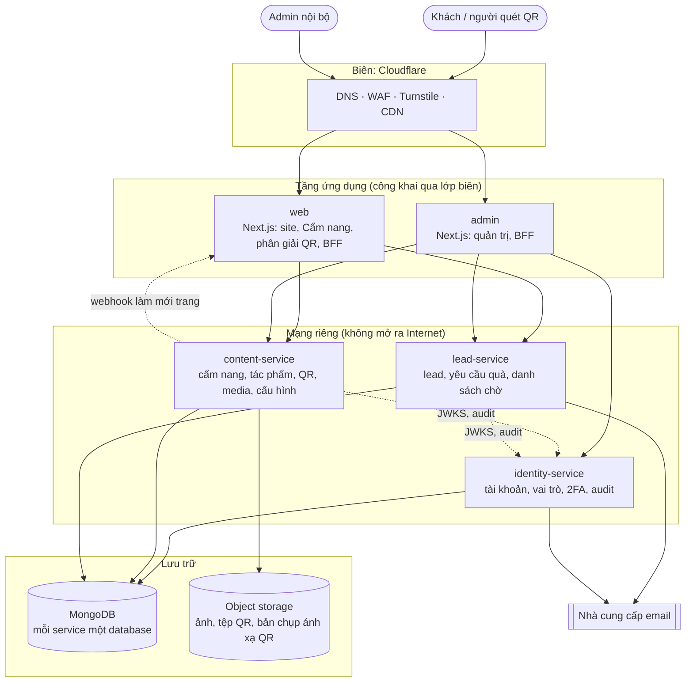
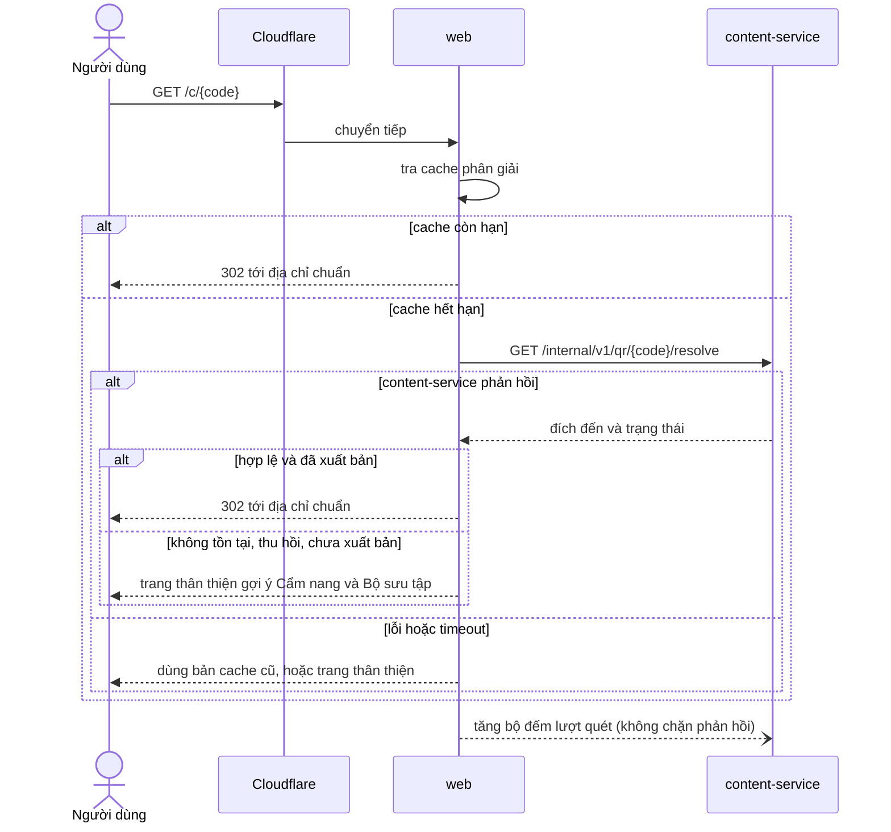
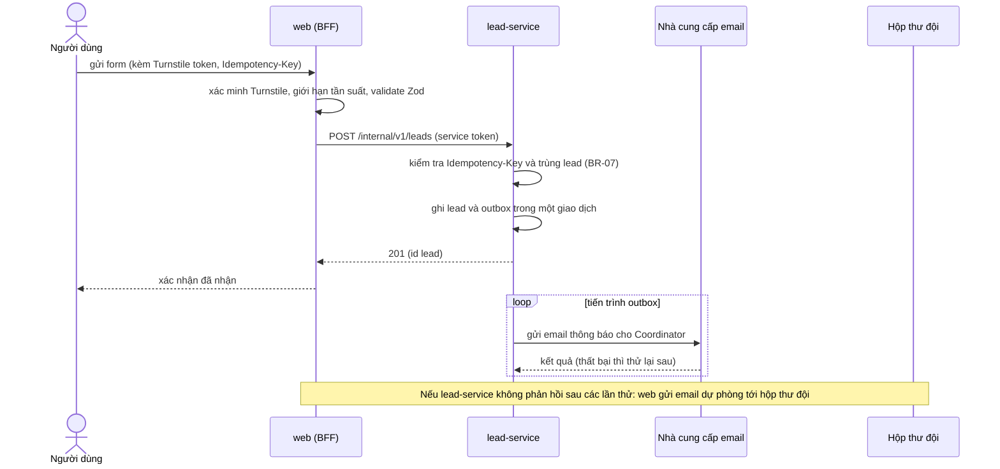
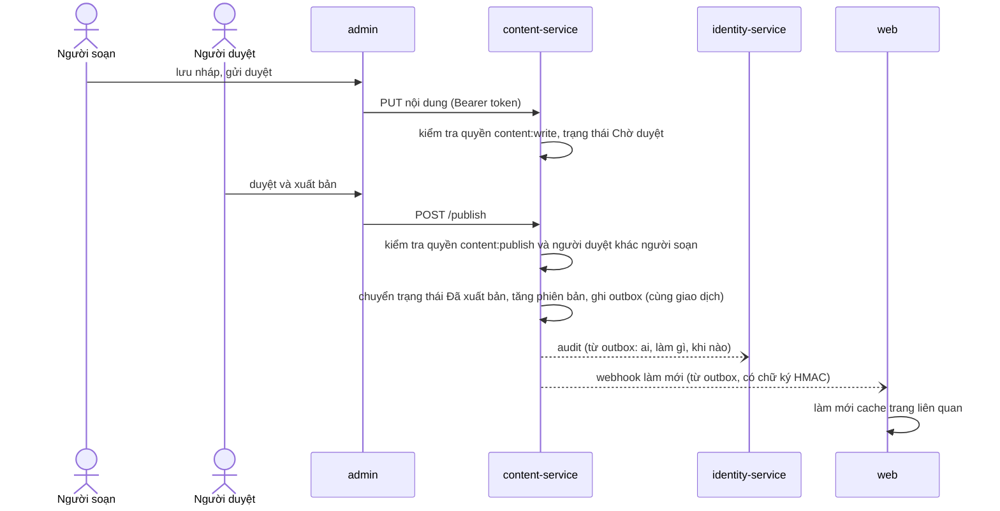
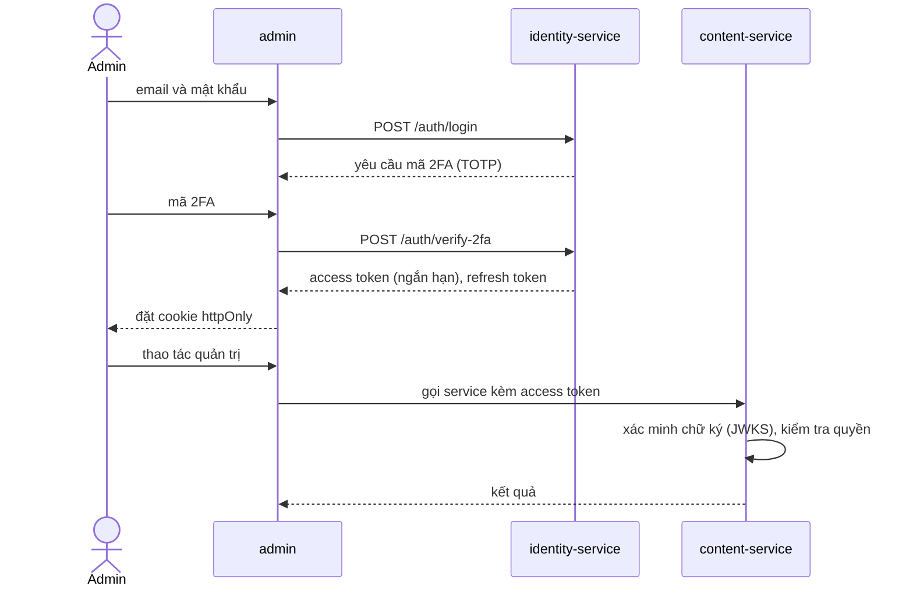
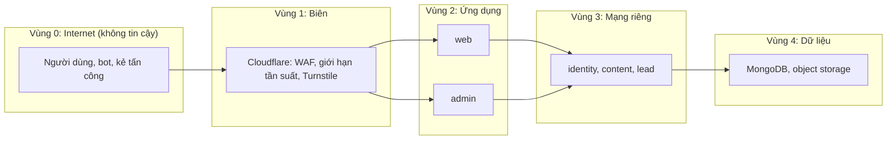
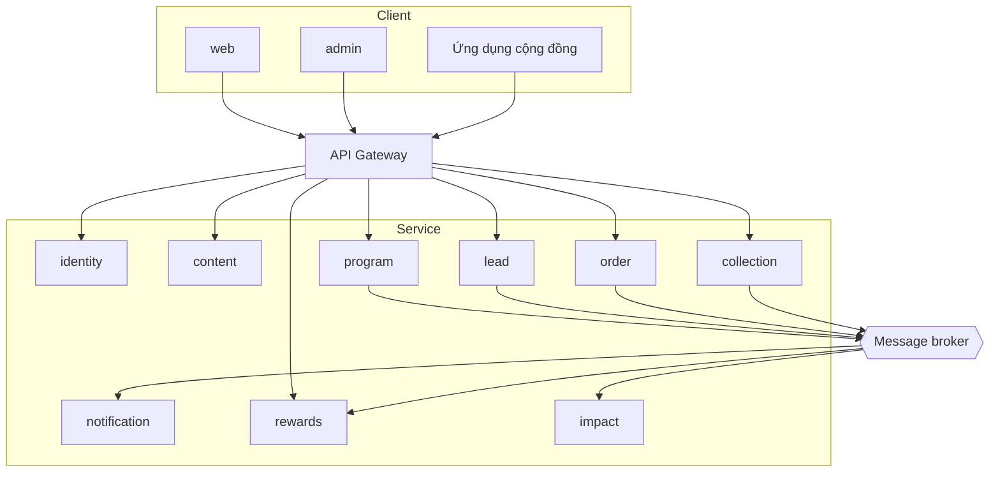

# LAVIECO: Kiến trúc hệ thống

| | |
|---|---|
| **Phiên bản** | v0.3 (bản nháp, chờ duyệt) |
| **Cập nhật** | 20/09/2026 |
| **Phụ trách** | Võ Chí Trọng (CTO) |
| **Đối tượng đọc** | Đội phát triển, CISO, mentor kỹ thuật |
| **Tài liệu liên quan** | `01-nghiep-vu.md` (đầu vào của tài liệu này) · `README.md` · `03-co-so-du-lieu.md` · `04-cau-truc-ma-nguon.md` · `CLAUDE.md` |

> **Phạm vi:** tài liệu mô tả **hệ thống được chia thành những thành phần nào, chúng nói chuyện với nhau ra sao, chạy ở đâu và được bảo vệ thế nào.** Schema chi tiết nằm ở `03`, cây thư mục và quy ước code nằm ở `04`. Danh sách API endpoint **không viết tay** mà sinh tự động từ code (OpenAPI).
>
> Mọi lựa chọn công nghệ ở đây là **đề xuất**; quyết định cuối cùng ghi bằng ADR (mục 16). Tài liệu không ghim số phiên bản và không nêu giá dịch vụ, vì hai thứ này thay đổi nhanh và cần kiểm tra tại thời điểm triển khai.

## Mục lục

1. [Động lực & ràng buộc](#1-động-lực--ràng-buộc)
2. [Nguyên tắc kiến trúc](#2-nguyên-tắc-kiến-trúc)
3. [Bức tranh tổng thể (Giai đoạn 1)](#3-bức-tranh-tổng-thể-giai-đoạn-1)
4. [Phân rã service](#4-phân-rã-service)
5. [Ứng dụng frontend](#5-ứng-dụng-frontend)
6. [Giao tiếp giữa các thành phần](#6-giao-tiếp-giữa-các-thành-phần)
7. [Các luồng chính](#7-các-luồng-chính)
8. [Dữ liệu & lưu trữ](#8-dữ-liệu--lưu-trữ)
9. [Bảo mật](#9-bảo-mật)
10. [Hiệu năng & bộ nhớ đệm](#10-hiệu-năng--bộ-nhớ-đệm)
11. [Quan sát & vận hành](#11-quan-sát--vận-hành)
12. [Triển khai & hạ tầng](#12-triển-khai--hạ-tầng)
13. [Truy vết yêu cầu phi chức năng](#13-truy-vết-yêu-cầu-phi-chức-năng)
14. [Lộ trình tiến hóa & quy tắc tách service](#14-lộ-trình-tiến-hóa--quy-tắc-tách-service)
15. [Đánh đổi, rủi ro & phương án thay thế](#15-đánh-đổi-rủi-ro--phương-án-thay-thế)
16. [ADR đề xuất](#16-adr-đề-xuất)
17. [Giả định & câu hỏi mở](#17-giả-định--câu-hỏi-mở)
18. [Đồng bộ với tài liệu khác](#18-đồng-bộ-với-tài-liệu-khác)
19. [Lịch sử phiên bản](#19-lịch-sử-phiên-bản)

---

## 1. Động lực & ràng buộc

### 1.1 Những yêu cầu nghiệp vụ quyết định kiến trúc

Rút ra từ `01-nghiep-vu.md`. Đây là các "driver": nếu kiến trúc không đáp ứng, hệ thống thất bại dù code chạy đúng.

| # | Driver | Hệ quả kiến trúc |
|---|---|---|
| D1 | **Mã QR đã in không sửa được** (BR-02); người quét phải luôn thấy nội dung hợp lệ hoặc trang thân thiện | Điểm phân giải QR là thành phần **quan trọng nhất về độ sẵn sàng**; địa chỉ QR phải ổn định lâu dài; có cache và phương án suy giảm (mục 7.1, 10) |
| D2 | Người dùng chủ yếu **quét bằng điện thoại**, mạng không chắc ổn định | Render phía server, tải nhanh, đọc được cả khi chưa chạy JavaScript |
| D3 | Đội nội dung **tự cập nhật** mà không nhờ lập trình viên; có quy trình duyệt (BR-05) | Có ứng dụng quản trị riêng; nội dung lưu dạng có cấu trúc; xuất bản tự làm mới trang công khai |
| D4 | **Không được mất lead** (BR-04); tránh làm phiền một người nhiều lần (BR-07) | Ghi nhận bền vững trước, thông báo sau; chống gửi trùng; có đường dự phòng khi thành phần lỗi |
| D5 | Dữ liệu cá nhân của phụ huynh, giáo viên, doanh nghiệp; có học sinh vị thành niên (BR-06, BR-08) | Thu thập tối thiểu, phân quyền chặt, nhật ký hoạt động, dịch vụ nội bộ không mở ra Internet |
| D6 | Hệ thống sẽ **mở rộng theo 3 giai đoạn** (đơn hàng, lịch, cộng đồng, thu gom) | Ranh giới theo nghiệp vụ, mỗi phần sở hữu dữ liệu riêng, tách dần khi cần |
| D7 | Đội kỹ thuật nhỏ (một CTO, sinh viên) | Ít thành phần vận hành nhất có thể, công cụ quen thuộc, tự động hóa kiểm tra |

### 1.2 Ràng buộc đã chốt

- Frontend **Next.js**, cơ sở dữ liệu **MongoDB**, hướng **microservices** (theo yêu cầu của đội).
- Giao diện đã thiết kế: bộ nhận diện Emerald/Deep Blue/Canary, font Fraunces + Be Vietnam Pro.
- Ngôn ngữ nội dung: tiếng Việt trước, cấu trúc cho phép thêm tiếng Anh (A7 ở `01`).

## 2. Nguyên tắc kiến trúc

| # | Nguyên tắc | Nghĩa là |
|---|---|---|
| P1 | **Microservices, nhưng tách dần** | Bắt đầu với **3 service nhỏ**, thêm khi có lý do theo quy tắc ở mục 14. Không dựng trước những thứ chưa cần. |
| P2 | **Ranh giới theo nghiệp vụ, không theo kỹ thuật** | Mỗi service tương ứng một nhóm module M1–M10, không có "service dữ liệu" hay "service tiện ích". |
| P3 | **Mỗi service sở hữu dữ liệu của mình** | Không đọc trực tiếp database của service khác. Tham chiếu chéo chỉ bằng ID; cần thêm thông tin thì hỏi qua API hoặc lưu bản chụp (snapshot). |
| P4 | **Service nội bộ không mở ra Internet** | Chỉ `web` và `admin` (đi qua lớp biên) nhận lưu lượng từ ngoài. Service chỉ nhận từ mạng riêng, có xác thực. |
| P5 | **Bảo mật nhiều lớp** | Phân quyền kiểm tra **ở cả BFF và ở service**, không tin duy nhất một điểm. |
| P6 | **Hợp đồng rõ ràng, dùng chung ở một chỗ** | Schema request/response và sự kiện định nghĩa một lần (Zod, `packages/shared`), FE và BE cùng dùng. Thư viện dùng chung **chỉ chứa hợp đồng và công cụ**, không chứa logic nghiệp vụ. |
| P7 | **Ghi bền vững trước, làm việc phụ sau** | Lưu dữ liệu quan trọng rồi mới gửi email/thông báo (outbox). Lỗi ở việc phụ không làm mất dữ liệu chính. |
| P8 | **Suy giảm êm** | Khi một thành phần lỗi, người dùng vẫn thấy nội dung (từ cache) hoặc trang thân thiện. Đặc biệt với QR. |
| P9 | **Nội dung có cấu trúc, không phải HTML thô** | Nội dung cẩm nang lưu dạng khối (block) JSON. Giảm rủi ro XSS, dễ hiển thị nhiều dạng, dễ dịch. |
| P10 | **Tự động hóa kiểm tra** | Lint, typecheck, test, quét phụ thuộc chạy tự động ở CI. Không dựa vào trí nhớ của người review. |

## 3. Bức tranh tổng thể (Giai đoạn 1)

### 3.1 Các thành phần

**5 thành phần triển khai** cho Giai đoạn 1:

| Thành phần | Loại | Vai trò tóm tắt |
|---|---|---|
| `web` | Ứng dụng Next.js | Website công khai, Cẩm nang, phân giải QR; đóng vai trò BFF cho người dùng công khai |
| `admin` | Ứng dụng Next.js | Giao diện quản trị nội bộ; BFF cho admin |
| `content-service` | Service NestJS | Nội dung xuất bản: cẩm nang, tác phẩm, story card, QR, trang giới thiệu, cấu hình site, media |
| `lead-service` | Service NestJS | Lead, yêu cầu quà tặng, danh sách chờ ra mắt, thông báo đi (email) |
| `identity-service` | Service NestJS | Tài khoản admin, vai trò, xác thực 2 lớp, phiên đăng nhập, nhật ký hoạt động |

**2 ứng dụng + 3 service.** `admin` và `identity-service` có mặt ngay ở GĐ1 vì các use case UC-21, 22, 23, 27, 28 (quản trị, phân quyền, xác thực 2 lớp) **thuộc Giai đoạn 1** (xem mục 18).

### 3.2 Sơ đồ container



### 3.3 Ba điểm cần nhớ

1. **Người dùng công khai không bao giờ gọi trực tiếp service.** Trình duyệt chỉ nói chuyện với `web`; `web` (phía server) mới gọi `content-service` / `lead-service`.
2. **Trang công khai chủ yếu được dựng sẵn** (SSG/ISR) và làm mới khi nội dung xuất bản. Nhờ đó `content-service` không nằm trên đường nóng của mỗi lượt xem.
3. **Chưa có API Gateway riêng ở Giai đoạn 1.** `web` và `admin` (mỗi cái là BFF) đảm nhiệm vai trò đó. Gateway thêm khi đủ điều kiện ở mục 14.

### 3.4 Gói dùng chung (`packages/`)

Sáu gói, **chỉ chứa hợp đồng và công cụ, không chứa logic nghiệp vụ** (P6). Hướng phụ thuộc và nội dung chi tiết ở `04` §4.

| Gói | Vai trò |
|---|---|
| `@lavieco/shared` | Zod schema, bảng vai trò → permission, enum, hợp đồng sự kiện, hàm thuần (chuẩn hóa email/SĐT...) |
| `@lavieco/ui` | Design token, component nguyên thủy |
| `@lavieco/api-clients` | Client HTTP có kiểu tới từng service: ký service token, timeout, thử lại, đọc Problem Details |
| `@lavieco/service-kit` | Phần chung của NestJS: guard + `@RequirePermission()`, bộ lọc lỗi, health, cấu hình, `OutboxModule`, `NotifyModule` (gửi email qua nhà cung cấp) |
| `@lavieco/observability` | Logger có che dữ liệu nhạy cảm, trace |
| `@lavieco/config` | Preset ESLint, tsconfig, Prettier |

## 4. Phân rã service

### 4.1 Định nghĩa từng thành phần

| Service | Trách nhiệm (bounded context) | Module bên trong | Dữ liệu sở hữu (khái niệm) | GĐ |
|---|---|---|---|:-:|
| **identity-service** | Ai là ai, được làm gì, đã làm gì | `auth` (đăng nhập, 2FA), `users`, `invitations`, `sessions`, `signing-keys`, `audit` | Người dùng, phiên/refresh token, lời mời, nhật ký hoạt động. GĐ2+: hồ sơ Member, liên kết Partner/Supplier | 1 |
| **content-service** | Mọi thứ được **xuất bản** cho công chúng | `handbook`, `catalog` (tác phẩm, nhóm, story card), `qr`, `programs-public` (mô tả chương trình), `pages` (Trang chủ, Câu chuyện, Tác động, Hợp tác; **Đội ngũ là dữ liệu tĩnh trong `web`**, không thuộc CMS), `site-settings`, `media`, `consent`, `outbox` | Chương/trang cẩm nang, tác phẩm, story card, mã QR + số lượt quét theo ngày, mô tả chương trình, trang tĩnh, cấu hình site, metadata media, nội dung đồng ý (bất biến), outbox | 1 |
| **lead-service** | Mọi **liên hệ đến** từ bên ngoài | `leads`, `gift-requests`, `waitlist`, `internal-notes`, `outbox`, `idempotency` | Lead, lịch sử trạng thái, ghi chú nội bộ, yêu cầu quà tặng, người đăng ký nhận tin, bản ghi đồng ý, outbox | 1 |
| **program-service** | Chương trình **vận hành**: lịch, đăng ký, buổi học; **số liệu tác động** | `programs`, `sessions`, `registrations`, `impact` | Chương trình vận hành, buổi học, đăng ký, số liệu tác động, báo cáo | 2 |
| **order-service** | Đơn hàng combo B2B: báo giá, xác nhận, giao nhận, thanh toán | `orders`, `quotes`, `payments` | Đơn hàng, báo giá, giao dịch thanh toán | 2 |
| **notification-service** | Gửi thông báo đa kênh (email, Zalo) theo sự kiện | `templates`, `channels`, `deliveries` | Mẫu thông báo, lịch sử gửi, tùy chọn nhận | 2 |
| **rewards-service** | Điểm thưởng, mở khóa nội dung freemium | `points`, `entitlements` | Số dư, giao dịch điểm, quyền truy cập | 3 |
| **collection-service** | Nhà cung ứng, lịch thu gom, khối lượng vỏ hải sản | `suppliers`, `pickups`, `volumes` | Nhà cung ứng, lịch thu gom, khối lượng | 3 |
| **API Gateway** | Cửa vào chung cho nhiều loại client | (không có nghiệp vụ) | Không | 2–3 |

> **Vai trò và permission là hằng số trong code** (`packages/shared`), không phải dữ liệu trong DB (`03` §4.1).

> **Hai khái niệm "chương trình" khác nhau.** `content-service` giữ **mô tả công khai** (trang giới thiệu Workshop, Ngoại khóa, ESG). `program-service` (GĐ2) giữ **thực thể vận hành** (lịch, đăng ký, buổi học). Hai bên liên kết bằng mã chương trình (slug), không chung dữ liệu.

> **Module `impact` (số liệu tác động) ban đầu nằm trong `program-service`.** Vì nguồn số liệu GĐ2 chỉ có buổi học. Khi `collection-service` xuất hiện (GĐ3) và số liệu đến từ nhiều nguồn, tách `impact` thành service riêng (điều kiện ở mục 14).

### 4.2 Ánh xạ module nghiệp vụ → thành phần

| Module (01) | Thành phần sở hữu | Ghi chú |
|---|---|---|
| M1 Cẩm nang xanh số | `content-service` (`handbook`, `qr`) | Ghi chú/đánh dấu lưu trên **thiết bị** ở GĐ1; GĐ2 đồng bộ qua collection `reader_states` **của `content-service`** (`03` §9.1) |
| M2 Bộ sưu tập & sản phẩm | `content-service` (`catalog`) | |
| M3 Hợp tác & lead | `lead-service` | |
| M4 Chương trình giáo dục | `content-service` (mô tả) → `program-service` (vận hành, GĐ2) | |
| M5 Yêu cầu quà & đơn hàng | `lead-service` (yêu cầu, GĐ1) → `order-service` (đơn, GĐ2) | Yêu cầu quà tặng luôn gắn với một lead |
| M6 Tác động & báo cáo ESG | `program-service` (`impact`, GĐ2) → service riêng (GĐ3) | |
| M7 Tài khoản & phân quyền | `identity-service` | Admin GĐ1, Member/Partner GĐ2, Supplier GĐ3 |
| M8 Thu gom nguyên liệu | `collection-service` | GĐ3 |
| M9 Cộng đồng & tích điểm | `rewards-service` | GĐ3 |
| M10 Nền tảng chung | Chia theo chức năng (bảng dưới) | Không có "service nền tảng" chung |

**M10 được chia như sau**, để tránh một service "chứa mọi thứ":

| Chức năng | Ở đâu (GĐ1) | Ở đâu (GĐ2+) |
|---|---|---|
| Danh sách chờ ra mắt | `lead-service` (`waitlist`) | giữ nguyên |
| Cấu hình site, media, trang tĩnh | `content-service` | giữ nguyên |
| Nhật ký hoạt động (audit) | `identity-service` (`audit`) | giữ nguyên |
| Thông báo đi (email) | `NotifyModule` trong `@lavieco/service-kit`, dùng bởi `lead-service` và `identity-service` | Tách thành `notification-service` |

### 4.3 Ánh xạ use case Giai đoạn 1 → thành phần

| Use case | Thành phần tham gia |
|---|---|
| UC-01 Quét QR | `web` → `content-service` (`qr`) |
| UC-02 Đọc cẩm nang | `web` → `content-service` (`handbook`); ghi chú lưu ở trình duyệt |
| UC-03 Bộ sưu tập | `web` → `content-service` (`catalog`) |
| UC-04 Yêu cầu quà tặng | `web` → `lead-service` (`gift-requests`, `leads`); tham chiếu tác phẩm từ `content-service` |
| UC-05 / UC-06 Form hợp tác, đăng ký khóa học | `web` → `lead-service` (`leads`) |
| UC-07 Nhận tin khi ra mắt | `web` → `lead-service` (`waitlist`) |
| UC-08 Trang giới thiệu | `web` → `content-service` (`pages`) |
| UC-21 Quản lý lead | `admin` → `lead-service`, `identity-service` |
| UC-22 Soạn & xuất bản cẩm nang | `admin` → `content-service`, `identity-service` |
| UC-23 Tác phẩm, story card, QR | `admin` → `content-service`, `identity-service` |
| UC-27 Người dùng & phân quyền | `admin` → `identity-service` |
| UC-28 Cấu hình site, "sắp ra mắt" | `admin` → `content-service`, `identity-service` |

## 5. Ứng dụng frontend

### 5.1 `web` (công khai)

| Chủ đề | Thiết kế |
|---|---|
| **Framework** | Next.js (App Router), TypeScript, Tailwind CSS v4 (cấu hình CSS-first, token ở `@lavieco/ui`). Font qua cơ chế tự lưu trữ (Fraunces, Be Vietnam Pro, bộ ký tự tiếng Việt). |
| **Kết xuất** | Trang giới thiệu, bộ sưu tập, chi tiết tác phẩm, chương cẩm nang: **SSG/ISR**. Trang `/c/{code}` (QR): động, có cache ngắn. Form: client component gọi Route Handler. |
| **BFF** | Route Handlers/Server Actions: kiểm tra Turnstile, giới hạn tần suất, validate bằng Zod, gọi `lead-service`/`content-service` bằng thông tin xác thực của chính `web`. |
| **Cẩm nang (đọc)** | Nội dung dựng phía server, **đọc được khi chưa chạy JS**. Hiệu ứng lật trang, chế độ tối, đổi cỡ chữ là lớp nâng cao (client component). |
| **Ghi chú/đánh dấu (GĐ1)** | Lưu ở trình duyệt (IndexedDB). Mỗi bản ghi có **ID sinh phía client (UUID)**, `updatedAt`, cờ xóa mềm. Cấu trúc này để GĐ2 chỉ cần *gộp và đồng bộ* khi người dùng đăng nhập, không phải làm lại. |
| **Proxy (`src/proxy.ts`)** | Next.js 16+ dùng `proxy.ts` thay `middleware.ts`. Chỉ điều hướng/gắn header nhẹ: cổng "sắp ra mắt", định tuyến ngôn ngữ, header bảo mật. **Không phải hàng rào bảo mật** (xem 9.3). |
| **Tài sản tĩnh** | Logo, ảnh và thông tin sáu thành viên, hình trang trí là **dữ liệu/ảnh tĩnh trong mã nguồn** (`public/images/`, `features/team/constants`). Ảnh do đội nội dung tải lên đi qua `media`/object storage. Chi tiết `04` §5.1. |
| **Chế độ "sắp ra mắt"** | `web` đọc cờ từ cấu hình site (cache ngắn) trong `proxy.ts`. Khi bật, khách thấy trang chờ. Admin xem toàn bộ site qua **Draft Mode** của Next.js, kích hoạt bằng liên kết xem trước có chữ ký từ `admin`. |
| **i18n** | Định tuyến theo ngôn ngữ, `vi` mặc định. Nội dung lưu dạng `{vi, en?}` ngay từ đầu (A7). |
| **SEO** | Metadata riêng từng trang, ảnh chia sẻ mạng xã hội, sitemap, dữ liệu có cấu trúc cho trang chính. |
| **Truy cập được** | Tôn trọng `prefers-reduced-motion` cho con trỏ tùy biến, thẻ lật, chạy chữ; độ tương phản đạt chuẩn; điều hướng bàn phím. |
| **Phân tích** | Ưu tiên công cụ thân thiện quyền riêng tư (tự host hoặc không cookie) để giảm gánh nặng đồng ý. Thống kê QR do hệ thống tự đếm (mục 7.1). |

> **Lưu ý khi chuyển từ prototype:** bản `code.html` dùng Tailwind qua CDN và Material Symbols từ Google Fonts. Khi dựng thật cần: cài Tailwind bằng bước build, dùng bộ icon nhúng (SVG/thư viện icon có tree-shaking), tự lưu trữ font.

### 5.2 `admin` (quản trị)

| Chủ đề | Thiết kế |
|---|---|
| **Tách riêng khỏi `web`** | Ứng dụng Next.js **riêng**, tên miền phụ riêng (ví dụ `admin.<tên miền>`). Lý do: mã quản trị không nằm trong gói tải của khách, cookie và CSP tách biệt, có thể thêm lớp chặn bổ sung ở biên (danh sách IP, Cloudflare Access) mà không ảnh hưởng site công khai. |
| **Xác thực** | Đăng nhập qua `identity-service`; cookie `httpOnly`, `Secure`, `SameSite=Strict`; **2FA bắt buộc** (mục 9.2). |
| **BFF** | Server Actions/Route Handlers gọi service kèm token của người dùng; kiểm tra quyền phía `admin` **và** phía service. |
| **Soạn nội dung** | Trình soạn thảo dạng khối (chọn thư viện ở ADR-008). Xem trước trên giao diện thật qua Draft Mode. Tải ảnh lên `content-service`. |
| **Chống lộ** | `noindex`, không liên kết từ `web`, CSP chặt, không tải script bên thứ ba. `proxy.ts` của `admin` chỉ chuyển hướng UX tới `/login` và gắn header; **không thay thế** kiểm tra phiên ở Server Action/Route Handler/service. |
| **Tổng hợp dữ liệu** | Khi cần hiển thị tên người phụ trách lead, `admin` gọi `lead-service` rồi `identity-service` và ghép lại (API composition). Không truy vấn chéo database. |

## 6. Giao tiếp giữa các thành phần

### 6.1 Đồng bộ (GĐ1): REST/JSON qua mạng riêng

| Quy ước | Nội dung |
|---|---|
| **Đường dẫn** | `/internal/v1/...` cho lời gọi giữa các thành phần. Không có endpoint công khai của service. |
| **Hợp đồng** | Zod schema trong `packages/shared`; OpenAPI **sinh từ code** (Swagger của NestJS) làm tài liệu tham chiếu. Test hợp đồng ở CI để FE/BE không lệch nhau. |
| **Lỗi** | Định dạng **Problem Details** (RFC 9457, `application/problem+json`): `type`, `title`, `status`, `detail`, kèm `traceId`. Thông điệp lỗi hiển thị cho người dùng do FE quyết định, không lộ chi tiết nội bộ. |
| **Phân trang** | Theo con trỏ (cursor) cho danh sách lớn (lead, nhật ký). |
| **Thời gian** | ISO 8601, UTC. Hiển thị theo múi giờ người dùng ở FE. |
| **Định danh** | ID nội bộ của MongoDB cho quản trị. **Mã công khai tách riêng** (ví dụ mã QR) và không tuần tự. |
| **Idempotency** | POST tạo lead nhận `Idempotency-Key` (FE sinh khi mở form). Lặp lại cùng khóa trả cùng kết quả, không tạo bản ghi mới. |
| **Tương quan** | Header `x-request-id` sinh ở biên và truyền xuyên suốt, ghi vào mọi log. |
| **Timeout & thử lại** | Timeout ngắn, rõ ràng cho mọi lời gọi. Thử lại (backoff) **chỉ cho lời gọi idempotent** (GET, POST có Idempotency-Key). |
| **Phiên bản** | Thay đổi tương thích ngược (thêm trường tùy chọn) không tăng phiên bản. Thay đổi phá vỡ: `v2` song song, có thời hạn ngừng `v1`. |

### 6.2 Bất đồng bộ (từ GĐ2): sự kiện qua message broker

Chưa cần ở GĐ1. Khi cần (điều kiện ở mục 14):

- **Outbox pattern:** service ghi sự kiện vào collection `outbox` **cùng giao dịch** với dữ liệu nghiệp vụ; một tiến trình đọc outbox và phát lên broker. Thiết kế outbox của `lead-service` ở GĐ1 (dùng để gửi email) chính là bước chuẩn bị.
- **Hợp đồng sự kiện** định nghĩa trong `packages/shared`, đặt tên `<domain>.<động từ quá khứ>` (ví dụ `lead.created`, `session.completed`), có phiên bản và `eventId` để consumer xử lý idempotent.
- **Broker đề xuất:** RabbitMQ (trưởng thành, có giao diện quản trị, hàng đợi lỗi, NestJS hỗ trợ sẵn). NATS JetStream là lựa chọn nhẹ hơn. Chọn chính thức ở ADR-009.

### 6.3 Xác thực giữa các thành phần

| Trường hợp | Cơ chế |
|---|---|
| Admin thực hiện thao tác | `admin` chuyển **access token của người dùng** tới service. Service tự xác minh chữ ký và kiểm tra quyền. |
| `web` đọc nội dung công khai / gửi form | `web` dùng **service token** riêng: JWT ngắn hạn, ký bằng khóa của `web`, có `aud` = service đích, chỉ mang quyền tối thiểu (đọc nội dung đã xuất bản, tạo lead). |
| Service gọi `identity-service` (audit, JWKS) | Service token của chính service đó. |
| Webhook `content-service` → `web` | Chữ ký HMAC trên nội dung + dấu thời gian (chống phát lại). |

> Khoá công khai để xác minh JWT phân phối qua **JWKS** của `identity-service`, service cache lại và làm mới định kỳ.

### 6.4 Chịu lỗi & suy giảm êm

| Sự cố | Hành vi mong muốn |
|---|---|
| `content-service` chậm/không phản hồi | `web` dùng bản cache/ISR gần nhất (stale). Không có cache thì hiển thị trang thân thiện, không phải lỗi kỹ thuật. |
| `lead-service` lỗi khi gửi form | `web` thử lại (idempotent). Vẫn lỗi: **gửi email dự phòng** tới hộp thư của đội chứa nội dung form (cần cân nhắc dữ liệu cá nhân trong email, xem AQ2), đồng thời báo người dùng đã nhận. Lead không được mất. |
| Nhà cung cấp email lỗi | Lead đã lưu; outbox giữ thông báo và **thử lại** cho tới khi gửi được, cảnh báo nếu tồn đọng lâu. |
| `identity-service` lỗi | Admin không đăng nhập mới được. Phiên hiện có vẫn hoạt động tới khi token hết hạn. Site công khai không phụ thuộc `identity-service`. |
| Object storage lỗi | Ảnh mới không tải lên được. Ảnh đã có phục vụ qua CDN. |

## 7. Các luồng chính

### 7.1 Quét QR → nội dung (UC-01)

**Quyết định thiết kế quan trọng:**
- Địa chỉ trong QR có dạng `https://<tên miền>/c/{code}`. **Tên miền phải là tài sản lâu dài của LAVIECO** (không dùng tên miền tạm của nhà cung cấp hosting), gia hạn nhiều năm, khóa chuyển nhượng.
- `{code}` **ngẫu nhiên, không tuần tự, không đoán được** (ví dụ chuỗi ngắn từ bảng chữ cái Crockford Base32). Tránh bị dò quét toàn bộ.
- Phản hồi là **chuyển hướng `302`** tới địa chỉ chuẩn của trang đích, **không dùng `301`**: `301` bị trình duyệt cache gần như vĩnh viễn, phá vỡ khả năng đổi đích đến (BR-02).
- Lượt quét đếm theo **ngày và theo mã** (bộ đếm cộng dồn), không lưu IP hay định danh cá nhân.
- Route `/c/{code}` nằm **ngoài nhánh ngôn ngữ** của `web`, để URL in trên QR không đổi khi cấu trúc i18n thay đổi (`04` §5.6).



**Bảo hiểm cho dữ liệu QR:** mỗi khi ánh xạ `mã → đích đến` thay đổi, `content-service` ghi thêm một **bản chụp bất biến** (JSON có phiên bản) vào object storage. Nếu cơ sở dữ liệu hỏng, ánh xạ vẫn khôi phục được, vì mất ánh xạ nghĩa là mất khả năng phục vụ mọi sản phẩm đã bán.

### 7.2 Gửi form → Lead (UC-04, 05, 06, 07)



- **Chống spam nhiều lớp:** Turnstile, ô ẩn (honeypot), giới hạn tần suất theo IP ở Cloudflare và ở `web`.
- **Trùng lead (BR-07):** chuẩn hóa số điện thoại/email, so trong cửa sổ thời gian cấu hình được. Trùng thì gộp vào lead cũ (thêm một lần liên hệ) thay vì tạo mới.
- **Bản ghi đồng ý (BR-06):** mỗi lead lưu phiên bản nội dung đồng ý và thời điểm.

### 7.3 Soạn → duyệt → xuất bản (UC-22, 23)



- Audit và webhook làm mới được ghi vào **outbox trong cùng giao dịch** với thay đổi (`03` §7.2), nên không mất khi `identity-service` hoặc `web` tạm ngưng. Webhook làm mới là **nỗ lực tốt nhất** (thử lại vài lần rồi thôi). Phòng khi lỗi, ISR có chu kỳ làm mới tối đa, để nội dung không cũ vô hạn.
- Chỉnh sửa nội dung đã xuất bản tạo **bản nháp mới**; bản đang chạy giữ nguyên tới khi duyệt.

### 7.4 Đăng nhập admin (UC-27)



## 8. Dữ liệu & lưu trữ

Chi tiết schema và index ở `03-co-so-du-lieu.md`. Ở đây chỉ chốt các quyết định kiến trúc.

### 8.1 MongoDB

| Chủ đề | Quyết định |
|---|---|
| **Mô hình** | **Database riêng cho mỗi service** (cùng một cluster ở GĐ1, khác database và **khác tài khoản truy cập**, mỗi service chỉ có quyền trên database của mình). Sau này tách cluster không cần đổi code nghiệp vụ. |
| **Giao dịch** | Cần **replica set** (để dùng giao dịch cho outbox và chuyển trạng thái). Dịch vụ quản lý luôn có sẵn; tự dựng thì chạy replica set một nút. |
| **Ràng buộc chéo service** | Không có khóa ngoại. Tham chiếu bằng ID. Khi cần hiển thị, ghép qua API hoặc lưu **bản chụp** (ví dụ lead lưu tên chương trình lúc gửi). |
| **Xóa** | Lead, nội dung: **xóa mềm/lưu trữ** (BR-04). Xóa thật chỉ khi xử lý yêu cầu xóa dữ liệu cá nhân (UC-29). |
| **Index** | Khai báo trong code nhưng **tắt tự tạo index ở production**; index tạo qua bước migration khi triển khai (tránh khóa/chậm bất ngờ). |
| **Migration** | Script có phiên bản (ví dụ công cụ migrate cho MongoDB), chạy trong pipeline triển khai, có thể chạy lại (idempotent). |
| **Nội dung đa ngôn ngữ** | Trường văn bản người dùng thấy lưu dạng `{vi, en?}`. |

### 8.2 Object storage (ảnh, tệp QR, bản chụp ánh xạ QR)

- Bộ chứa tương thích S3, **bucket riêng tư**; công chúng nhận ảnh qua CDN với tên tệp có băm nội dung (cache bất biến).
- Quy trình tải ảnh: admin → `content-service` kiểm tra loại tệp **theo nội dung thực (magic bytes)**, giới hạn dung lượng → xử lý bằng thư viện ảnh (ví dụ `sharp`): **xóa metadata EXIF (có thể chứa tọa độ GPS)**, tạo các kích thước và định dạng hiện đại → lưu.
- Tệp QR chất lượng in (SVG/PNG) sinh theo yêu cầu, lưu kèm phiên bản.

### 8.3 Sao lưu & khôi phục

| Đối tượng | Chính sách đề xuất |
|---|---|
| MongoDB | Sao lưu hàng ngày; nếu nhà cung cấp hỗ trợ, bật khôi phục theo thời điểm. **Diễn tập khôi phục định kỳ** (bản sao lưu chưa từng thử khôi phục là bản sao lưu chưa được kiểm chứng). |
| Object storage | Bật versioning; bản chụp ánh xạ QR không xóa. |
| Bí mật & khóa | Lưu ở kho bí mật, có bản dự phòng do 2 người nắm giữ. |
| Mục tiêu đề xuất | RPO ≤ 24 giờ, RTO trong vài giờ ở GĐ1 (điều chỉnh sau khi có dữ liệu thực tế). |

## 9. Bảo mật

### 9.1 Vùng tin cậy



Quy tắc: dữ liệu đi qua **mỗi ranh giới** đều bị validate lại; không vùng nào tin mặc định vùng ngoài nó.

### 9.2 Xác thực (AuthN)

| Chủ đề | Thiết kế |
|---|---|
| **Mật khẩu** | Băm bằng **Argon2id**; chính sách độ dài, kiểm tra mật khẩu bị lộ; chống dò (giới hạn số lần, khóa tạm). |
| **2FA** | **Bắt buộc với mọi admin**, dùng TOTP (RFC 6238). Mã khôi phục cấp một lần. Nâng lên passkey/WebAuthn khi phù hợp. |
| **Token** | Access token JWT **ngắn hạn** (ví dụ vài chục phút trở xuống), ký bất đối xứng, kèm `sub`, `roles`, `aud`. Refresh token **xoay vòng**, lưu dạng băm ở `identity-service`, thu hồi được. |
| **Cookie** | `httpOnly`, `Secure`, `SameSite=Strict`, phạm vi theo host của `admin`. |
| **Thao tác nhạy cảm** | Xuất danh sách lead, đổi vai trò, thu hồi mã QR: **yêu cầu xác thực lại** (step-up) và ghi audit. |
| **Mời admin** | Liên kết mời dùng một lần, hết hạn; người được mời tự đặt mật khẩu và cài 2FA. |
| **Khóa/thu hồi** | Khóa tài khoản có hiệu lực trong thời gian sống tối đa của access token (ngắn); refresh token bị vô hiệu ngay. |

### 9.3 Phân quyền (AuthZ)

Mô hình **RBAC theo permission**: vai trò (mục 4.2 ở `01`) gán bộ permission; code kiểm tra **permission**, không kiểm tra tên vai trò. Ánh xạ vai trò → permission định nghĩa một chỗ ở `packages/shared`.

Bộ permission Giai đoạn 1 (khớp ma trận §4.4 của `01`):

| Permission | Super Admin | Content Editor | Coordinator | Auditor |
|---|:-:|:-:|:-:|:-:|
| `content:read` (xem cả nháp) | ✓ | ✓ | ✓ | ✓ |
| `content:write` | ✓ | ✓ | — | — |
| `content:publish` | ✓ | ✓ (*) | — | — |
| `qr:read` | ✓ | ✓ | ✓ | ✓ |
| `qr:manage` (tạo, đổi đích, thu hồi) | ✓ | ✓ | — | — |
| `site:read` | ✓ | ✓ | — | ✓ |
| `site:write` (liên hệ, banner) | ✓ | ✓ | — | — |
| `site:system` ("sắp ra mắt", cấu hình hệ thống) | ✓ | — | — | — |
| `lead:read` | ✓ | — | ✓ | ✓ |
| `lead:write` (gán, đổi trạng thái, ghi chú) | ✓ | — | ✓ | — |
| `lead:export` | ✓ | — | ✓ | — |
| `user:read` | ✓ | — | — | ✓ |
| `user:manage` | ✓ | — | — | — |
| `audit:read` | ✓ | — | — | ✓ |
| `privacy:process` (xử lý yêu cầu xóa dữ liệu) | ✓ | — | — | — |

(*) Chỉ duyệt nội dung **do người khác soạn**, ràng buộc kiểm tra ở `content-service` (Q1 ở `01`). Permission GĐ2+ (`program:*`, `impact:*`, `order:*`, ...) bổ sung khi các service tương ứng ra đời. Ánh xạ bổ sung theo `03`: tải media cần `content:write`; sửa `work_categories` cần `content:publish`; ghi `consent_texts` cần `site:system`; tài liệu `site_settings` "public" cần `site:write`, tài liệu "system" cần `site:system`.

**Quy tắc thực thi:**
1. `admin` ẩn/hiện chức năng theo quyền (chỉ để trải nghiệm tốt), **không phải hàng rào bảo mật**.
2. **Mỗi service kiểm tra permission** trên mọi endpoint, mặc định **từ chối** nếu thiếu.
3. `proxy.ts` của Next.js **không phải hàng rào bảo mật**: mọi Route Handler, Server Action và service tự kiểm tra xác thực/quyền (đã có tiền lệ lỗ hổng vượt qua middleware ở bản Next.js cũ).
4. GĐ2: dữ liệu Partner/Member **bị giới hạn theo chủ sở hữu** (kiểm tra `ownerId` ở service) để chống truy cập dữ liệu người khác (IDOR).

### 9.4 Bảo vệ dữ liệu cá nhân (BR-06, BR-08)

| Biện pháp | Chi tiết |
|---|---|
| **Thu thập tối thiểu** | Form chỉ hỏi trường cần thiết; **không** có trường nhập dữ liệu học sinh. |
| **Đồng ý** | Lưu phiên bản nội dung đồng ý + thời điểm cho mỗi lead/đăng ký. |
| **Mã hóa** | TLS mọi nơi (kể cả nội bộ nếu vượt máy chủ); mã hóa lưu trữ ở tầng đĩa/dịch vụ. Cân nhắc mã hóa cấp trường cho số điện thoại/email khi quy mô tăng. |
| **Nhật ký** | Log **không chứa dữ liệu cá nhân** (bộ lọc che trường nhạy cảm ở tầng logger). |
| **Lưu giữ** | Lead lưu trữ quá thời hạn đội quy định sẽ được ẩn danh hóa (thời hạn: AQ3). |
| **Quyền của chủ thể** | UC-29: tiếp nhận yêu cầu xóa/xuất dữ liệu, thực hiện qua quy trình có ghi audit. |
| **Email dự phòng** | Chứa dữ liệu cá nhân: hộp thư nhận phải là hộp thư chung của đội, bật 2FA, giới hạn người truy cập (AQ2). |

### 9.5 Bảo vệ tải lên & nội dung

- Nội dung cẩm nang là **khối JSON có kiểu**, được kết xuất bằng component. Không kết xuất HTML do người dùng nhập, nên không có đường XSS qua nội dung.
- Tải ảnh: kiểm tra loại theo nội dung thực, giới hạn dung lượng và kích thước, xử lý lại ảnh (mục 8.2), không thực thi/phục vụ tệp gốc.
- CSP chặt ở cả hai ứng dụng; chỉ cho phép nguồn cần thiết (Turnstile, font/ảnh tự lưu trữ).

### 9.6 Quản lý bí mật & chuỗi cung ứng phần mềm

| Chủ đề | Biện pháp |
|---|---|
| **Bí mật** | Không commit vào repo. Lưu ở kho bí mật của nền tảng CI/hosting; repo chỉ có `.env.example`; `.env.local` chỉ ở máy dev và bị `.gitignore`/`.dockerignore` chặn, staging/production không dùng tệp `.env*`. Mỗi service có bí mật và tài khoản DB riêng. Xoay vòng định kỳ và khi có người rời đội. |
| **Phụ thuộc** | Lockfile bắt buộc; cập nhật tự động (Dependabot/Renovate) + `npm audit` ở CI; hạn chế thư viện mới không cần thiết. |
| **CI** | Ghim GitHub Actions theo commit SHA; quyền `GITHUB_TOKEN` tối thiểu; nhánh `main` bảo vệ (bắt buộc review + CI xanh). |
| **Container** | Ảnh nền tối giản, chạy bằng người dùng không phải root, quét lỗ hổng ảnh trước khi phát hành. |

### 9.7 Nhật ký hoạt động (Audit)

Ghi tối thiểu: đăng nhập (thành công/thất bại), bật/tắt 2FA, đổi vai trò, khóa/mở tài khoản, xuất lead, xem/sửa lead nhạy cảm, xuất bản/thu hồi nội dung, tạo/đổi đích/thu hồi QR, thay đổi cấu hình hệ thống, xử lý yêu cầu xóa dữ liệu. Mỗi bản ghi: **ai, làm gì, trên đối tượng nào, khi nào, từ đâu (IP/thiết bị đã băm hoặc rút gọn), kết quả**. Nhật ký **chỉ thêm, không sửa**; Auditor chỉ đọc.

### 9.8 Mô hình mối đe dọa (rút gọn)

| Mối đe dọa | Ảnh hưởng | Biện pháp chính |
|---|---|---|
| Spam / bot tràn form | Nhiễu lead, tốn tài nguyên | Turnstile, honeypot, giới hạn tần suất, idempotency |
| Dò đoán mã QR hàng loạt | Lộ nội dung chưa công bố, quét tải | Mã ngẫu nhiên không tuần tự, chỉ trả nội dung **đã xuất bản**, giới hạn tần suất |
| Nhồi thông tin đăng nhập vào admin | Chiếm tài khoản | 2FA bắt buộc, khóa tạm, phát hiện bất thường, tùy chọn danh sách IP |
| XSS/HTML độc trong nội dung | Chiếm phiên admin, lừa khách | Nội dung dạng khối, CSP, không kết xuất HTML thô |
| Truy cập trái phép dữ liệu lead | Lộ dữ liệu cá nhân | RBAC ở mọi service, step-up khi xuất, audit, log không chứa PII |
| Lộ bí mật/khóa | Chiếm quyền dịch vụ | Kho bí mật, khóa theo service, xoay vòng, quét bí mật trong repo |
| Phụ thuộc/CI bị cài mã độc | Chiếm chuỗi phát hành | Lockfile, ghim SHA, quyền tối thiểu, review PR |
| Mất tên miền / ánh xạ QR | Toàn bộ QR đã in vô dụng | Gia hạn nhiều năm, khóa chuyển nhượng, bản chụp ánh xạ QR |
| Mất dữ liệu | Mất lead, nội dung | Sao lưu + diễn tập khôi phục, versioning |

## 10. Hiệu năng & bộ nhớ đệm

**Mục tiêu (đề xuất, từ `01` §9):** Core Web Vitals ở ngưỡng "tốt" trên mạng di động thông thường: LCP ≤ 2,5 s, INP ≤ 200 ms, CLS ≤ 0,1.

| Tầng | Chiến lược |
|---|---|
| **CDN (Cloudflare)** | Cache tài nguyên tĩnh và ảnh (tên băm nội dung, cache dài, bất biến). Trang HTML cache theo cấu hình ISR. |
| **Next.js** | SSG/ISR cho trang nội dung; làm mới theo tag khi xuất bản; `stale-while-revalidate`. Chuyển hướng QR cache rất ngắn. |
| **Ảnh** | Nhiều kích thước, định dạng hiện đại, tải lười; ảnh đầu trang ưu tiên tải. Ảnh trong khung vòm có kích thước cố định để tránh dịch chuyển bố cục (CLS). |
| **Font** | Tự lưu trữ, chỉ tải bộ ký tự tiếng Việt/Latin cần thiết, `font-display: swap`. |
| **JavaScript** | Server Component mặc định; client component chỉ cho phần tương tác (lật trang, ghi chú, form). Hiệu ứng nặng tải sau nội dung chính và tắt khi `prefers-reduced-motion`. |
| **Truy vấn** | Index theo mẫu truy vấn thực tế (xem `03`); danh sách phân trang theo con trỏ; không truy vấn N+1 trong BFF. |
| **Bộ đếm lượt quét** | Cộng dồn theo `(mã, ngày)` bằng cập nhật nguyên tử, không ghi từng sự kiện. |

## 11. Quan sát & vận hành

| Nhóm | Thiết kế |
|---|---|
| **Log** | Có cấu trúc (JSON), một định dạng cho mọi thành phần (`packages/observability`), có `x-request-id`, **che dữ liệu cá nhân**. |
| **Trace & metric** | OpenTelemetry; các chỉ số: độ trễ và tỷ lệ lỗi theo endpoint, độ sâu outbox, số lượt quét QR, tỷ lệ cache hit. |
| **Lỗi ứng dụng** | Công cụ theo dõi lỗi (ví dụ Sentry) cho FE và BE, che dữ liệu nhạy cảm. |
| **Sức khỏe** | Mỗi service có `/health/live` (còn sống) và `/health/ready` (sẵn sàng: DB, phụ thuộc). |
| **Giám sát bên ngoài** | Kiểm tra định kỳ (mỗi phút) **endpoint phân giải QR** và trang chủ từ bên ngoài. QR là chỉ báo sống còn. |
| **Cảnh báo** | Kênh thông báo cho đội (chat/email): QR phân giải lỗi, outbox tồn đọng, tỷ lệ lỗi tăng, sao lưu thất bại, chứng chỉ/tên miền sắp hết hạn. |
| **SLO đề xuất** | Phân giải QR khả dụng ≥ 99,5%/tháng (≈ 3,6 giờ ngưng cho phép). Các trang khác: mục tiêu mềm, xem lại sau 2–3 tháng vận hành. |
| **Runbook** | Mỗi cảnh báo có tài liệu xử lý ngắn (kiểm tra gì, khôi phục thế nào, liên hệ ai). |

## 12. Triển khai & hạ tầng

### 12.1 Môi trường

| Môi trường | Mục đích | Ghi chú |
|---|---|---|
| **Local** | Phát triển | Docker Compose: MongoDB (replica set một nút), MinIO (object storage tương thích S3), Mailpit (bắt email gửi ra); ứng dụng và service chạy trên máy (`npm run dev`). Dữ liệu mẫu, **không dùng dữ liệu thật** (`04` §11). |
| **Staging** | Kiểm thử trước phát hành | Nhánh `develop`. Dữ liệu giả lập. Tên miền tách biệt, chặn công cụ tìm kiếm. |
| **Production** | Người dùng thật | Nhánh `main`. Triển khai có phê duyệt. |

### 12.2 Lựa chọn nơi chạy (ADR-006)

Vì nguyên tắc **P4 (service không mở ra Internet)**, các thành phần cần nằm chung một mạng riêng. Điều này ảnh hưởng trực tiếp đến lựa chọn hosting:

| Phương án | Mô tả | Ưu | Nhược |
|---|---|---|---|
| **A. Tách nhà cung cấp** | Web/admin ở nền tảng chuyên Next.js; service ở nền tảng container khác | Ít vận hành, Next.js tối ưu sẵn | **Service phải mở ra Internet** (khó giữ P4), phải tự xác thực + giới hạn IP; chi phí theo từng thành phần; phụ thuộc nhiều nhà cung cấp |
| **B. Một máy chủ + Docker** *(đề xuất GĐ1)* | Một VPS chạy tất cả bằng Docker Compose (hoặc bảng điều khiển tự host như Coolify/Dokploy), Cloudflare phía trước, MongoDB do dịch vụ quản lý | **Mạng riêng tự nhiên**, chi phí thấp và dễ dự đoán, toàn quyền cấu hình | Đội tự vá lỗi hệ điều hành/backup, **một điểm lỗi duy nhất**, ISR chạy một instance |
| **C. Kubernetes** | Cụm đầy đủ | Co giãn, tự phục hồi | **Quá tải vận hành** so với quy mô và đội hiện tại. Xem lại khi có nhiều service và nhiều lưu lượng |

**Khuyến nghị GĐ1: phương án B**, kèm giảm thiểu rủi ro một điểm lỗi: sao lưu tự động ra ngoài máy chủ, IaC/Compose lưu trong repo để dựng lại nhanh, giám sát bên ngoài, và bản cache ở CDN cho QR. Vị trí máy chủ: gần Việt Nam để giảm độ trễ (kiểm tra nhà cung cấp); vị trí cụm MongoDB gần nhất có sẵn. **Cần kiểm tra giá và yêu cầu lưu trữ dữ liệu trong nước** với người có chuyên môn pháp lý trước khi chốt (AQ4).

### 12.3 Lớp biên

Cloudflare (hoặc tương đương) trước `web`/`admin`: DNS, TLS, WAF, giới hạn tần suất, Turnstile, CDN. Cân nhắc **Cloudflare Access** hoặc danh sách IP cho `admin` như lớp bảo vệ thêm.

### 12.4 CI/CD

```
push / PR ──▶ cài đặt (npm ci, lockfile) ──▶ lint ──▶ typecheck ──▶ deps:check (ranh giới gói)
          ──▶ test đơn vị ──▶ test tích hợp ──▶ test hợp đồng (Zod/OpenAPI) ──▶ quét phụ thuộc và bí mật
          ──▶ build (chỉ phần bị ảnh hưởng)
merge develop ──▶ dựng ảnh Docker ──▶ đẩy registry ──▶ triển khai STAGING ──▶ e2e smoke
merge main    ──▶ dựng ảnh ──▶ (phê duyệt) ──▶ migration ──▶ triển khai PRODUCTION ──▶ smoke test QR
```

- **Monorepo:** Turborepo chỉ chạy các gói bị ảnh hưởng bởi thay đổi (`--filter="...[origin/main]"`), cache kết quả.
- **Ảnh Docker:** một ảnh cho mỗi thành phần, gắn thẻ theo commit; registry riêng tư.
- **Phát hành:** triển khai cuốn chiếu hoặc thay thế có kiểm tra sức khỏe; có đường **quay lui** về ảnh trước. Migration DB phải tương thích ngược ít nhất một phiên bản (để quay lui được).
- **Smoke test sau triển khai:** trang chủ, một mã QR mẫu phân giải thành công, form ở staging tạo được lead thử.

## 13. Truy vết yêu cầu phi chức năng

| Yêu cầu (01 §9) | Cơ chế kiến trúc | Mục |
|---|---|---|
| Dùng trên điện thoại | SSR/SSG, đọc được khi chưa có JS, ảnh tối ưu, giao diện ưu tiên di động | 5.1, 10 |
| Hiệu năng (Core Web Vitals) | ISR, CDN, font tự lưu trữ, Server Component mặc định | 10 |
| Truy cập được | `prefers-reduced-motion`, cỡ chữ, chế độ tối, tương phản | 5.1 |
| Ngôn ngữ | Định tuyến i18n, nội dung `{vi, en?}` | 5.1, 8.1 |
| SEO & chia sẻ | Metadata theo trang, sitemap, ảnh chia sẻ | 5.1 |
| Bảo mật | Vùng tin cậy, 2FA, RBAC ở mọi service, CSP, audit | 9 |
| Dữ liệu cá nhân | Thu thập tối thiểu, đồng ý có phiên bản, log không PII, quy trình xóa | 9.4 |
| Sao lưu & khôi phục | Sao lưu DB, versioning, **bản chụp ánh xạ QR**, diễn tập khôi phục | 8.3, 7.1 |
| Độ ổn định QR | 302 (không 301), cache + stale, trang thân thiện, giám sát QR, tên miền lâu dài | 7.1, 6.4, 11 |

## 14. Lộ trình tiến hóa & quy tắc tách service

### 14.1 Quy tắc: khi nào tách / thêm thành phần

Tách hoặc thêm khi thỏa **ít nhất một** điều kiện và đã thử phương án đơn giản hơn:

| Hành động | Điều kiện kích hoạt |
|---|---|
| **Tách một service khỏi service khác** | (1) Hai nhóm người/hai tốc độ phát hành xung đột nhau; hoặc (2) hồ sơ tải/độ sẵn sàng khác biệt rõ rệt; hoặc (3) dữ liệu và ranh giới đã ổn định, khớp một bounded context. **Không tách vì "trông giống microservices hơn".** |
| **Thêm message broker** | Có luồng nghiệp vụ **liên service bất đồng bộ đầu tiên**, dự kiến GĐ2 (ví dụ đăng ký → thông báo, buổi học hoàn thành → số liệu tác động). |
| **Tách `notification-service`** | Có từ **2 kênh** (email + Zalo) hoặc từ **2 service** cùng gửi thông báo. Kiểm tra điều kiện đăng ký kênh Zalo trước. |
| **Thêm API Gateway** | Xuất hiện client thứ ba ngoài `web`/`admin` (ứng dụng cộng đồng, GĐ3), hoặc cần tập trung xác thực/giới hạn tần suất cho nhiều service. |
| **Tách `impact` khỏi `program-service`** | `collection-service` ra đời và số liệu tác động đến từ nhiều nguồn. |
| **Thêm cache phân tán (Redis)** | Đo được nhu cầu thực (giới hạn tần suất dùng chung nhiều instance, phiên, khóa phân tán). Chưa dùng ở GĐ1. |
| **Chuyển sang nền tảng co giãn** | Vượt ngưỡng tải/độ sẵn sàng mà một máy chủ + Compose không còn đáp ứng (đo được, không đoán). |

### 14.2 Bản đồ theo giai đoạn

| GĐ | Thành phần triển khai | Thêm so với GĐ trước |
|---|---|---|
| **1** | `web`, `admin`, `identity`, `content`, `lead` | (khởi đầu) |
| **2** | + `program-service` (kèm `impact`), `order-service`, `notification-service`, message broker, API Gateway *(nếu đủ điều kiện)*; Member/Partner trong `identity` | Thương mại hóa giáo dục, đơn B2B, thông báo đa kênh |
| **3** | + `rewards-service`, `collection-service`, tách `impact`, client ứng dụng cộng đồng; Supplier trong `identity` | Hệ sinh thái cộng đồng, thu gom |

### 14.3 Đích đến (GĐ3)



## 15. Đánh đổi, rủi ro & phương án thay thế

### 15.1 Cái giá của microservices mà ta chấp nhận

| Chi phí | Giảm thiểu |
|---|---|
| Gỡ lỗi khó hơn (lỗi trải nhiều thành phần) | `x-request-id` xuyên suốt, log chung định dạng, trace |
| Hợp đồng giữa các service dễ lệch | Zod dùng chung, test hợp đồng ở CI |
| Triển khai/vận hành nhiều thành phần | Bắt đầu chỉ 5 thành phần, tự động hóa CI/CD, Compose trong repo |
| Không có giao dịch xuyên service | Thiết kế để mỗi nghiệp vụ nằm trong một service; xuyên service dùng outbox + sự kiện |
| Độ trễ mạng nội bộ | Cache/ISR cho luồng đọc chính; gộp lời gọi ở BFF |

### 15.2 Phương án thay thế: monolith có module

Với đội và lưu lượng hiện tại, một **monolith có module (modular monolith)** sẽ đơn giản hơn: một ứng dụng NestJS, các module `identity`, `content`, `lead` tách bạch. Thiết kế này **vẫn giữ nguyên ranh giới đó** và nguyên tắc P3 (mỗi phần sở hữu dữ liệu riêng), nên:

> **Điều kiện lùi có kiểm soát:** nếu cuối GĐ1 chi phí vận hành 3 service lớn hơn lợi ích, có thể gộp `identity` + `content` + `lead` thành một tiến trình NestJS mà **không đổi hợp đồng API** và không đổi mô hình dữ liệu. Ngược lại nếu đi từ monolith rối rắm sang tách service thì đắt hơn nhiều.

Mình đề xuất **giữ 3 service** vì yêu cầu của đội và vì ranh giới bảo mật (`identity` tách khỏi phần công khai) có giá trị thật ngay từ GĐ1. Quyết định ghi ở ADR-002 và **xem xét lại khi kết thúc GĐ1**.

### 15.3 Rủi ro chính

| Rủi ro | Mức | Giảm thiểu / ghi chú |
|---|:-:|---|
| Một máy chủ là điểm lỗi duy nhất (phương án B) | Trung bình | Sao lưu ngoài máy, dựng lại từ Compose, giám sát QR, cache CDN |
| Đội kỹ thuật quá nhỏ (bus factor) | Cao | Tài liệu (`01`–`04`, ADR), runbook, tự động hóa, ít thành phần |
| Mất/hết hạn tên miền của QR | Cao | Gia hạn nhiều năm, khóa chuyển nhượng, nhiều người nắm quyền quản trị tên miền |
| Chọn quá nhiều công nghệ mới cùng lúc | Trung bình | Chỉ dùng công cụ thật cần; mỗi lựa chọn có ADR |
| Nội dung trên prototype chưa khớp (thông tin liên hệ, nhóm đối tác) | Thấp | Cấu hình site (UC-28); chốt Q4/Q5 ở `01` |

## 16. ADR đề xuất

Mỗi quyết định lớn viết một tệp ngắn trong `docs/adr/`, trạng thái khởi đầu là *Đề xuất*.

| ADR | Quyết định | Trạng thái |
|---|---|---|
| 001 | Monorepo với npm workspaces + Turborepo | Đề xuất |
| 002 | Microservices tách dần; 3 service ở GĐ1; điều kiện lùi về monolith module | Đề xuất |
| 003 | NestJS + Mongoose cho service; TypeScript toàn hệ thống | Đề xuất |
| 004 | MongoDB, database riêng mỗi service, tài khoản truy cập riêng | Đề xuất |
| 005 | Xác thực: JWT bất đối xứng + JWKS, refresh xoay vòng, 2FA TOTP bắt buộc cho admin | Đề xuất |
| 006 | Hosting GĐ1: một máy chủ + Docker Compose, Cloudflare phía trước | Đề xuất |
| 007 | Mã QR: tên miền lâu dài, mã ngẫu nhiên, chuyển hướng 302, bản chụp ánh xạ | Đề xuất |
| 008 | Nội dung dạng khối JSON; chọn thư viện trình soạn thảo | Cần thêm thông tin |
| 009 | Message broker (RabbitMQ so với NATS), quyết định khi bắt đầu GĐ2 | Hoãn |
| 010 | `admin` là ứng dụng Next.js riêng trên tên miền phụ | Đề xuất |
| 011 | Nhà cung cấp email giao dịch và cấu hình SPF/DKIM/DMARC | Cần thêm thông tin |
| 012 | Định dạng module của gói dùng chung: phát hành cả ESM và CJS (Next.js dùng ESM, NestJS mặc định CJS) | Đề xuất |

## 17. Giả định & câu hỏi mở

### 17.1 Giả định

| Mã | Giả định |
|---|---|
| **AR1** | Lưu lượng GĐ1 thấp/trung bình (thí điểm tại Cần Thơ); một máy chủ đủ đáp ứng. Cần đo để xác nhận. |
| **AR2** | Chưa có thanh toán online ở GĐ1 (A1 ở `01`) nên chưa cần đối chiếu chuẩn thanh toán. |
| **AR3** | Các câu hỏi mở Q1–Q9 ở `01` **không thay đổi ranh giới service**, chỉ ảnh hưởng chi tiết nội bộ (ví dụ Q4 ảnh hưởng danh mục nhóm đối tác trong `lead-service`). |
| **AR4** | Đội có thể quản lý được tên miền lâu dài và tài khoản Cloudflare dưới danh nghĩa của LAVIECO (không gắn cá nhân). |

### 17.2 Câu hỏi mở (cần đội/CTO quyết định)

| Mã | Câu hỏi | Ảnh hưởng |
|---|---|---|
| **AQ1** | Chốt **phương án hosting** (A/B/C ở mục 12.2) và ngân sách hằng tháng cho hạ tầng? | ADR-006 |
| **AQ2** | **Email dự phòng** khi `lead-service` lỗi có chứa dữ liệu cá nhân: chấp nhận không? Hộp thư nào nhận? | 6.4, 9.4 |
| **AQ3** | **Thời hạn lưu giữ lead** trước khi ẩn danh hóa? | 9.4 |
| **AQ4** | Yêu cầu **lưu trữ dữ liệu trong nước**: có áp dụng cho LAVIECO không? (cần tham vấn pháp lý) | Vị trí DB/máy chủ |
| **AQ5** | **Tên miền chính thức** của LAVIECO là gì, ai đứng tên đăng ký? | 7.1, ADR-007 |
| **AQ6** | Ai quản trị hạ tầng, ai là người dự phòng khi CTO vắng? | 15.3, 11 |
| **AQ7** | Có cần **danh sách IP/Cloudflare Access** cho `admin` từ đầu, hay chỉ 2FA? | 5.2, 12.3 |
| **AQ8** | Nhà cung cấp email giao dịch, và tên miền gửi mail? | ADR-011 |

## 18. Đồng bộ với tài liệu khác

Từ v0.2, `README.md`, `01`, `03`, `04` và `CLAUDE.md` đã được đồng bộ với tài liệu này. Bảng dưới ghi lại các điều chỉnh so với bản README đầu tiên để truy vết lý do:

| Điểm | README (bản đầu) | Hiện tại | Lý do |
|---|---|---|---|
| Thành phần GĐ1 | `web`, `lead-service`, `content-service` | **Thêm `admin` (ứng dụng) và `identity-service`** | UC-21, 22, 23, 27, 28 thuộc GĐ1, cần quản trị và xác thực 2 lớp |
| `identity-service` | GĐ3 | **GĐ1 (admin)**; Member/Partner GĐ2; Supplier GĐ3 | Như trên |
| `catalog-order-service` | GĐ2 | Đổi tên **`order-service`** | Danh mục sản phẩm là nội dung, đã ở `content-service`; service này chỉ lo đơn hàng |
| Số liệu tác động | Chưa có service | Module `impact` trong `program-service` (GĐ2), tách riêng ở GĐ3 | Ánh xạ M6 |
| Trang quản trị | GĐ2 | **GĐ1** | Như trên |
| Cấu trúc thư mục | Chỉ có `apps/web` | Thêm `apps/admin`, `services/identity-service`, `packages/api-clients`, `e2e/` | Chi tiết ở `04` |
| Hosting | Vercel cho `web` | Một máy chủ + Docker Compose + Cloudflare (đề xuất) | Mục 12.2; nguyên tắc P4 (service không mở ra Internet) |
| Mã câu hỏi | `Q` trùng giữa các tài liệu | `Q` (01), `AQ` (02), `DQ` (03), `PQ` (04) | Tránh nhầm khi dẫn chiếu |
| Bố cục project | Chưa quy định | Mã nằm gọn trong `src/`, `public/` cho ảnh tĩnh, `.env.local`, `src/proxy.ts` (Next.js 16+) | `04` §2.1 |
| Đội ngũ | Nội dung CMS | Dữ liệu tĩnh trong `web` | Ảnh thành viên là tài sản tĩnh cứng trong code |

## 19. Lịch sử phiên bản

| Phiên bản | Ngày | Nội dung | Thực hiện |
|---|---|---|---|
| v0.1 | 20/09/2026 | Bản nháp đầu: phân rã service, giao tiếp, luồng chính, bảo mật, triển khai, lộ trình tiến hóa, ADR đề xuất | V.C. Trọng |
| v0.2 | 20/09/2026 | Đồng bộ với `01`, `03`, `04`: sửa số thành phần (5), thêm mục 3.4 (gói dùng chung), module `consent`/`outbox`/`sessions`/`signing-keys`, permission `site:read`, audit qua outbox, CI/local env, ADR-012, đổi mã câu hỏi sang `AQ` | V.C. Trọng |
| v0.3 | 20/09/2026 | Thêm `proxy.ts` (không phải hàng rào bảo mật), tài sản tĩnh, `.env.local`; Đội ngũ là dữ liệu tĩnh | V.C. Trọng |