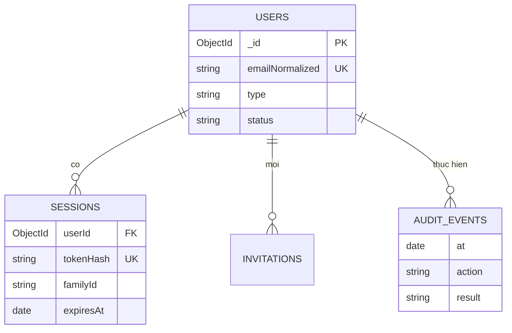
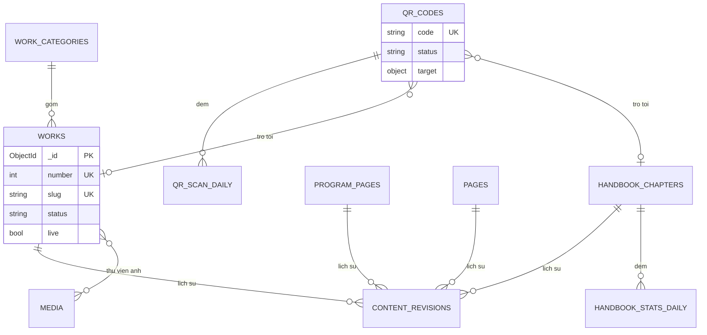
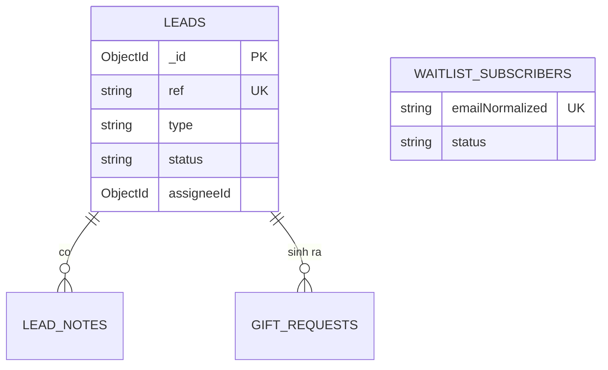
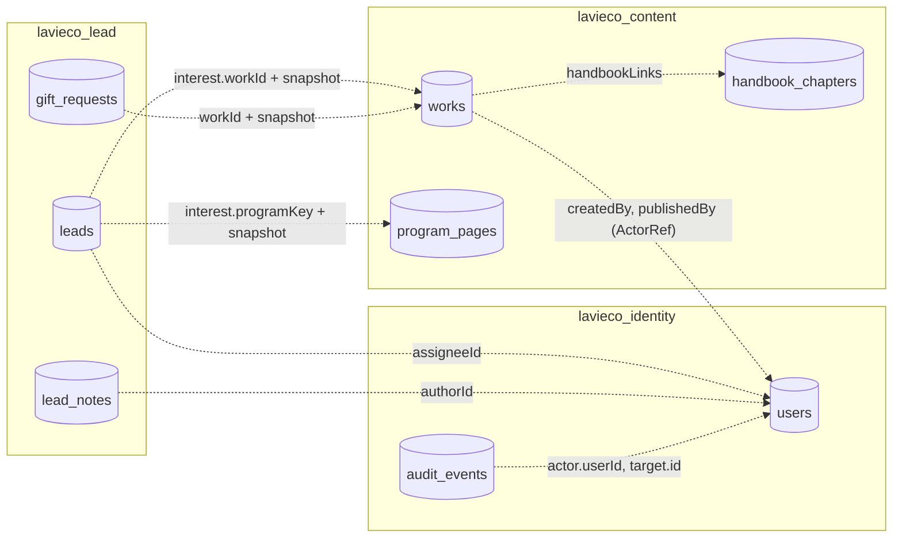

# LAVIECO: Thiết kế cơ sở dữ liệu

| | |
|---|---|
| **Phiên bản** | v0.3 (bản nháp, chờ duyệt) |
| **Cập nhật** | 20/09/2026 |
| **Phụ trách** | Võ Chí Trọng (CTO) |
| **Đối tượng đọc** | Đội phát triển, CISO |
| **Tài liệu liên quan** | `01-nghiep-vu.md` · `02-kien-truc.md` (đầu vào) · `04-cau-truc-ma-nguon.md` |

> **Phạm vi:** tài liệu mô tả **thiết kế dữ liệu**: chia database và collection thế nào, chỗ nào nhúng, chỗ nào tham chiếu, các trường chính, index, vòng đời và quyền riêng tư. **Nguồn sự thật cho từng trường và kiểu dữ liệu là Zod schema trong `packages/shared`**; tài liệu này không lặp lại toàn bộ trường để tránh lệch code. Khi hai bên khác nhau, Zod schema thắng và tài liệu này cần được sửa.
>
> Phạm vi chi tiết: **Giai đoạn 1** (3 database: identity, content, lead). Giai đoạn 2–3 chỉ nêu định hướng ở mục 9.

## Mục lục

1. [Nguyên tắc & quy ước](#1-nguyên-tắc--quy-ước)
2. [Tổng quan](#2-tổng-quan)
3. [Mẫu tài liệu có thể xuất bản (publishable)](#3-mẫu-tài-liệu-có-thể-xuất-bản-publishable)
4. [Database `lavieco_identity`](#4-database-lavieco_identity)
5. [Database `lavieco_content`](#5-database-lavieco_content)
6. [Database `lavieco_lead`](#6-database-lavieco_lead)
7. [Tham chiếu chéo, giao dịch & nhất quán](#7-tham-chiếu-chéo-giao-dịch--nhất-quán)
8. [Vòng đời dữ liệu, quyền riêng tư & sao lưu](#8-vòng-đời-dữ-liệu-quyền-riêng-tư--sao-lưu)
9. [Định hướng Giai đoạn 2–3](#9-định-hướng-giai-đoạn-23)
10. [Vận hành: migration, index, quyền truy cập](#10-vận-hành-migration-index-quyền-truy-cập)
11. [Truy vết use case → collection](#11-truy-vết-use-case--collection)
12. [Giả định & câu hỏi mở](#12-giả-định--câu-hỏi-mở)
13. [Lịch sử phiên bản](#13-lịch-sử-phiên-bản)

---

## 1. Nguyên tắc & quy ước

### 1.1 Nguyên tắc thiết kế

| # | Nguyên tắc | Nghĩa là |
|---|---|---|
| N1 | **Mỗi service một database** (từ P3 ở `02`) | Không service nào đọc/ghi database của service khác. Không có `$lookup` chéo database. |
| N2 | **Thiết kế theo cách truy cập** | Nhúng những gì luôn đọc cùng nhau; tách những gì phát triển không giới hạn hoặc có vòng đời riêng. |
| N3 | **Nhúng có giới hạn** | Mảng nhúng luôn có trần (ghi rõ ở từng collection), tránh tài liệu phình vô hạn và giới hạn 16 MB. |
| N4 | **Tham chiếu chéo service = ID + bản chụp (snapshot)** | Không có khóa ngoại. Dữ liệu lịch sử (lead) lưu bản chụp thứ khách đã thấy (tên tác phẩm, khoảng giá lúc gửi). |
| N5 | **Xóa mềm, lưu trữ thay vì xóa** (BR-04) | Chỉ xóa thật khi xử lý yêu cầu xóa dữ liệu cá nhân, hoặc dữ liệu tạm có TTL. |
| N6 | **Dữ liệu cá nhân tối thiểu** (BR-06, BR-08) | Không có trường nào chứa dữ liệu học sinh. Log/outbox không chứa PII. |
| N7 | **Bất biến ở những chỗ cần tin cậy** | Nhật ký hoạt động chỉ thêm; mã QR không đổi; phiên bản nội dung đã xuất bản không sửa. |

### 1.2 Quy ước đặt tên & kiểu

| Chủ đề | Quy ước |
|---|---|
| **Database** | `lavieco_<service>`: `lavieco_identity`, `lavieco_content`, `lavieco_lead`. Mỗi môi trường một cụm/instance riêng (không dùng hậu tố tên database để tách môi trường). |
| **Collection** | `snake_case`, số nhiều: `handbook_chapters`, `qr_codes`. |
| **Trường** | `camelCase`. Trường khóa ngoại kết thúc bằng `Id`: `leadId`, `assigneeId`. |
| **`_id`** | `ObjectId`. Ngoại lệ có chủ đích: `site_settings` (`_id` cố định `"public"`/`"system"`). |
| **Thời gian** | `Date` (UTC). Riêng trường phân nhóm theo ngày (`day`) là chuỗi `YYYY-MM-DD` tính theo **Asia/Ho_Chi_Minh** để báo cáo khớp lịch của đội. |
| **Tiền** | Số nguyên **đồng VND** (`{ min, max }`), không dùng số thực. Chưa có giao dịch ở GĐ1. |
| **Văn bản đa ngôn ngữ** | `LocalizedText = { vi: string, en?: string }`. Văn bản có định dạng dùng `LocalizedRichText = { vi: Span[], en?: Span[] }` (mảng span có dấu định dạng, **không phải HTML**). |
| **Tham chiếu người thao tác** | `ActorRef = { userId: ObjectId, name: string }` (tên là bản chụp lúc thao tác). |
| **Enum** | Chuỗi tiếng Anh `snake_case`, định nghĩa một lần trong `packages/shared`. Nhãn tiếng Việt do FE ánh xạ. |
| **Phiên bản tài liệu** | `schemaVersion: int` trên mọi tài liệu để nâng cấp dần khi đổi cấu trúc (mục 10.1). |
| **Khóa lạc quan** | Trường `revision: int` trên tài liệu có nhiều người sửa. Cập nhật kèm điều kiện `{ _id, revision: n }` và `$inc: { revision: 1 }`; không khớp thì trả `409 Conflict`. |
| **Mốc chung** | `createdAt`, `updatedAt` trên mọi collection nghiệp vụ. |
| **Chuẩn hóa để so khớp** | Email: bỏ khoảng trắng, chữ thường → `emailNormalized`. SĐT: chuẩn E.164 (mặc định VN) → `phoneNormalized`. Giữ cả giá trị gốc để hiển thị. |

## 2. Tổng quan

### 2.1 Danh sách collection Giai đoạn 1

| Database | Collection | Vai trò | Ước lượng quy mô* |
|---|---|---|---|
| **identity** | `users` | Tài khoản (GĐ1: admin) | chục |
| | `sessions` | Refresh token (xoay vòng) | chục–trăm (có TTL) |
| | `invitations` | Lời mời admin | ít (có TTL) |
| | `audit_events` | Nhật ký hoạt động, chỉ thêm | chục nghìn/năm |
| | `signing_keys` | Siêu dữ liệu khóa ký JWT (khóa công khai) | ít |
| **content** | `handbook_chapters` | Chương cẩm nang (chứa trang và khối) | chục |
| | `works` | Tác phẩm, kèm story card nhúng | chục–trăm |
| | `work_categories` | Nhóm sản phẩm | 3 |
| | `program_pages` | Mô tả công khai chương trình | 4 |
| | `pages` | Trang tĩnh do CMS quản trị (Trang chủ, Câu chuyện, Tác động, Hợp tác) | vài |
| | `qr_codes` | Mã QR và ánh xạ đích đến | trăm |
| | `qr_scan_daily` | Bộ đếm lượt quét theo mã × ngày | vài chục nghìn/năm |
| | `handbook_stats_daily` | Bộ đếm mở/đọc hết chương theo ngày | nghìn/năm |
| | `media` | Siêu dữ liệu ảnh | trăm–nghìn |
| | `content_revisions` | Bản chụp bất biến mỗi lần xuất bản | trăm–nghìn |
| | `site_settings` | Cấu hình site (2 tài liệu cố định) | 2 |
| | `consent_texts` | Các phiên bản nội dung đồng ý (bất biến) | ít |
| | `outbox` | Việc cần làm bất đồng bộ (audit, làm mới cache) | tạm thời (có TTL) |
| **lead** | `leads` | Lead (liên hệ hợp tác) | nghìn/năm |
| | `lead_notes` | Ghi chú nội bộ theo lead | nghìn/năm |
| | `gift_requests` | Yêu cầu quà tặng | trăm–nghìn/năm |
| | `waitlist_subscribers` | Danh sách chờ ra mắt | trăm–nghìn |
| | `outbox` | Việc cần làm bất đồng bộ (email, audit) | tạm thời (có TTL) |
| | `idempotency_keys` | Khóa chống gửi trùng | tạm thời (TTL 48 giờ) |
| | `counters` | Bộ đếm tuần tự (mã lead) | 1 |

\* Ước lượng giả định (AR1 ở `02`), chưa phải số đo. Với quy mô này **không cần sharding**; thiết kế tập trung vào đúng đắn và bảo mật, không phải cực đại hóa thông lượng.

### 2.2 Sơ đồ quan hệ theo database

**identity**



**content**



**lead**



## 3. Mẫu tài liệu có thể xuất bản (publishable)

Áp dụng cho `handbook_chapters`, `works`, `program_pages`, `pages`. Thay vì hai collection (nháp và xuất bản), mỗi tài liệu chứa **cả bản nháp lẫn bản đang chạy**:

```jsonc
{
  "_id": "ObjectId",
  "schemaVersion": 1,
  // --- trường ổn định (không cần duyệt theo nội dung) ---
  "slug": "vo-so-den-tu-dau",
  "slugHistory": ["ten-cu"],           // để chuyển hướng khi đổi slug
  "order": 2,
  // --- trạng thái quy trình của bản NHÁP ---
  "status": "draft",                    // draft | in_review | published | archived
  "live": true,                         // = có bản published VÀ chưa archived (để đánh index)
  "revision": 14,                       // khóa lạc quan
  // --- nội dung ---
  "draft":     { /* các trường nội dung */ "editorIds": ["ObjectId"], "updatedAt": "Date" },
  "published": { /* CÙNG hình dạng với draft */ "version": 3, "publishedAt": "Date", "publishedBy": { "userId": "ObjectId", "name": "..." } },
  "review": {                           // lần gửi duyệt gần nhất
    "submittedBy": { "userId": "ObjectId", "name": "..." }, "submittedAt": "Date",
    "decidedBy": null, "decidedAt": null, "decision": null, "comment": null
  },
  "archivedAt": null,
  "createdAt": "Date", "updatedAt": "Date"
}
```

**Vì sao thiết kế này (khớp `01` §8.3 và BR-05):**

| Nhu cầu | Cách đáp ứng |
|---|---|
| Chỉnh sửa mục đã xuất bản mà **bản đang chạy không đổi** | Sửa `draft`; `published` giữ nguyên tới khi duyệt. `status` quay về `draft` nhưng `live` vẫn `true`. |
| Xuất bản **nguyên tử** | Sao chép `draft` → `published` và tăng `version` trong **một** cập nhật (một tài liệu = một thao tác nguyên tử). |
| Người duyệt khác người soạn (BR-05) | `draft.editorIds` ghi mọi người đã sửa bản nháp hiện tại; `content-service` từ chối duyệt nếu người duyệt nằm trong `editorIds` hoặc là `review.submittedBy`. |
| Lịch sử, quay lui | Mỗi lần xuất bản ghi một bản chụp bất biến vào `content_revisions`. Quay lui = tạo `draft` mới từ một revision. |
| Đọc công khai nhanh | Truy vấn công khai chỉ lọc `live: true` và **chỉ lấy `published`**. |

**Quy tắc bắt buộc:**

1. **Không rò rỉ bản nháp.** Mọi endpoint công khai dùng phương thức repository riêng, projection rõ ràng chỉ lấy `published`, và có test hợp đồng khẳng định phản hồi công khai **không chứa** `draft`, `review`, `editorIds`.
2. `order`, `slug` của mục đang `live` chỉ đổi bởi người có `content:publish`, ghi audit (vì ảnh hưởng trực tiếp lên trang công khai).
3. Lưu trữ (`archived`) một mục **đang có mã QR hoạt động trỏ tới** phải cảnh báo và yêu cầu xác nhận. Người quét khi đó thấy trang thân thiện (BR-02).
4. Mục nhúng có trần: tối đa **50 trang/chương**, mỗi trang tối đa **200 khối** (đề xuất). Cảnh báo khi tài liệu vượt ~1 MB.

## 4. Database `lavieco_identity`

### 4.1 `users`

| Trường chính | Ghi chú |
|---|---|
| `email`, `emailNormalized` | `emailNormalized` **unique**. |
| `displayName` | Hiển thị trong audit, giao diện. |
| `type` | `staff` (GĐ1). GĐ2+: `member`, `partner`, `supplier`. |
| `roles` | Mảng khóa vai trò: `super_admin`, `content_editor`, `coordinator`, `auditor`. |
| `status` | `invited` · `active` · `locked` · `disabled`. |
| `passwordHash` | **Argon2id**. Không bao giờ trả ra API. |
| `mfa.totp` | `{ secretEnc, enabledAt, lastUsedStep }`. `secretEnc` là bí mật TOTP **mã hóa cấp ứng dụng** (khóa nằm ở kho bí mật, không ở DB). `lastUsedStep` chống dùng lại cùng một mã. |
| `mfa.recoveryCodes` | `[{ hash, usedAt }]`. Chỉ lưu băm; dùng một lần. |
| `failedLoginCount`, `lockedUntil`, `lastLoginAt` | Chống dò mật khẩu. |
| `createdBy`, `createdAt`, `updatedAt`, `revision` | |

**Vai trò và permission nằm trong code (`packages/shared`), không nằm trong DB.** Lý do: ở GĐ1 chỉ có 4 vai trò cố định, thay đổi phải qua review code và được audit qua lịch sử git; giảm bề mặt tấn công (không thể nâng quyền bằng cách sửa dữ liệu). Nếu sau này cần vai trò tùy biến, thêm collection `roles`.

**Index:** `{ emailNormalized: 1 }` unique · `{ status: 1 }`.

### 4.2 `sessions` (refresh token)

| Trường chính | Ghi chú |
|---|---|
| `userId`, `familyId` | `familyId` gom các token xoay vòng cùng một phiên đăng nhập. |
| `tokenHash` | Băm của refresh token; **không lưu token gốc**. |
| `createdAt`, `lastUsedAt`, `expiresAt` | |
| `rotatedAt`, `revokedAt`, `revokedReason` | Dùng lại token đã xoay vòng ⇒ nghi ngờ bị đánh cắp ⇒ **thu hồi cả `familyId`**. |
| `userAgentShort`, `ipTruncated` | Rút gọn, phục vụ hiển thị "thiết bị đăng nhập"; không lưu IP đầy đủ. |

**Index:** `{ tokenHash: 1 }` unique · `{ userId: 1, revokedAt: 1 }` · `{ familyId: 1 }` · **TTL** `{ expiresAt: 1 }` (`expireAfterSeconds: 0`).

### 4.3 `invitations`

Email mời gửi **trực tiếp** qua `NotifyModule` (`@lavieco/service-kit`), không qua outbox, vì đi kèm thao tác của người dùng ngay lúc đó; lỗi gửi hiển thị để admin gửi lại.

`email`/`emailNormalized`, `roles`, `tokenHash`, `invitedBy`, `expiresAt`, `acceptedAt`, `revokedAt`, `purgeAt`.
**Index:** `{ tokenHash: 1 }` unique · `{ emailNormalized: 1 }` · **TTL** `{ purgeAt: 1 }` (đặt `purgeAt` = hết hạn hoặc chấp nhận + 30 ngày).

### 4.4 `audit_events` (chỉ thêm)

```jsonc
{
  "_id": "ObjectId", "schemaVersion": 1,
  "at": "Date",
  "service": "lead-service",                 // nơi phát sinh
  "action": "lead.export",                   // <đối_tượng>.<hành_động>
  "actor": { "userId": "ObjectId", "email": "...", "roles": ["coordinator"] },
  "target": { "type": "lead_export", "id": "..." },
  "result": "success",                       // success | failure
  "context": { "requestId": "...", "ipTruncated": "...", "userAgentShort": "..." },
  "meta": { }                                // nhỏ, KHÔNG chứa PII (ví dụ số lượng bản ghi xuất)
}
```

- **Không sửa, không xóa** từ ứng dụng. Thực thi bằng **vai trò DB riêng** cho collection này chỉ có `find` + `insert` (mục 10.3).
- Ghi qua endpoint nội bộ của `identity-service`; các service khác đưa vào **outbox cục bộ** trước (mục 7.2) để không mất audit khi `identity-service` tạm ngưng.
- Danh sách hành động cần ghi: `02` §9.7.
- **Index:** `{ at: -1 }` · `{ "actor.userId": 1, at: -1 }` · `{ action: 1, at: -1 }` · `{ "target.type": 1, "target.id": 1, at: -1 }`.
- **Thời hạn lưu giữ:** chưa chốt (DQ2).

### 4.5 `signing_keys`

`kid` (`_id`), `publicJwk`, `status` (`active` · `retiring` · `retired`), `createdAt`, `activateAt`, `retireAt`. **Khóa riêng không nằm trong DB**; nằm ở kho bí mật. Khóa `retiring` vẫn xuất hiện trên JWKS để token cũ còn xác minh được trong thời gian sống tối đa của chúng.

## 5. Database `lavieco_content`

### 5.1 `handbook_chapters`

Dùng mẫu publishable (mục 3). **Chương là đơn vị xuất bản; trang và khối được nhúng.** Lý do: người đọc lấy cả chương một lần, xuất bản theo chương là nguyên tử, dữ liệu vừa (chục trang/chương).

Nội dung (`draft`/`published`):

| Trường | Ghi chú |
|---|---|
| `title`, `summary` | `LocalizedText`. |
| `coverMediaId` | Tham chiếu `media`. |
| `accessLevel` | `free` (GĐ1) · `member` · `premium` (BR-03). Có sẵn từ đầu để làm freemium (GĐ3). |
| `pages[]` | Mỗi trang: `{ id (UUID ổn định), order, title, blocks[] }`. |
| `pages[].blocks[]` | Mỗi khối: `{ id (UUID ổn định), type, data }`. |

**`id` của trang và khối là UUID ổn định qua các lần chỉnh sửa/xuất bản**: đây là điểm neo cho ghi chú và đánh dấu của người đọc (GĐ1 lưu ở trình duyệt, GĐ2 đồng bộ, xem 9.1).

**Loại khối (`blocks[].type`)**, kiểm tra bằng Zod theo từng loại:

| Loại | Dữ liệu chính | Ghi chú giao diện |
|---|---|---|
| `heading` | `text`, `level` | |
| `paragraph` | `content: LocalizedRichText` | Mảng span (đậm, nghiêng, liên kết); không HTML |
| `image` | `mediaId`, `alt`, `caption` | `alt` bắt buộc |
| `quote` | `text`, `attribution?` | Trích dẫn nổi bật |
| `callout` | `tone`, `content` | Khối nhấn mạnh |
| `infographic` | `mediaId`, `alt`, `caption?` | Sơ đồ minh họa |
| `reveal` | `prompt`, `content` | "Chạm để lật mở bí mật phế phẩm" |
| `note_area` | `label` | Vùng "Ghi chú của bạn" (nội dung ghi chú **không** lưu ở đây) |
| `related_works` | `workIds[]` | Gắn tác phẩm liên quan |

**Index:** `{ slug: 1 }` unique · `{ live: 1, order: 1 }` · `{ status: 1, updatedAt: -1 }`.

### 5.2 `works` (tác phẩm, kèm story card nhúng)

Dùng mẫu publishable. Nội dung (`draft`/`published`):

| Trường | Ghi chú |
|---|---|
| `title`, `description`, `material` | `LocalizedText`. |
| `categoryKey` | Tham chiếu `work_categories.key`. |
| `priceRange` | `{ min, max }` đồng VND; `priceNote` (ví dụ "kèm story card"). Đây là **khoảng giá niêm yết** (BR-10). |
| `boxContents[]` | "Trong hộp có gì": `{ key, title, description }` (sản phẩm chính, story card, bao bì kraft, mã QR số hóa, ...). |
| `gallery[]` | `{ mediaId, alt, order, isPrimary }`. |
| `storyCard` | **Nhúng 1:1**: `{ story, year, origin, project }`. |
| `handbookLinks[]` | Danh sách `{ chapterId, pageId? }` dẫn về Cẩm nang. |
| `relatedWorkIds[]` | Tác phẩm liên quan. |

Trường gốc: `number` (N°, số nguyên, **unique**; ý nghĩa xem DQ5), `slug`, `categoryKey` (bản sao ở gốc để lập chỉ mục).

**Vì sao nhúng story card?** Quan hệ 1:1, luôn đọc cùng tác phẩm, xuất bản nguyên tử cùng nhau. Nếu sau này story card trở thành bộ sưu tập theo chủ đề độc lập (Giai đoạn 2 trong tài liệu định vị), sẽ tách ra collection riêng bằng một migration.

**Kiểm tra khi xuất bản (BR-01):** tác phẩm phải có `storyCard` đầy đủ và ít nhất một `handbookLinks`. Thiếu thì từ chối xuất bản.

**Index:** `{ slug: 1 }` unique · `{ number: 1 }` unique · `{ live: 1, categoryKey: 1, number: 1 }` (danh sách theo nhóm) · `{ status: 1, updatedAt: -1 }`.

### 5.3 `work_categories`

`key` (`keychain` · `decor` · `gift_combo`), `name: LocalizedText`, `order`, `createdAt`, `updatedAt`. Ba tài liệu, nạp bằng migration. Sửa cần `content:publish`. **Index:** `{ key: 1 }` unique.

### 5.4 `program_pages`

Dùng mẫu publishable. **Đây là mô tả công khai** (khác `programs` vận hành ở GĐ2 của `program-service`).

Gốc: `key` (slug, dùng làm mã chương trình liên kết), `tier` (1–4, thứ tự "bốn nấc thang"). Nội dung: `title`, `tagline`, `duration` (`LocalizedText`), `audience`, `sections[]` (`{ key, title, body }`, dạng thẻ mở rộng), `pricePolicy` (`contact` hoặc `listed`; xem Q8 ở `01`).
**Index:** `{ key: 1 }` unique · `{ live: 1, tier: 1 }`.

### 5.5 `pages`

Dùng mẫu publishable. Trang tĩnh: `key` ∈ `home`, `story`, `impact`, `contact`. Nội dung: `seo { title, description, ogMediaId }` và `sections[]` (`{ key, blocks[] }`, dùng lại các loại khối ở 5.1).

> **Đội ngũ không thuộc `pages`.** Thông tin và ảnh sáu thành viên là **dữ liệu tĩnh trong mã nguồn** của `web` (`features/team/constants`, ảnh ở `public/images/team/`; `04` §5.1), đổi bằng Pull Request.

> **Bố cục do code quyết định, chữ và ảnh do dữ liệu quyết định.** Landing page có nhiều phần bố cục cố định; `pages` chỉ chứa nội dung điền vào các phần đó, không phải trình dựng trang tự do.

**Index:** `{ key: 1 }` unique.

### 5.6 `qr_codes`

```jsonc
{
  "_id": "ObjectId", "schemaVersion": 1,
  "code": "k7m2q9xw4t",                       // BẤT BIẾN, ngẫu nhiên, 10 ký tự Crockford Base32
  "label": "Combo Sage Elements, lô 1",       // ghi chú nội bộ
  "workId": "ObjectId",                        // sản phẩm mà QR được in lên (không bắt buộc)
  "target": { "type": "work", "refId": "ObjectId", "pageId": null },   // work | chapter | page
  "status": "active",                          // active | revoked
  "targetHistory": [ { "at": "Date", "by": { "userId": "...", "name": "..." }, "from": { }, "to": { } } ],   // tối đa 20 gần nhất
  "revokedAt": null, "revokedBy": null, "revokeReason": null,
  "createdBy": { "userId": "ObjectId", "name": "..." },
  "createdAt": "Date", "updatedAt": "Date", "revision": 3
}
```

- **`code` không bao giờ được cập nhật** (chặn ở tầng ứng dụng và có thể thêm `$jsonSchema` validator). 10 ký tự Crockford Base32 ≈ 50 bit; với vài trăm mã, việc dò đoán toàn bộ là không khả thi. Không dùng ký tự dễ nhầm (`I`, `L`, `O`, `U`).
- **Không denormalize đường dẫn đích** vào tài liệu QR (dễ cũ khi đổi slug/gỡ nội dung). Phân giải làm hai truy vấn theo index (QR → đối tượng đích) và trả `{ status, canonicalPath }` với `status` ∈ `ok` · `not_published` · `revoked` · `not_found`.
- **Bản chụp ánh xạ** ra object storage sau mỗi thay đổi (tạo, đổi đích, thu hồi): xem 7.3.

**Index:** `{ code: 1 }` unique · `{ "target.type": 1, "target.refId": 1 }` (tìm mọi QR trỏ tới một đối tượng, dùng cho cảnh báo khi lưu trữ) · `{ status: 1 }`.

### 5.7 Bộ đếm

**`qr_scan_daily`**: `{ code, day, count }`. Cập nhật nguyên tử, không ghi từng sự kiện:

```js
db.qr_scan_daily.updateOne(
  { code, day },                               // day = 'YYYY-MM-DD' theo Asia/Ho_Chi_Minh
  { $inc: { count: 1 }, $setOnInsert: { createdAt: now } },
  { upsert: true }
)
```

- **Không lưu IP, không lưu định danh cá nhân** (theo `02` §7.1).
- Nếu một mã quét cực dày gây tranh chấp trên một tài liệu, chia thêm chiều `bucket` (giờ hoặc số ngẫu nhiên 0–N) rồi cộng khi báo cáo. Chưa cần ở quy mô hiện tại.
- **Index:** `{ code: 1, day: 1 }` unique · `{ day: 1 }`. Giữ vô thời hạn (rất nhỏ).

**`handbook_stats_daily`**: `{ chapterId, day, opens, completions }`. Phục vụ chỉ số "tỷ lệ quét → đọc hết chương" (`01` §1.4). Do đếm ẩn danh, **đây là tỷ lệ gần đúng theo ngày**, không nối được từng lượt quét với từng lượt đọc. Đánh đổi có chủ đích để không cần định danh người dùng.
**Index:** `{ chapterId: 1, day: 1 }` unique.

### 5.8 `media`

> `media` chỉ dành cho ảnh **do đội nội dung tải lên qua `admin`**. Ảnh tĩnh cứng trong mã nguồn (logo, ảnh thành viên, hình trang trí) nằm ở `apps/web/public/images/` và **không** có bản ghi trong `media`.

| Trường chính | Ghi chú |
|---|---|
| `kind` | `image` (GĐ1). **Không nhận SVG do người dùng tải lên** (rủi ro script); SVG chỉ do hệ thống sinh (mã QR). |
| `original` | `{ mime, width, height, bytes, sha256 }`. Ảnh gốc giữ ở bucket riêng tư. |
| `variants[]` | `{ name, width, height, format, storageKey, bytes }`, ví dụ `w480.webp`. |
| `defaultAlt`, `caption`, `credit` | `credit` = tác giả/nguồn (bản quyền ảnh). |
| `exifStripped` | Luôn `true`; đã xóa metadata (có thể chứa tọa độ GPS). |
| `status` | `active` · `deleted` (xóa mềm). |
| `uploadedBy` | `ActorRef`. |

- **Vòng đời:** chỉ xóa thật (khỏi object storage) qua tác vụ dọn định kỳ đối với media `deleted` và không còn được tham chiếu. Việc phát hiện tham chiếu là quét theo lịch, không duy trì bộ đếm tham chiếu (tránh phức tạp và lệch).
- **Index:** `{ sha256: 1 }` unique (lọc `status: active`, chống tải trùng) · `{ createdAt: -1 }`.

### 5.9 `content_revisions`

Bản chụp bất biến khi xuất bản: `{ entityType, entityId, version, snapshot, publishedAt, publishedBy, reason? }`.
**Index:** `{ entityType: 1, entityId: 1, version: -1 }` unique. Giữ vô thời hạn (dung lượng nhỏ). Không có API sửa/xóa.

### 5.10 `site_settings`

Hai tài liệu cố định, tách theo **mức quyền**:

| `_id` | Nội dung | Quyền ghi |
|---|---|---|
| `"public"` | `contact` (email, điện thoại, địa chỉ, giờ mở cửa), `social`, `banner`, thương hiệu phụ | `site:write` |
| `"system"` | `comingSoon { enabled, headline, message, expectedLaunch? }`, cờ hệ thống | `site:system` |

Tách thành hai tài liệu để **quyền được kiểm tra ở mức tài liệu**, không phải ở mức từng trường. Có `revision` chống ghi đè; mọi thay đổi ghi audit.

### 5.11 `consent_texts`

Các phiên bản nội dung đồng ý xử lý dữ liệu, **bất biến**: `{ key, version, text: LocalizedText, publishedAt, publishedBy }`. Ví dụ `key: "lead_form"`, `"waitlist"`. Mỗi lead/đăng ký lưu `{ key, version }` mình đã đồng ý; muốn đổi nội dung thì tạo **phiên bản mới**, không sửa bản cũ. Ghi cần `site:system` (nội dung mang tính pháp lý).
**Index:** `{ key: 1, version: -1 }` unique.

### 5.12 `outbox` (content)

Việc bất đồng bộ **ghi cùng giao dịch** với thay đổi dữ liệu, xem 7.2.

## 6. Database `lavieco_lead`

### 6.1 `leads`

```jsonc
{
  "_id": "ObjectId", "schemaVersion": 1,
  "ref": "LD-000123",                          // mã dễ đọc để nói qua điện thoại (từ counters)
  "source": { "channel": "web_form", "formKey": "collab", "path": "/hop-tac",
              "utm": { "source": null, "medium": null, "campaign": null } },
  "groupSubmitted": "school",                  // nhóm khách chọn trên form (giữ nguyên để truy vết)
  "type": "partner",                           // partner | supplier | general (khớp 01 §4.3)
  "partnerType": "school",                     // school | enterprise | tourism | null
  "contact": {
    "name": "...", "organization": "...",
    "phone": "0901 234 567", "phoneNormalized": "+84901234567",
    "email": "A@Example.com", "emailNormalized": "a@example.com"
  },
  "search": { "key": "nguyen van a truong thpt ..." },   // chữ thường, bỏ dấu, đ → d
  "message": "...",
  "interest": {                                // thứ khách quan tâm, kèm BẢN CHỤP
    "programKey": "workshop-trai-nghiem", "programSnapshot": { "title": "Workshop trải nghiệm" },
    "workId": null, "workSnapshot": null
  },
  "status": "new",                             // new | contacted | negotiating | won | lost | archived
  "outcome": null,                             // won | lost (giữ lại khi archived)
  "assigneeId": null,
  "firstContactedAt": null, "lastActivityAt": "Date", "nextFollowUpAt": null,
  "statusHistory": [ { "from": null, "to": "new", "at": "Date", "by": null, "note": null } ],   // tối đa 100
  "submissions": [ { "at": "Date", "formKey": "collab", "message": "...", "interest": { } } ],   // tối đa 20; các lần gửi sau (BR-07)
  "submissionCount": 1,
  "consent": { "key": "lead_form", "version": 2, "acceptedAt": "Date" },
  "mergedIntoId": null,
  "redaction": null,                           // { at, reason: 'retention' | 'subject_request' }
  "createdBy": null,                           // null = từ form; ActorRef nếu Coordinator tạo tay
  "createdAt": "Date", "updatedAt": "Date", "archivedAt": null, "revision": 1
}
```

**Quyết định thiết kế**

| Chủ đề | Quyết định |
|---|---|
| **Phân loại** | `groupSubmitted` (khách chọn) tách khỏi `type`/`partnerType` (đội phân loại). Coordinator đổi lại `type` khi xử lý mà không mất thông tin gốc. Bảng ánh xạ ở `01` §4.3. |
| **Lịch sử trạng thái** | Nhúng (`statusHistory`, tối đa 100): ít và luôn cần cùng lead. Cho phép tính "thời gian từ khi nhận đến lần liên hệ đầu tiên" (`01` §1.4). |
| **Gửi lại nhiều lần (BR-07)** | Trùng SĐT hoặc email chuẩn hóa trong **cửa sổ thời gian** (cấu hình, mặc định đề xuất 30 ngày; DQ6) thì **thêm vào `submissions`** của lead cũ và cập nhật `lastActivityAt`, không tạo lead mới. |
| **Lưu trữ** | `status: archived` + `outcome` giữ kết quả cuối (`won`/`lost`). Không xóa cứng. |
| **Gộp lead thủ công** | Lead phụ: `status: archived`, `mergedIntoId` trỏ lead chính. |
| **Bản chụp** | `programSnapshot`, `workSnapshot` lưu thứ khách thấy lúc gửi (tên, N°, khoảng giá), để hồ sơ lịch sử không đổi khi nội dung sau này thay đổi. |
| **Đồng ý** | Chỉ lưu `{ key, version, acceptedAt }`; **không lưu IP/User-Agent**. |
| **Ẩn danh hóa** | `redaction` đánh dấu đã xóa PII (mục 8.2). Cấu trúc và số liệu tổng hợp vẫn giữ. |

**Trần nhúng:** `statusHistory` ≤ 100, `submissions` ≤ 20 (vượt: chỉ tăng `submissionCount`, giữ bản mới nhất).

**Index**

| Index | Phục vụ |
|---|---|
| `{ ref: 1 }` unique | Tra theo mã |
| `{ status: 1, type: 1, createdAt: -1 }` | Danh sách lọc theo trạng thái và loại (màn hình chính của Coordinator) |
| `{ assigneeId: 1, status: 1, createdAt: -1 }` | "Lead của tôi" |
| `{ "contact.phoneNormalized": 1, createdAt: -1 }` (partial: có trường) | Phát hiện trùng, tìm khi xử lý yêu cầu xóa dữ liệu |
| `{ "contact.emailNormalized": 1, createdAt: -1 }` (partial: có trường) | Như trên |
| `{ "search.key": 1 }` | Tìm theo tiền tố tên/đơn vị **không dấu** |
| `{ createdAt: -1 }` | Danh sách mặc định |
| `{ lastActivityAt: 1 }` (partial: `status` chưa kết thúc) | Cảnh báo lead lâu chưa xử lý (UC-21) |

> **Tìm kiếm tiếng Việt:** index text của MongoDB gộp được dấu (ví dụ `ă`, `ê`, `ô`) nhưng **không gộp `đ` thành `d`**, nên "Đà Nẵng" không khớp "Da Nang". Vì vậy dùng trường `search.key` đã chuẩn hóa ở tầng ứng dụng (chữ thường, bỏ dấu, `đ` → `d`) rồi tìm theo tiền tố. Khi cần tìm toàn văn tốt hơn, cân nhắc Atlas Search sau.

### 6.2 `lead_notes`

`{ leadId, authorId, body, createdAt, editedAt? }`. Tách collection vì số ghi chú không giới hạn và do nhiều người viết.
**Index:** `{ leadId: 1, createdAt: -1 }`. Ghi chú **không** chứa PII ngoài những gì người viết tự nhập; hướng dẫn nhập ghi chú ở giao diện admin.

### 6.3 `gift_requests`

| Trường chính | Ghi chú |
|---|---|
| `leadId` | Mọi yêu cầu gắn với một lead. |
| `kind` | `personal` ("Chọn quà này") · `bulk` ("Đặt số lượng lớn"). |
| `workId`, `workSnapshot` | Tác phẩm quan tâm, kèm bản chụp (N°, tên, nhóm, khoảng giá). |
| `quantity`, `occasion`, `neededBy?`, `notes` | |
| `status` | `open` · `closed` (kèm `closedReason`). GĐ2: `order-service` nhận và chuyển thành đơn. |

**Index:** `{ leadId: 1 }` · `{ status: 1, createdAt: -1 }`.

### 6.4 `waitlist_subscribers`

| Trường chính | Ghi chú |
|---|---|
| `email`, `emailNormalized` | `emailNormalized` **unique**. Gửi lại email đã có: không tạo mới, phản hồi giống nhau (`01` UC-07). |
| `status` | `subscribed` · `unsubscribed`. |
| `consent` | `{ key: "waitlist", version, acceptedAt }`. |
| `subscribedAt`, `confirmedAt?`, `unsubscribedAt?`, `notifiedAt?` | `confirmedAt` chỉ dùng nếu bật xác nhận 2 bước (DQ3). |
| `source` | `{ path }`. |

- **Đường hủy đăng ký** dùng liên kết có **chữ ký HMAC** (không cần lưu token).
- Khi hủy: giữ `emailNormalized` dạng **băm** trong danh sách loại trừ để không gửi lại nhầm (quyền của chủ thể vẫn được tôn trọng: không giữ email gốc).
- **Index:** `{ emailNormalized: 1 }` unique · `{ status: 1, subscribedAt: -1 }`.

### 6.5 `outbox`, `idempotency_keys`, `counters`

| Collection | Thiết kế |
|---|---|
| **`outbox`** | `{ type, payload, status, attempts, nextAttemptAt, lockedUntil, lastError, dedupeKey?, createdAt, sentAt?, purgeAt? }`. `type`: `notify.email`, `audit.record`. **`payload` chỉ chứa ID, không chứa PII**; tiến trình gửi nạp lead từ DB lúc gửi. Trạng thái: `pending` → `processing` → `sent` hoặc `failed` (thử lại theo backoff) → `dead` (quá số lần thử, **báo động**). Index: `{ status: 1, nextAttemptAt: 1 }`; **TTL** `{ purgeAt: 1 }` (đặt khi `sent`, giữ ~30 ngày). |
| **`idempotency_keys`** | `{ _id: "<scope>:<key>", requestHash, result: { leadId, statusCode }, createdAt, expiresAt }`. **TTL** `{ expiresAt: 1 }` (≈ 48 giờ). Cùng khóa khác nội dung yêu cầu ⇒ từ chối `422`. |
| **`counters`** | `{ _id: "lead", seq }`, cập nhật bằng `$inc` **trong cùng giao dịch** tạo lead. |

## 7. Tham chiếu chéo, giao dịch & nhất quán

### 7.1 Bản đồ tham chiếu chéo service



Nét đứt = **tham chiếu logic, không ràng buộc ở DB**. Hệ quả và xử lý:

| Tình huống | Xử lý |
|---|---|
| Tác phẩm bị gỡ sau khi có lead trỏ tới | Lead giữ `workSnapshot`, hồ sơ vẫn nguyên nghĩa. Giao diện admin hiển thị "tác phẩm không còn xuất bản". |
| Người dùng admin bị khóa/rời đội khi đang được gán lead | Có báo cáo "lead của người không còn hoạt động" để gán lại. Không tự động gán. |
| Cần tên người phụ trách khi hiển thị danh sách lead | `admin` gọi `lead-service` rồi gọi `identity-service` một lần cho cả trang để lấy tên (API composition), không truy vấn chéo DB. |
| `ActorRef.name` (bản chụp tên) lỗi thời | Chấp nhận: đó là tên **tại thời điểm thao tác**, đúng ý nghĩa lịch sử. |

### 7.2 Giao dịch (chỉ trong một service)

Yêu cầu **replica set** (`02` §8.1). Các thao tác dùng giao dịch nhiều tài liệu:

| Thao tác | Nằm trong cùng một giao dịch |
|---|---|
| Tạo lead | `leads` + `counters` + `idempotency_keys` + `outbox` (`notify.email`, `audit.record`) |
| Gộp lead trùng | cập nhật `leads` + `outbox` |
| Xuất bản nội dung | cập nhật thực thể + `content_revisions` + `outbox` (`audit.record`, `web.revalidate`) |
| Tạo/đổi đích/thu hồi QR | `qr_codes` + `outbox` (`audit.record`, `qr.snapshot`) |

**Xuyên service = nhất quán cuối cùng** qua outbox (ví dụ lead ghi xong, audit tới `identity-service` sau vài giây). Không dùng giao dịch phân tán.

### 7.3 Outbox và bản chụp ánh xạ QR

- `outbox` của `content-service` và `lead-service` có cùng cấu trúc (dùng `OutboxModule` của `@lavieco/service-kit`), tiến trình xử lý nằm trong chính service (thăm dò theo chu kỳ ngắn, khóa việc bằng `findOneAndUpdate` để nhiều instance không xử lý trùng).
- `type: qr.snapshot`: sau mỗi thay đổi QR, ghi bản chụp toàn bộ ánh xạ `{ code, status, target, updatedAt }` thành **tệp JSON bất biến có phiên bản** ở object storage (`qr-mapping/<thời điểm>-<số thứ tự>.json`), thử lại tới khi thành công. Đây là bảo hiểm cho BR-02 khi database hỏng (`02` §7.1).
- `type: web.revalidate`: gọi webhook làm mới cache của `web`; thất bại thì thử lại vài lần rồi bỏ (ISR có chu kỳ làm mới làm lưới an toàn).

## 8. Vòng đời dữ liệu, quyền riêng tư & sao lưu

### 8.1 Bảng lưu giữ

| Dữ liệu | Lưu bao lâu | Cơ chế |
|---|---|---|
| `sessions` | Tới `expiresAt` | TTL |
| `invitations` | Hết hạn/chấp nhận + 30 ngày | TTL `purgeAt` |
| `idempotency_keys` | ≈ 48 giờ | TTL |
| `outbox` (đã gửi) | ≈ 30 ngày | TTL `purgeAt` |
| `outbox` (`dead`) | Tới khi xử lý tay | Giữ để điều tra, có cảnh báo |
| `audit_events` | Chưa chốt (DQ2) | Chỉ thêm |
| `leads` | Chưa chốt (AQ3 ở `02`) | Ẩn danh hóa sau thời hạn (8.2) |
| `waitlist_subscribers` | Tới khi hủy hoặc sau khi thông báo ra mắt + thời hạn đội quy định | Xóa, giữ băm vào danh sách loại trừ nếu đã hủy |
| `qr_scan_daily`, `handbook_stats_daily` | Vô thời hạn | Tổng hợp ẩn danh, rất nhỏ |
| `content_revisions`, `qr_codes` | Vô thời hạn | Bất biến / lưu trữ |

### 8.2 Ẩn danh hóa & yêu cầu xóa dữ liệu (BR-06, UC-29)

Quy trình một hàm dùng chung cho **hết thời hạn lưu giữ** và **yêu cầu của chủ thể dữ liệu**:

1. Tìm bản ghi theo `phoneNormalized`/`emailNormalized` (đã có index) trong `leads`, `waitlist_subscribers`.
2. Với `leads`: xóa/đặt `null` `contact.*`, `search.key`, `message`, nội dung trong `submissions[]`; giữ `type`, `status`, `outcome`, mốc thời gian, `interest` (không chứa PII) để thống kê. Ghi `redaction { at, reason }`.
3. `lead_notes` của lead đó: **xóa nội dung** hoặc xem xét thủ công (ghi chú do người viết tự nhập, có thể chứa PII).
4. `gift_requests`: xóa `notes` chứa dữ liệu cá nhân.
5. Ghi `audit_events` (`privacy.redact`), **không ghi PII** vào `meta`.
6. Lưu ý: dữ liệu vẫn còn trong **bản sao lưu** tới khi bản sao lưu đó luân chuyển hết chu kỳ; ghi rõ điều này trong chính sách quyền riêng tư.

### 8.3 Bí mật lưu ở DB

| Dữ liệu | Cách bảo vệ |
|---|---|
| Mật khẩu | Argon2id, chỉ lưu băm |
| Bí mật TOTP | Mã hóa cấp ứng dụng, khóa ở kho bí mật |
| Mã khôi phục 2FA, refresh token, token mời | Chỉ lưu **băm**; không thể khôi phục giá trị gốc |
| Khóa ký JWT | **Không** ở DB (chỉ khóa công khai) |
| PII trong `leads` (tên, SĐT, email) | Dạng rõ trong DB, dựa vào mã hóa lưu trữ của dịch vụ/đĩa + kiểm soát truy cập + audit. Cân nhắc mã hóa cấp trường (CSFLE) khi quy mô hoặc yêu cầu tuân thủ tăng. |

### 8.4 Sao lưu

Theo `02` §8.3 (sao lưu hàng ngày, diễn tập khôi phục). Bổ sung ở mức dữ liệu:

- **Thứ tự ưu tiên khôi phục:** `qr_codes` và `content` trước (để QR phục vụ lại được), rồi `lead`, rồi `identity`.
- Sau khôi phục, chạy kiểm tra tính nhất quán nhẹ: mọi QR `active` trỏ tới đối tượng tồn tại; chỉ số `live` khớp `published`.

## 9. Định hướng Giai đoạn 2–3

Chưa thiết kế chi tiết; nêu để đảm bảo thiết kế GĐ1 không cản đường.

| GĐ | Service | Collection dự kiến | Nguyên tắc khi thiết kế |
|---|---|---|---|
| 2 | `program-service` | `programs`, `sessions`, `registrations`, `impact_records`, `impact_reports` | Chỉ lưu **số lượng** học sinh (BR-08). Báo cáo tác động có trạng thái duyệt (BR-09) và nguồn dẫn chứng. |
| 2 | `order-service` | `orders`, `quotes`, `payments` | Tiền = số nguyên VND; đơn giữ **bản chụp** giá và sản phẩm; nhận `gift_request` đã chuyển. |
| 2 | `notification-service` | `templates`, `deliveries`, `preferences` | Tiêu thụ sự kiện từ outbox; log gửi không chứa PII. |
| 2 | `identity-service` | thêm hồ sơ Member, liên kết Partner | `type` mở rộng; kiểm tra quyền theo `ownerId`. |
| 3 | `rewards-service` | `point_ledger`, `entitlements` | **Sổ cái chỉ thêm**; số dư được tính từ sổ cái (hoặc bản cache có kiểm tra lại). |
| 3 | `collection-service` | `suppliers`, `pickups`, `volumes` | Khối lượng vỏ đưa vào số liệu tác động qua sự kiện. |

### 9.1 Đồng bộ ghi chú/đánh dấu của người đọc (GĐ2)

Đề xuất: collection **`reader_states`** thuộc `content-service` (không thuộc `identity`), khóa theo `userId`, chứa ghi chú, đánh dấu, tiến độ. Lý do: dữ liệu neo vào `pageId`/`blockId` của cẩm nang mà `content-service` hiểu; quyền riêng tư (BR-11) thực thi bằng `ownerId` ở service. Mỗi bản ghi có **ID sinh phía client (UUID)**, `updatedAt`, cờ xóa mềm để gộp từ IndexedDB theo *last-write-wins* từng bản ghi. Điều này đã được phản ánh ở `02` §4.2.

## 10. Vận hành: migration, index, quyền truy cập

### 10.1 Migration

- Công cụ có phiên bản (ví dụ `migrate-mongo`), thư mục riêng mỗi service, tên `YYYYMMDDHHmm-mo-ta`. Mỗi migration **idempotent** (chạy lại an toàn).
- Chạy ở pipeline triển khai **trước** khi phát hành ứng dụng mới (`02` §12.4), bởi tài khoản `migrator`.
- **Mẫu mở rộng – co lại (expand/contract)** cho thay đổi phá vỡ, để quay lui được một phiên bản: (1) thêm trường/collection mới; (2) ghi cả hai; (3) đọc từ mới; (4) backfill; (5) ở lần phát hành sau mới xóa trường cũ.
- `schemaVersion` trên tài liệu cho phép nâng cấp **lười** (khi đọc/ghi) với các thay đổi nhỏ, hoặc backfill hàng loạt bằng migration.
- **Dữ liệu khởi tạo (seed):** `work_categories` (3), `site_settings` (mặc định, `comingSoon.enabled = true`), `consent_texts` (phiên bản 1). **Tài khoản Super Admin đầu tiên tạo bằng lệnh khởi tạo một lần**, dùng mã dùng một lần cấp qua biến môi trường và **bắt buộc thiết lập 2FA ở lần đăng nhập đầu**. Tuyệt đối không có mật khẩu mặc định trong seed.

### 10.2 Index

- Khai báo trong schema code, **tắt `autoIndex` ở production**; index tạo/đổi qua migration để kiểm soát thời điểm và tải.
- Đặt tên có hệ thống: `idx_<collection>_<các_trường>`; index unique thêm hậu tố `_uq`.
- Thiết kế theo quy tắc **Bằng – Sắp xếp – Khoảng (ESR)**. Mọi truy vấn danh sách trong ứng dụng phải có index phục vụ; kiểm tra bằng `explain` ở CI với dữ liệu mẫu cho các truy vấn chính.
- Index partial dùng điều kiện được hỗ trợ (bằng nhau, `$exists: true`, so sánh khoảng). Vì `$ne` không dùng được trong điều kiện partial, mẫu publishable có trường boolean `live` để lọc.
- Email: dùng trường chuẩn hóa `emailNormalized` unique thay vì collation, đơn giản và dễ kiểm chứng.

### 10.3 Tài khoản & quyền truy cập DB

| Tài khoản | Database | Quyền |
|---|---|---|
| `svc_identity` | `lavieco_identity` | Vai trò tùy biến: `find`, `insert`, `update`, `remove` trên các collection; **riêng `audit_events` chỉ `find` + `insert`** |
| `svc_content` | `lavieco_content` | Vai trò tùy biến: `find`, `insert`, `update`, `remove` |
| `svc_lead` | `lavieco_lead` | Vai trò tùy biến: `find`, `insert`, `update`, `remove` |
| `migrator` | cả ba | Tạo/sửa index và collection; **chỉ dùng trong pipeline**, thông tin xác thực không nằm ở service chạy |
| `backup` | cả ba | Chỉ đọc |

Không dùng vai trò `readWrite` dựng sẵn cho ứng dụng vì nó gồm cả quyền quản lý index và xóa collection; ứng dụng không cần quyền đó khi chạy. Mọi tài khoản dùng mật khẩu/khóa riêng, lưu ở kho bí mật, giới hạn địa chỉ mạng được phép kết nối.

### 10.4 Truy cập dữ liệu trong code

- Tầng **repository** duy nhất chạm DB; không trả tài liệu Mongoose ra ngoài, luôn ánh xạ sang DTO đã kiểm tra bằng Zod.
- Truy vấn công khai đi qua repository riêng với projection rõ ràng (mục 3, quy tắc 1).
- Mọi truy vấn danh sách phân trang theo **con trỏ** (`_id` hoặc `createdAt` kèm `_id` để ổn định), không dùng `skip` cho dữ liệu lớn.
- Cập nhật nhiều người sửa: dùng `revision` (mục 1.2).

## 11. Truy vết use case → collection

| Use case | Collection đọc/ghi |
|---|---|
| UC-01 Quét QR | đọc `qr_codes`, `works`/`handbook_chapters`; ghi `qr_scan_daily` |
| UC-02 Đọc cẩm nang | đọc `handbook_chapters`; ghi `handbook_stats_daily` (ghi chú ở trình duyệt) |
| UC-03 Bộ sưu tập | đọc `works`, `work_categories`, `media` |
| UC-04 Yêu cầu quà tặng | ghi `leads`, `gift_requests`, `idempotency_keys`, `outbox`, `counters`; đọc `consent_texts` (qua `web`) |
| UC-05 / 06 Form hợp tác, đăng ký khóa học | ghi `leads`, `idempotency_keys`, `outbox`, `counters`; đọc `program_pages` (qua `web`) |
| UC-07 Nhận tin khi ra mắt | ghi `waitlist_subscribers`; đọc `consent_texts` |
| UC-08 Trang giới thiệu | đọc `pages`, `media` |
| UC-21 Quản lý lead | đọc/ghi `leads`, `lead_notes`, `gift_requests`; ghi `outbox`; đọc `users` (qua `identity-service`) |
| UC-22 Soạn & xuất bản cẩm nang | đọc/ghi `handbook_chapters`, `content_revisions`, `media`, `outbox` |
| UC-23 Tác phẩm, story card, QR | đọc/ghi `works`, `qr_codes`, `content_revisions`, `media`, `outbox`; ghi object storage |
| UC-27 Người dùng & phân quyền | đọc/ghi `users`, `invitations`, `sessions`, `audit_events` |
| UC-28 Cấu hình site | đọc/ghi `site_settings`, `consent_texts`, `outbox` |

## 12. Giả định & câu hỏi mở

### 12.1 Giả định

| Mã | Giả định |
|---|---|
| **AD1** | Khối lượng dữ liệu nhỏ (mục 2.1), không cần sharding; cụm MongoDB là replica set. |
| **AD2** | Zod schema trong `packages/shared` là nguồn sự thật; tài liệu này chỉ mô tả thiết kế. |
| **AD3** | Vai trò và permission nằm trong code (4 vai trò cố định ở GĐ1). |
| **AD4** | `N°` là mã số bộ sưu tập, duy nhất (A4 ở `01`). |
| **AD5** | Ghi chú/đánh dấu người đọc chưa có ở DB trong GĐ1 (lưu ở trình duyệt). |

### 12.2 Câu hỏi mở

| Mã | Câu hỏi | Ảnh hưởng |
|---|---|---|
| **DQ1** | Thời hạn lưu giữ lead trước khi ẩn danh hóa (trùng AQ3 ở `02`)? | 8.1, 8.2 |
| **DQ2** | Thời hạn lưu giữ `audit_events`? (Đề xuất tối thiểu vài năm; hỏi CISO.) | 4.4 |
| **DQ3** | Đăng ký nhận tin có **xác nhận 2 bước** (gửi email xác nhận) để tránh người khác đăng ký hộ email không? Có thêm ma sát nhưng an toàn hơn. | 6.4, UC-07 |
| **DQ4** | Bộ nhóm đối tác cuối cùng (Q4 ở `01`) quyết định enum `groupSubmitted`. | 6.1 |
| **DQ5** | Ý nghĩa của `N°` (Q5 ở `01`): mã bộ sưu tập hay số thứ tự từng tác phẩm độc bản? Nếu là hàng độc bản, cần mô hình tồn kho/đơn vị bán. | 5.2 |
| **DQ6** | Độ dài **cửa sổ phát hiện trùng lead** (BR-07)? Đề xuất mặc định 30 ngày, cấu hình được. | 6.1 |
| **DQ7** | Có nhập/xuất dữ liệu lead hàng loạt (CSV) không, và ai được phép? (Ảnh hưởng permission `lead:export` và audit.) | 6.1, `02` §9.3 |

### 12.3 Đồng bộ với tài liệu khác

Các điều chỉnh mà bản v0.1 của tài liệu này đề xuất cho `02` (module `outbox` của `content-service`, ghi chú người đọc thuộc `content-service`, permission cho `consent_texts`, đổi mã câu hỏi `Q` → `AQ`/`DQ`) **đã được áp dụng** ở `02` v0.2.

## 13. Lịch sử phiên bản

| Phiên bản | Ngày | Nội dung | Thực hiện |
|---|---|---|---|
| v0.1 | 20/09/2026 | Bản nháp đầu: 3 database Giai đoạn 1, mẫu publishable, index, vòng đời và quyền riêng tư, định hướng GĐ2–3 | V.C. Trọng |
| v0.2 | 20/09/2026 | Đồng bộ với `02`, `04`: `OutboxModule`/`NotifyModule` ở `service-kit`, email mời gửi trực tiếp, đổi tham chiếu câu hỏi sang `AQ`, bỏ mục "cần cập nhật" đã áp dụng | V.C. Trọng |
| v0.3 | 20/09/2026 | Bỏ khóa `team` và khối `team_members` khỏi `pages` (Đội ngũ là dữ liệu tĩnh); ghi chú ranh giới `media` và `public/` | V.C. Trọng |