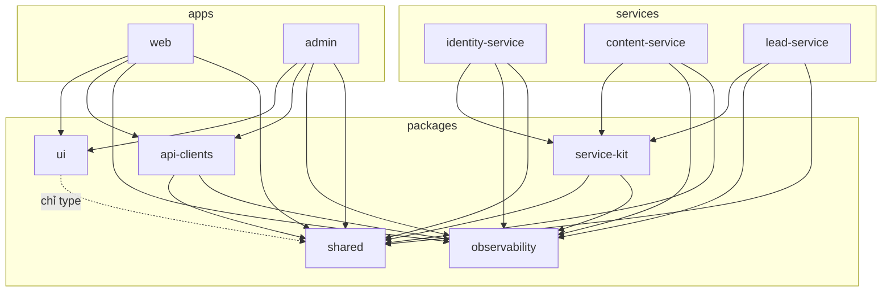
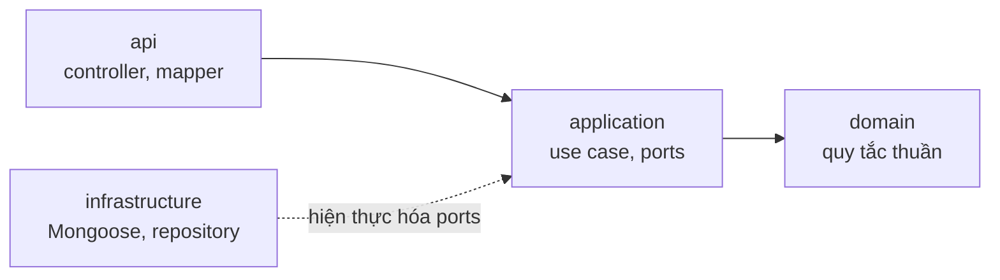

# LAVIECO: Cấu trúc mã nguồn & quy ước

| | |
|---|---|
| **Phiên bản** | v0.3 (bản nháp, chờ duyệt) |
| **Cập nhật** | 20/09/2026 |
| **Phụ trách** | Võ Chí Trọng (CTO) |
| **Đối tượng đọc** | Mọi người viết code trong repo |
| **Tài liệu liên quan** | `02-kien-truc.md` · `03-co-so-du-lieu.md` (đầu vào) · `README.md` |

> **Phạm vi:** cây thư mục monorepo, ranh giới giữa các gói, cấu trúc bên trong ứng dụng và service, quy ước đặt tên, kiểm thử, công cụ, và các "công thức" thao tác thường gặp (thêm tính năng, thêm endpoint, thêm service). Tài liệu **không** lặp lại kiến trúc (`02`) hay thiết kế dữ liệu (`03`).
>
> Một số quy ước **kế thừa từ bản web trước đây** của LAVIECO (kiến trúc theo tính năng, chữ giao diện nằm trong constants, không màu hex rời, chỉ dùng bộ icon Feather, không sửa `globals.css` khi làm tính năng). Chúng được đánh dấu **[kế thừa]** để đội xác nhận còn áp dụng cho dự án mới (câu hỏi mở PQ1).
>
> Tên gói, công cụ và cú pháp cấu hình là **đề xuất**; chưa ghim phiên bản (ghim ở bước khởi tạo repo, ADR-001).

## Mục lục

1. [Nguyên tắc](#1-nguyên-tắc)
2. [Tổng quan repo](#2-tổng-quan-repo)
3. [Công cụ monorepo](#3-công-cụ-monorepo)
4. [Các gói dùng chung](#4-các-gói-dùng-chung)
5. [Ứng dụng frontend](#5-ứng-dụng-frontend)
6. [Service backend](#6-service-backend)
7. [Quy ước đặt tên & phong cách code](#7-quy-ước-đặt-tên--phong-cách-code)
8. [Cấu hình & biến môi trường](#8-cấu-hình--biến-môi-trường)
9. [Kiểm thử](#9-kiểm-thử)
10. [Chất lượng & tự động hóa](#10-chất-lượng--tự-động-hóa)
11. [Hạ tầng cục bộ & Docker](#11-hạ-tầng-cục-bộ--docker)
12. [Tài liệu trong repo](#12-tài-liệu-trong-repo)
13. [Công thức thao tác thường gặp](#13-công-thức-thao-tác-thường-gặp)
14. [Bản đồ use case → nơi viết code](#14-bản-đồ-use-case--nơi-viết-code)
15. [Lộ trình dựng khung](#15-lộ-trình-dựng-khung)
16. [Giả định & câu hỏi mở](#16-giả-định--câu-hỏi-mở)
17. [Đồng bộ với tài liệu khác](#17-đồng-bộ-với-tài-liệu-khác)
18. [Lịch sử phiên bản](#18-lịch-sử-phiên-bản)

---

## 1. Nguyên tắc

| # | Nguyên tắc | Nghĩa là |
|---|---|---|
| C1 | **Cấu trúc theo tính năng/nghiệp vụ, không theo loại tệp** **[kế thừa]** | Gom mọi thứ của một tính năng vào một thư mục, không rải `components/`, `hooks/`, `utils/` toàn cục. |
| C2 | **Ranh giới được máy kiểm tra** | Quy tắc "ai được import ai" nằm trong cấu hình lint và kiểm tra ở CI, không dựa vào trí nhớ. |
| C3 | **Gói dùng chung chỉ chứa hợp đồng và công cụ** (P6 ở `02`) | Không có logic nghiệp vụ trong `packages/`. Nghiệp vụ nằm trong service. |
| C4 | **Chữ giao diện không viết cứng trong JSX** **[kế thừa]** | Chữ cố định của giao diện nằm trong file constants của tính năng, có cấu trúc theo ngôn ngữ. |
| C5 | **Màu, font, bo góc chỉ đến từ design token** **[kế thừa]** | Không hex/px màu rời trong component. Giá trị gốc nằm ở một tệp token duy nhất. |
| C6 | **Đường dẫn công khai (`app/`) mỏng** | Route chỉ ghép các tính năng lại; logic và giao diện phức tạp nằm trong `features/`. |
| C7 | **Mỗi service đọc như một ứng dụng nhỏ độc lập** | Cùng một bố cục, cùng một cách đặt tên. Đọc được một service là đọc được cả ba. |
| C8 | **Thêm thứ mới bằng công thức có sẵn** | Mục 13 có checklist cho các thao tác lặp lại, và có generator cho phần khung. |

## 2. Tổng quan repo

```
lavieco/
├── apps/
│   ├── web/                     # Next.js: site công khai, Cẩm nang, phân giải QR, BFF   (src/, public/)
│   └── admin/                   # Next.js: quản trị nội bộ, BFF                            (src/, public/)
├── services/
│   ├── identity-service/        # NestJS: tài khoản admin, vai trò, 2FA, audit
│   ├── content-service/         # NestJS: cẩm nang, tác phẩm, QR, media, cấu hình site
│   └── lead-service/            # NestJS: lead, yêu cầu quà, danh sách chờ
├── packages/
│   ├── shared/                  # @lavieco/shared         hợp đồng: Zod schema, permission, enum, sự kiện
│   ├── ui/                      # @lavieco/ui             design token + component nguyên thủy
│   ├── api-clients/             # @lavieco/api-clients    client HTTP có kiểu tới từng service
│   ├── service-kit/             # @lavieco/service-kit    phần chung của NestJS (guard, lỗi, health, outbox)
│   ├── observability/           # @lavieco/observability  logger, trace, che dữ liệu nhạy cảm
│   └── config/                  # @lavieco/config         preset ESLint, tsconfig, Prettier
├── e2e/                         # @lavieco/e2e            kiểm thử end-to-end xuyên hệ thống (mã trong e2e/src/)
├── infra/
│   ├── compose/                 # docker-compose cho dev / staging / production
│   ├── mongo/                   # script khởi tạo replica set, vai trò và tài khoản DB
│   └── scripts/                 # tiện ích vận hành (khởi tạo Super Admin, sao lưu thử...)
├── docs/                        # 01-04, adr/, design/, brand/, runbooks/, api/
├── .github/                     # workflows, CODEOWNERS, PR template, dependabot
├── .env.example                 # biến môi trường cho compose (commit)
├── .env.local                   # giá trị thật ở máy dev (gitignore, KHÔNG commit)
├── package.json  turbo.json  tsconfig.base.json
├── .nvmrc  .editorconfig  .gitignore  commitlint.config.js
├── CLAUDE.md                    # quy tắc cho Claude Code (tóm tắt từ docs/01–04)
└── README.md
```

| Thư mục | Chứa gì | Không chứa gì |
|---|---|---|
| `apps/` | Ứng dụng người dùng cuối (Next.js) | Logic nghiệp vụ, truy cập DB |
| `services/` | Nghiệp vụ, dữ liệu, API nội bộ | Giao diện; mã import từ `apps/` hay từ service khác |
| `packages/` | Hợp đồng và công cụ dùng chung | Logic nghiệp vụ; phụ thuộc vào `apps/`/`services/` |
| `e2e/` | Kịch bản kiểm thử toàn hệ thống | Mã sản phẩm |
| `infra/` | Cấu hình hạ tầng, script vận hành | Mã ứng dụng |
| `docs/` | Tài liệu, ADR, thiết kế, runbook | Tệp sinh tự động lớn (trừ OpenAPI, mục 12) |

### 2.1 Quy tắc bố cục project

| # | Quy tắc |
|---|---|
| L1 | **Mã nguồn của mỗi project (`apps/*`, `services/*`, `packages/*`, `e2e`) nằm gọn trong `src/`.** Không có `app/`, `lib/`, `components/`, `modules/`... ở gốc project. **Ngoại lệ: `packages/config`** chỉ chứa tệp cấu hình ở gốc gói (preset ESLint, tsconfig, Prettier), không có `src/`. |
| L2 | Ngoài `src/` chỉ có: tệp cấu hình (`package.json`, `tsconfig*.json`, `next.config.ts`, `nest-cli.json`, `playwright.config.ts`...), `public/` (chỉ app Next.js), `Dockerfile`, `.env.example`, `.env.local`, và **hai ngoại lệ có chủ đích: `migrations/`** của service và **tệp cấu hình ở gốc `packages/config`** (script chạy bằng công cụ migration, không thuộc runtime ứng dụng). |
| L3 | **Test cũng nằm trong `src/`**: đơn vị/component cạnh mã (`*.spec.ts`); tích hợp và hợp đồng ở `src/test/` của service (loại khỏi bản build bằng `tsconfig.build.json`); e2e ở `e2e/src/`. |
| L4 | **`docs/` ở gốc repo**: tài liệu `01`–`04`, `adr/`, `design/`, `brand/`, `runbooks/`, `api/`. Không đặt tài liệu trong `apps/`, `services/`, `packages/`. |
| L5 | **`public/` nằm ở gốc mỗi app Next.js** (`apps/web/public/`, `apps/admin/public/`), chứa **tài sản tĩnh cứng trong code** (logo, ảnh thành viên, hình trang trí). Chi tiết ở mục 5.1. |
| L6 | **Biến môi trường:** mỗi project có `.env.example` (commit) và `.env.local` (gitignore, giá trị thật ở máy dev). Chi tiết ở mục 8. |
| L7 | **Next.js 16 trở lên dùng `src/proxy.ts`**, không dùng `middleware.ts`. Chi tiết ở mục 5.1. |

## 3. Công cụ monorepo

| Chủ đề | Quyết định |
|---|---|
| **Quản lý gói** | **npm workspaces.** Phiên bản npm ghim qua trường `packageManager`; phiên bản Node ghim ở `.nvmrc` (bản LTS). |
| **Điều phối tác vụ** | **Turborepo**: chạy tác vụ theo đồ thị phụ thuộc, cache kết quả, chỉ chạy phần bị ảnh hưởng ở CI. |
| **Tên gói** | `@lavieco/<tên-thư-mục>`: `@lavieco/web`, `@lavieco/content-service`, `@lavieco/shared`. |
| **TypeScript** | Một `tsconfig.base.json` ở gốc (chế độ nghiêm ngặt: `strict`, `noUncheckedIndexedAccess`, `noImplicitOverride`, `verbatimModuleSyntax`); mỗi gói kế thừa và chỉ thêm khác biệt. |
| **Định dạng module cho gói dùng chung** | Gói trong `packages/` **phát hành cả ESM lẫn CJS** (ví dụ bằng `tsup`) kèm `exports` map. Lý do: Next.js dùng ESM, NestJS mặc định CJS; chỉ phát ESM sẽ gây lỗi khó chịu ở service. Chốt ở ADR-012. |
| **Import xuyên gói** | Chỉ qua tên gói (`@lavieco/shared`). **Cấm import sâu** vào `src/` của gói khác; chỉ dùng các điểm vào khai báo trong `exports`. |

`package.json` (trường `workspaces`, thay cho `pnpm-workspace.yaml`):

```yaml
packages:
  - "apps/*"
  - "services/*"
  - "packages/*"
  - "e2e"
```

`turbo.json` (cú pháp theo Turborepo 2.x, minh họa):

```json
{
  "$schema": "https://turbo.build/schema.json",
  "tasks": {
    "build":     { "dependsOn": ["^build"], "outputs": ["dist/**", ".next/**", "!.next/cache/**"] },
    "typecheck": { "dependsOn": ["^build"] },
    "lint":      { "dependsOn": ["^build"] },
    "test":      { "dependsOn": ["^build"] },
    "test:int":  { "dependsOn": ["^build"], "cache": false },
    "dev":       { "cache": false, "persistent": true }
  }
}
```

**Lệnh ở gốc repo (`package.json`):**

| Lệnh | Việc làm |
|---|---|
| `npm run env:init` | Tạo `.env.local` từ `.env.example` cho mọi project và cho compose (**không ghi đè** tệp đã có) |
| `npm run dev:infra` | Bật MongoDB (replica set), MinIO, Mailpit bằng Docker, đọc biến từ `.env.local` ở gốc (mục 11) |
| `npm run dev` | Chạy đồng thời `web`, `admin` và 3 service ở chế độ phát triển |
| `npm run build` · `npm run lint` · `npm run typecheck` | Chạy trên toàn workspace (Turborepo lo cache) |
| `npm run test` · `npm run test:int` | Test đơn vị · test tích hợp |
| `npm run e2e` | Kiểm thử end-to-end (mục 9) |
| `npm run db:migrate` · `npm run db:seed` | Chạy migration · nạp dữ liệu khởi tạo (mục 13.4) |
| `npm run gen` | Generator tạo khung (tính năng, service, module) qua `turbo gen` |
| `npm run gen:openapi` | Sinh OpenAPI từ mã của các service vào `docs/api/` |
| `npm run deps:check` | Kiểm tra quy tắc phụ thuộc giữa các gói (mục 10) |

## 4. Các gói dùng chung

### 4.1 Hướng phụ thuộc

Mũi tên nghĩa là "được phép import". **Mọi hướng khác đều bị cấm** và bị chặn ở CI.



Quy tắc đi kèm:
- `apps` **không** import `services`; `services` **không** import `apps`.
- **Service không import service khác.** Service gọi nhau qua HTTP (bằng `api-clients` hoặc client riêng), không qua mã.
- `shared` không phụ thuộc gói nội bộ nào khác (chỉ Zod).
- `config` là gói công cụ (preset), được dùng bởi mọi gói ở dạng devDependency nên không vẽ vào sơ đồ.

### 4.2 Nội dung từng gói

| Gói | Chứa | Không chứa |
|---|---|---|
| **`shared`** | Zod schema cho request/response và tài liệu công khai; `LocalizedText`, `ActorRef` (`03` §1.2); enum; **bảng vai trò → permission**; hợp đồng sự kiện; mã lỗi; loại khối nội dung (`03` §5.1); hàm thuần túy: chuẩn hóa email/SĐT, tạo `search.key`, kiểm tra định dạng mã QR | Gọi HTTP, truy cập DB, React, NestJS |
| **`ui`** | **Tệp design token** (`theme.css`); component nguyên thủy không gắn nghiệp vụ (Button, Field, Card khung vòm, Dialog, Toast...); bộ hook giao diện chung | Chữ nội dung, gọi API, kiến thức nghiệp vụ (lead, tác phẩm...) |
| **`api-clients`** | Client HTTP có kiểu cho từng service: ký/đính service token, timeout, thử lại (chỉ lời gọi idempotent), đọc Problem Details, phân tích phản hồi bằng schema của `shared` | Logic nghiệp vụ, cache giao diện |
| **`service-kit`** | Phần chung của NestJS: `ZodValidationPipe`, guard xác thực + `@RequirePermission()`, bộ lọc lỗi → Problem Details, module health, module cấu hình (đọc env bằng Zod, dừng khi sai), **`OutboxModule`** (tiến trình đọc outbox, nhận danh sách handler do service đăng ký), **`NotifyModule`** (cổng `EmailSender` + bộ chuyển đổi nhà cung cấp email), module `x-request-id` | Tên collection, quy tắc nghiệp vụ của bất kỳ service nào |
| **`observability`** | Logger có cấu trúc, **bộ che trường nhạy cảm** (email, SĐT, token...), khởi tạo OpenTelemetry | Đo lường riêng của từng nghiệp vụ |
| **`config`** | Preset ESLint, tsconfig, Prettier; luật kiểm tra ranh giới (mục 10) | |

> **Kiểm tra trước khi thêm vào `packages/`:** "Hai nơi trở lên thật sự cần nó chưa?" Nếu chưa, để trong nơi đang dùng. Gói chung càng to càng thành "bãi rác" và tạo liên kết ngầm giữa các service (nguyên tắc P3, P6 ở `02`).

### 4.3 Cấu trúc `packages/shared` (tham khảo)

```
packages/shared/src/
├── index.ts                  # điểm vào chính
├── common/                   # LocalizedText, ActorRef, phân trang, Problem Details
├── permissions/              # permission.ts, roles.ts (vai trò → permission), can.ts
├── content/                  # schema tài liệu publishable, các loại khối (blocks/*.ts)
├── identity/                 # schema user, session, audit
├── lead/                     # schema lead, gift-request, waitlist, enum nhóm đối tác
├── events/                   # hợp đồng sự kiện (từ GĐ2), loại việc trong outbox
└── utils/                    # normalizeEmail, normalizePhone, buildSearchKey, isValidQrCode
```

Mỗi thư mục con có `exports` riêng trong `package.json` (`@lavieco/shared/permissions`, `@lavieco/shared/content`...) để `web` không kéo theo mã không cần.

## 5. Ứng dụng frontend

Áp dụng cho cả `apps/web` và `apps/admin`. Khác biệt của từng ứng dụng ở 5.5 và 5.6.

### 5.1 Bố cục chung

```
apps/<web|admin>/
├── src/                         # TOÀN BỘ mã nguồn của ứng dụng (L1)
│   ├── app/                     # CHỈ định tuyến, mỏng (C6); gồm cả tệp quy ước metadata (icon, robots, sitemap)
│   ├── features/                # mỗi tính năng một thư mục (5.2)
│   ├── lib/                     # hạ tầng phía ứng dụng: env, khởi tạo api-clients, SEO, i18n, session
│   ├── shared/                  # thành phần, hằng số dùng chung trong ứng dụng (ví dụ constants/assets.ts)
│   └── proxy.ts                 # cổng request trước khi định tuyến (thay middleware.ts, Next.js 16+)
├── public/                      # tài sản tĩnh cứng trong code (L5)
│   └── images/
│       ├── brand/               # logo, ảnh chia sẻ mặc định
│       ├── team/                # ảnh thành viên
│       ├── illustrations/       # hình trang trí (sóng, hạt ngọc, họa tiết vỏ sò)
│       └── placeholders/        # ảnh dự phòng khi chưa có nội dung
├── next.config.ts
├── package.json  tsconfig.json
├── .env.example                 # commit
└── .env.local                   # gitignore, chỉ ở máy dev
```

**Quy tắc tệp `app/`:**
1. Chỉ có `page.tsx`, `layout.tsx`, `route.ts`, `loading.tsx`, `error.tsx`, `not-found.tsx` và các tệp đặc biệt của Next.js.
2. Mỗi `page.tsx` **chỉ ghép** component từ `features/*` (qua `index.ts`) và gọi hàm lấy dữ liệu của tính năng.
3. `default export` chỉ dùng ở nơi Next.js bắt buộc (`page`, `layout`, `route`...); còn lại dùng named export.
4. `globals.css` chỉ có `@import` tới token trong `@lavieco/ui` **[kế thừa]**. **Không sửa `globals.css` khi làm tính năng**; muốn thêm/đổi token thì làm ở `packages/ui` trong một PR riêng do người phụ trách thiết kế duyệt.

**`src/proxy.ts`** (Next.js 16+, thay cho `middleware.ts`; đặt **cùng cấp với `src/app/`**):

- Xuất hàm tên **`proxy`** và (nếu cần) `config.matcher`. Chạy trước khi định tuyến; ở Next.js 16 mặc định chạy trên runtime Node.js (theo hướng dẫn của Vercel; kiểm tra lại khi ghim phiên bản).
- Chỉ làm việc **điều hướng và gắn header nhẹ**:
    - `web`: (1) cổng "sắp ra mắt": khi cờ `comingSoon` bật và không có cookie Draft Mode thì rewrite tới `/sap-ra-mat`; (2) định tuyến ngôn ngữ nếu thư viện i18n yêu cầu; (3) header bảo mật (CSP...).
    - `admin`: (1) chuyển hướng tới `/login` khi chưa có cookie phiên (chỉ để trải nghiệm); (2) `X-Robots-Tag: noindex` và header bảo mật chặt.
- **Không** chứa logic nghiệp vụ, không truy vấn DB, không gọi service nặng; cờ "sắp ra mắt" đọc từ bản cache ngắn của cấu hình site.
- **Không phải hàng rào bảo mật.** Mọi Route Handler, Server Action và service vẫn tự kiểm tra xác thực/quyền (P5 ở `02`). Đã có tiền lệ lỗ hổng vượt qua middleware ở bản Next.js cũ (CVE-2025-29927), nên không được dựa vào proxy làm lớp bảo vệ duy nhất.
- `config.matcher` loại `_next/static`, `_next/image`, tệp tĩnh và `/api/revalidate`.
- **Không tạo `middleware.ts`** (tên cũ); có luật lint chặn.

**`public/`** (tài sản tĩnh cứng trong code):

- **Dành cho:** logo, ảnh chia sẻ mặc định, **ảnh thành viên**, hình trang trí, ảnh dự phòng. **Ảnh do đội nội dung tải lên** (tác phẩm, cẩm nang, infographic) **không** để ở đây, mà đi qua `media`/object storage (`03` §5.8).
- Mọi tệp trong `public/` được phục vụ **công khai** → không đặt dữ liệu riêng tư, bản nháp hay bí mật.
- **Tên tệp:** `kebab-case`, chữ thường, không dấu, không khoảng trắng (ví dụ `team/vo-chi-trong.jpg`). Đổi ảnh thì **đổi tên tệp** (hoặc thêm hậu tố phiên bản) để không dính cache.
- **Định dạng và dung lượng (đề xuất):** logo và hình trang trí dạng **SVG**; ảnh chụp dạng WebP/JPEG, cạnh dài tối đa ≈ 2000 px, khoảng ≤ 500 KB mỗi ảnh sau tối ưu. Tệp gốc/nguồn thiết kế để ở `docs/brand/` hoặc kho của đội thiết kế, **không** để trong `public/`.
- **Không viết đường dẫn ảnh rải rác trong JSX.** Ảnh dùng chung khai báo ở `src/shared/constants/assets.ts`; ảnh riêng của tính năng khai báo ở `constants/` của tính năng; văn bản thay thế (`alt`) nằm ở `text.ts`.
- Hiển thị bằng `next/image` (khai báo `width`/`height` hoặc `fill` + `sizes`); `priority` chỉ cho ảnh đầu trang ảnh hưởng LCP.
- **Favicon, ảnh chia sẻ, `robots`, `sitemap`** dùng **tệp quy ước metadata của Next.js đặt trong `src/app/`** (`icon.*`, `opengraph-image.*`, `robots.ts`, `sitemap.ts`), không đặt ở `public/`.
- **Ảnh thành viên là dữ liệu cá nhân:** cần sự đồng ý của từng người trước khi đưa vào repo; cân nhắc repo private hay public (AC6).

### 5.2 Cấu trúc một tính năng (`features/<tên>/`)

```
features/<tên>/
├── components/              # UI riêng của tính năng
├── constants/
│   ├── text.ts              # chữ giao diện, theo ngôn ngữ (C4)
│   └── config.ts            # hằng số hành vi (số mục mỗi trang, giới hạn...)
├── hooks/                   # hook của tính năng (nếu có)
├── server/                  # chạy phía server ('server-only'): lấy dữ liệu, ánh xạ sang view model
├── actions/                 # Server Actions / xử lý form của tính năng
├── schemas.ts               # Zod cho form của tính năng (nếu không cần chia sẻ)
├── types.ts
└── index.ts                 # API công khai của tính năng
```

**Luật ranh giới (kiểm tra bằng lint):**

| # | Luật |
|---|---|
| F1 | `app/**` và tính năng khác chỉ import từ `features/<tên>` qua **`index.ts`**, không import sâu vào `components/`, `server/`... |
| F2 | **Tính năng không import tính năng khác.** Nếu hai tính năng cần cùng một thứ: giao diện thuần → nâng lên `@lavieco/ui`; còn lại → `src/shared/`. |
| F3 | Chỉ `server/` và `actions/` được import `@lavieco/api-clients` và `lib/env`. Component client **không** gọi trực tiếp service. |
| F4 | Tệp trong `server/` bắt đầu bằng `import "server-only"` để trình biên dịch chặn khi lỡ import từ client component. |

### 5.3 Chữ giao diện và nội dung biên tập

Có hai loại chữ, đi hai đường khác nhau:

| Loại | Ví dụ | Nằm ở đâu |
|---|---|---|
| **Chữ cố định của giao diện** | Nhãn nút "Gửi lời nhắn", tên ô nhập, thông báo lỗi, nhãn menu, chữ trạng thái | `features/<tên>/constants/text.ts` **[kế thừa]** |
| **Nội dung biên tập** | Thông điệp trang chủ, chương cẩm nang, mô tả tác phẩm, story card | `content-service` (đội nội dung sửa được, `03` §5) |
| **Dữ liệu và ảnh tĩnh cứng trong code** | Logo, thông tin và ảnh sáu thành viên, hình trang trí | Dữ liệu ở `constants/` của tính năng (ví dụ `features/team/constants/members.ts`), ảnh ở `public/images/` (mục 5.1); đổi bằng Pull Request, không qua CMS |

Cấu trúc `text.ts` (sẵn sàng thêm tiếng Anh, A7 ở `01`):

```ts
// features/contact/constants/text.ts
export const TEXT = {
  vi: {
    submit: "Gửi lời nhắn",
    successNote: "Chúng tôi sẽ liên hệ lại sớm.",
    // ...
  },
  // en: {...}  // thêm sau; kiểu được suy ra từ `vi` để đảm bảo đủ khóa
} as const;
```

- Component đọc chữ **từ constants của chính tính năng** (self-contained), không truyền chữ xuống qua nhiều tầng props **[kế thừa]**. Ngôn ngữ hiện hành lấy từ tiện ích i18n của ứng dụng.
- **Bản dự phòng (fallback):** với các trang thiết yếu (trang chủ, 404, trang chờ), constants giữ **bản chữ dự phòng** để site vẫn dựng được khi `content-service` chưa sẵn sàng (nguyên tắc P8 ở `02`).
- Không đặt chữ cho người dùng trong `lib/`, hook hay schema Zod (thông điệp lỗi của Zod cũng lấy từ constants).

### 5.4 Giao diện, token, icon

| Chủ đề | Quy ước |
|---|---|
| **Tailwind** | Tailwind CSS **v4, cấu hình kiểu CSS-first (`@theme`)** **[kế thừa]**, không dùng `tailwind.config.js` và không dùng bản CDN của prototype. |
| **Token** | Toàn bộ token ở **một tệp**: `packages/ui/src/styles/theme.css` (bên dưới). **Hex chỉ được xuất hiện trong tệp này.** |
| **Cấm hex rời** | Không viết `#10B183`, `bg-[#...]`, `style={{ color: "#..." }}` trong component. Dùng lớp token (`bg-emerald-brand`, `text-deep-blue`). Có luật lint chặn (mục 10). |
| **Font** | Fraunces (tiêu đề) và Be Vietnam Pro (nội dung) nạp bằng cơ chế tự lưu trữ của Next.js (`next/font`), chỉ bộ ký tự cần cho tiếng Việt; gán vào biến `--font-fraunces`, `--font-be-vietnam-pro`. |
| **Icon** | Chỉ dùng bộ **Feather qua `react-icons`** (`react-icons/fi`) **[kế thừa]**. Không viết SVG inline cho icon. Cần icon Feather không có (ví dụ mã QR): xem PQ2. |
| **Hình minh họa/trang trí** | Sóng, hạt ngọc, sơ đồ vỏ sò... **không phải icon**; là tài sản đồ họa (tệp trong `public/images/illustrations/` hoặc component đồ họa chuyên biệt), có văn bản thay thế đúng nơi. |
| **Chuyển động** | Mọi hiệu ứng (con trỏ tùy biến, thẻ lật, chạy chữ, thanh tiến trình) phải tắt/giảm khi `prefers-reduced-motion`. |
| **Truy cập được** | Dùng `eslint-plugin-jsx-a11y`; `alt` bắt buộc cho ảnh; điều hướng bằng bàn phím; tương phản đạt chuẩn. |
| **Không HTML thô** | Cấm `dangerouslySetInnerHTML` (P9 ở `02`); nội dung dạng khối được kết xuất bằng component. |

`packages/ui/src/styles/theme.css` (bản khởi đầu từ bộ nhận diện đã chốt và prototype):

```css
@import "tailwindcss";

@theme {
  /* Màu: bộ nhận diện tạm thời đã chốt */
  --color-emerald-brand: #10B183;
  --color-mint-mist:     #EAF8F3;
  --color-deep-blue:     #20345F;
  --color-canary:        #E7DD6A;
  --color-soft-white:    #F8FAF6;
  --color-charcoal:      #1E2A32;

  /* Font (biến do next/font cấp) */
  --font-display: var(--font-fraunces), serif;
  --font-sans:    var(--font-be-vietnam-pro), sans-serif;

  /* Khung vòm (arch) và khoảng cách chữ, từ prototype */
  --radius-arch:    160px 160px 24px 24px;
  --radius-arch-sm: 100px 100px 16px 16px;
  --radius-arch-lg: 220px 220px 32px 32px;
  --tracking-museum: 0.14em;
}
```

> Chế độ tối của Cẩm nang cần thêm lớp token ngữ nghĩa (bề mặt, chữ, viền) để đổi được theo chế độ; bổ sung cùng người phụ trách thiết kế khi làm tính năng đọc.

### 5.5 Dữ liệu, cache, form

| Chủ đề | Quy ước |
|---|---|
| **Lấy dữ liệu** | Trong `features/<tên>/server/`: gọi `@lavieco/api-clients`, ánh xạ phản hồi sang **view model** (dạng dữ liệu component cần), không trả nguyên DTO của service vào component. |
| **Cache tag** | Đặt tên `content:<thực-thể>` và `content:<thực-thể>:<slug-hoặc-id>` (ví dụ `content:work:sage-elements`, `content:chapter:vo-so-den-tu-dau`). Webhook làm mới ở `web` gọi `revalidateTag` với đúng các tag này (`02` §7.3). |
| **Form** | Schema Zod dùng chung ở `@lavieco/shared` khi cùng hợp đồng với service; schema chỉ riêng giao diện để ở `schemas.ts` của tính năng. Kiểm tra ở client (trải nghiệm) **và** ở Route Handler (an toàn). |
| **Chống gửi trùng** | Form sinh `Idempotency-Key` (UUID) khi mở, gửi kèm mọi lần nộp (`02` §6.1). |
| **State phía client** | Ưu tiên state cục bộ và server state. Không thêm thư viện quản lý state toàn cục khi chưa có nhu cầu đo được. |
| **Lưu cục bộ (Cẩm nang)** | Ghi chú/đánh dấu/tiến độ ở IndexedDB, bọc sau một module `features/handbook/storage` với ID UUID, `updatedAt`, cờ xóa mềm (`03` §9.1). Không rải truy cập IndexedDB khắp nơi. |

### 5.6 Bản đồ `apps/web`

**Route (dự kiến theo bản thiết kế):**

| URL | Nội dung | Kết xuất | Tính năng |
|---|---|---|---|
| `/` | Trang chủ | ISR | `home` |
| `/cau-chuyen` | Câu chuyện, sáu người kể chuyện | ISR | `story` |
| `/chuong-trinh` | Bốn nấc thang giá trị, form đăng ký khóa học | ISR + form | `programs` |
| `/bo-suu-tap` | Bộ sưu tập, lọc theo nhóm | ISR | `collection` |
| `/bo-suu-tap/[slug]` | Chi tiết tác phẩm/combo | ISR | `collection` |
| `/tac-dong` | Từ Cần Thơ ra biển lớn | ISR | `impact` |
| `/cam-nang` | Mục lục Cẩm nang | ISR | `handbook` |
| `/cam-nang/[chapterSlug]` | Đọc chương (tùy chọn `?trang=<pageId>`) | ISR + client | `handbook` |
| `/hop-tac` | Form hợp tác, 5 nhóm đối tác | ISR + form | `contact` |
| `/sap-ra-mat` | Trang chờ + nhận tin | ISR + form | `coming-soon` |
| **`/c/[code]`** | **Phân giải QR, trả `302`** | Động | `qr-resolver` |
| `/api/leads` · `/api/waitlist` · `/api/handbook-stats` | BFF cho form và thống kê | Động | trong tính năng tương ứng |
| `/api/revalidate` | Webhook làm mới cache (HMAC) | Động | `lib` |

- **`/c/[code]` nằm ngoài nhánh ngôn ngữ.** URL in trên QR không kèm mã ngôn ngữ, để **không bao giờ đổi** khi cấu trúc i18n thay đổi (BR-02, ADR-007).
- Các đường dẫn tiếng Việt không dấu ở trên là đề xuất; tên URL chuẩn và chiến lược tiền tố ngôn ngữ chốt ở PQ3.
- `src/proxy.ts` của `web`: cổng "sắp ra mắt" và header bảo mật (mục 5.1); không chứa logic nghiệp vụ.

**Tính năng (`src/features/`):**

| Thư mục | Nội dung |
|---|---|
| `navigation` | Thanh điều hướng viên nang (Tide Dock), chân trang |
| `home` | Các phần của trang chủ (hero, từ vỏ đến tác phẩm, nấc thang giá trị, bằng chứng nhỏ, tác động) |
| `team` | Phần "Sáu người kể chuyện": **dữ liệu tĩnh** (`constants/members.ts`) + ảnh ở `public/images/team/`; được `app/` ghép vào trang chủ và trang Câu chuyện |
| `story`, `programs`, `impact` | Trang giới thiệu và trang chương trình |
| `collection` | Danh sách, bộ lọc, chi tiết tác phẩm, "trong hộp có gì", tác phẩm liên quan |
| `handbook` | Trình đọc: mục lục chương, kết xuất khối, lật trang, ghi chú, đánh dấu, cỡ chữ, chế độ tối, tiến độ; `storage` cục bộ |
| `contact` | Form hợp tác |
| `gift-request` | Form chọn quà / đặt số lượng lớn |
| `waitlist` | Form nhận tin |
| `coming-soon` | Trang chờ ra mắt |
| `not-found` | Trang 404 (bản dự phòng chữ trong constants) |
| `qr-resolver` | Logic phân giải mã và ghi nhận lượt quét (`route.ts` chỉ gọi vào đây) |

### 5.7 Bản đồ `apps/admin`

```
apps/admin/src/
├── app/
│   ├── (auth)/login/  (auth)/2fa/  (auth)/accept-invite/
│   └── (dashboard)/
│       ├── page.tsx                 # tổng quan
│       ├── leads/                   # danh sách, chi tiết
│       ├── handbook/                # chương, soạn, duyệt
│       ├── works/                   # tác phẩm, story card
│       ├── qr/                      # mã QR, thống kê
│       ├── programs/  pages/        # mô tả chương trình, trang tĩnh
│       ├── media/
│       ├── site/                    # cấu hình site, "sắp ra mắt", nội dung đồng ý
│       ├── users/                   # người dùng, vai trò, lời mời
│       └── audit/                   # nhật ký hoạt động
├── features/
│   auth · leads · handbook · works · qr · programs · pages · media · site-settings · users · audit · dashboard
│   editor/                          # trình soạn thảo dạng khối dùng chung (ADR-008)
├── lib/                             # session, kiểm tra quyền phía admin, khởi tạo api-clients
└── proxy.ts                         # chuyển hướng UX tới /login khi chưa có phiên; header bảo mật (KHÔNG phải hàng rào bảo mật)
```

`apps/admin/public/` chỉ chứa logo và tài sản tối thiểu của giao diện quản trị.

- **Ẩn/hiện theo quyền chỉ để trải nghiệm.** Hàng rào thật nằm ở service (P5 ở `02`). Dùng `can(user, "lead:write")` từ `@lavieco/shared/permissions` để ẩn nút; **không** dựa vào đó để bảo vệ.
- Các thao tác nhạy cảm (xuất lead, đổi vai trò, thu hồi QR) đi qua bước xác thực lại (step-up, `02` §9.2).

## 6. Service backend

### 6.1 Bố cục chung của một service

```
services/<tên>-service/
├── src/
│   ├── main.ts                       # khởi động, cấu hình chung từ service-kit
│   ├── app.module.ts
│   ├── config/                       # schema env (Zod), đăng ký module cấu hình
│   ├── modules/                      # mỗi module = một nhóm nghiệp vụ (bảng 4.1 ở 02)
│   │   └── <module>/
│   │       ├── <module>.module.ts
│   │       ├── api/                  # controller, ánh xạ request/response  (tầng giao tiếp)
│   │       ├── application/          # use case, điều phối, ranh giới giao dịch
│   │       │   └── ports/            # giao diện repository và dịch vụ ngoài mà use case cần
│   │       ├── domain/               # quy tắc nghiệp vụ thuần (không import framework)
│   │       ├── infrastructure/       # model Mongoose, repository, client bên ngoài
│   │       └── index.ts              # API công khai của module
│   ├── health/
│   └── test/                         # test tích hợp và hợp đồng (loại khỏi bản build, L3)
│       ├── integration/              # test tích hợp với MongoDB thật (mục 9)
│       ├── contract/                 # test hợp đồng với schema trong shared
│       └── support/                  # tiện ích test: khởi động Testcontainers, fixture
├── migrations/                       # NGOẠI LỆ ngoài src/ (L2): migration MongoDB của service này (03 §10.1)
├── Dockerfile
├── nest-cli.json  package.json  tsconfig.json  tsconfig.build.json
├── .env.example                      # commit
└── .env.local                        # gitignore, chỉ ở máy dev
```

### 6.2 Phân tầng trong một module



| Tầng | Được làm | Không được |
|---|---|---|
| **`api`** | Nhận request, xác thực đầu vào bằng Zod, kiểm tra permission (`@RequirePermission`), gọi use case, ánh xạ kết quả ra DTO | Chứa quy tắc nghiệp vụ, gọi Mongoose |
| **`application`** | Điều phối một tình huống (ví dụ "xuất bản chương"), mở giao dịch, gọi `ports`, ghi outbox | Import Mongoose/Nest, biết HTTP |
| **`domain`** | Trạng thái, quy tắc thuần: máy trạng thái publishable (`03` §3), quy tắc người duyệt khác người soạn, kiểm tra xuất bản (BR-01), máy trạng thái lead, phát hiện trùng | Import bất kỳ framework nào (kể cả Nest, Mongoose) |
| **`infrastructure`** | Schema/model Mongoose, hiện thực repository, gọi dịch vụ ngoài (object storage, email) | Chứa quy tắc nghiệp vụ; để lộ kiểu Mongoose ra ngoài tầng này |

**Ghi chú thực dụng (không quá tay):**
- `domain` là **hàm và kiểu thuần TypeScript**, dễ test không cần khởi động gì. Không cần dựng "aggregate root" hay "value object" nặng nề khi quy tắc chỉ vài dòng.
- Chỉ tạo **`ports`** khi giúp test hoặc thay thế thật sự (repository, object storage, gửi email). Đừng tạo giao diện cho mọi lớp.
- Module giao tiếp với nhau qua **`index.ts`** (dịch vụ được export), không import sâu vào tầng trong của module khác (luật S2 dưới đây).

### 6.3 Luật ranh giới trong service

| # | Luật |
|---|---|
| S1 | Chỉ tầng `infrastructure` được import `mongoose`. Không trả tài liệu Mongoose ra khỏi repository; luôn ánh xạ sang kiểu thuần (`03` §10.4). |
| S2 | Module khác chỉ import từ `modules/<tên>/index.ts`. |
| S3 | Repository có phương thức riêng, projection tường minh cho **truy vấn công khai** (chỉ lấy `published`); phản hồi công khai có test khẳng định không lộ `draft` (`03` §3). |
| S4 | Mọi endpoint khai báo permission bằng `@RequirePermission(...)`. Endpoint thiếu khai báo bị **từ chối mặc định** (guard chung ở `service-kit`). |
| S5 | Ghi dữ liệu kèm việc bất đồng bộ (audit, email, làm mới cache) → **ghi vào outbox trong cùng giao dịch** (`03` §7.2). Không gọi thẳng dịch vụ ngoài trong giao dịch. |
| S6 | Lỗi nghiệp vụ là kiểu lỗi có mã (định nghĩa ở `shared`), ném từ `domain`/`application`; bộ lọc chung ở `service-kit` chuyển thành Problem Details. Không ném `HttpException` từ tầng dưới `api`. |
| S7 | Không ghi log dữ liệu cá nhân; dùng logger của `@lavieco/observability` (đã che trường nhạy cảm). |

### 6.4 Endpoint và tài liệu API

- Đường dẫn `/internal/v1/<tài-nguyên>` (kebab-case, số nhiều), theo `02` §6.1.
- Controller chia theo **ai gọi**: `*-public.controller.ts` (cho `web`, quyền tối thiểu đọc nội dung đã xuất bản/tạo lead) và `*-admin.controller.ts` (cho `admin`, dùng token người dùng).
- OpenAPI **sinh từ mã** (`npm run gen:openapi`) ra `docs/api/<service>.openapi.json`; **không viết tay**. Cách sinh từ Zod (ví dụ `nestjs-zod`) chốt ở ADR-003.
- Thay đổi hợp đồng phá vỡ (xóa/đổi tên trường) cần `v2` song song (`02` §6.1); CI so sánh OpenAPI với `main` để phát hiện.

### 6.5 Bố cục ba service GĐ1

| Service | Module (`src/modules/`) |
|---|---|
| `identity-service` | `auth` · `users` · `invitations` · `sessions` · `signing-keys` · `audit` |
| `content-service` | `handbook` · `catalog` (tác phẩm, nhóm, story card) · `qr` · `programs-public` · `pages` · `site-settings` · `media` · `consent` · `outbox` |
| `lead-service` | `leads` · `gift-requests` · `waitlist` · `internal-notes` · `idempotency` · `outbox` |

> **Module mỏng** (`outbox`, `idempotency`, `consent`) chưa cần đủ 4 tầng; chỉ tạo `api/`, `domain/`... khi thật sự cần.

> `outbox` là module mỏng đăng ký các handler (ví dụ `audit.record`, `notify.email`, `web.revalidate`, `qr.snapshot`) vào `OutboxModule` của `service-kit`. Logic đọc/khóa/thử lại nằm ở `service-kit`, không lặp ở từng service (`03` §7.3).

## 7. Quy ước đặt tên & phong cách code

### 7.1 Đặt tên

| Đối tượng | Quy ước | Ví dụ |
|---|---|---|
| Thư mục, tệp | `kebab-case` | `handbook-reader.tsx`, `publish-chapter.use-case.ts` |
| Component React, class, kiểu | `PascalCase` (không tiền tố `I`) | `HandbookReader`, `LeadStatus` |
| Hàm, biến | `camelCase` | `buildSearchKey` |
| Hằng số thật sự bất biến | `UPPER_SNAKE_CASE` | `MAX_BLOCKS_PER_PAGE` |
| Enum | **Không dùng `enum` của TS.** Dùng `as const` + kiểu hợp nhất, hoặc `z.enum` | `LEAD_STATUS = ["new", ...] as const` |
| Package | `@lavieco/<tên>` | `@lavieco/shared` |
| Biến môi trường | `UPPER_SNAKE_CASE` | `MONGODB_URI`, `JWT_AUDIENCE` |
| Nhánh | `feat/<phạm-vi>-<mô-tả>`, `fix/...` | `feat/content-qr-resolve` |

**Hậu tố tệp (biểu thị vai trò):**

| Hậu tố | Vai trò |
|---|---|
| `*.module.ts` · `*.controller.ts` | NestJS |
| `*.use-case.ts` | Use case tầng `application` |
| `*.repository.ts` | Hiện thực repository (`infrastructure`) |
| `*.model.ts` | **Model Mongoose** |
| `*.schema.ts` | **Schema Zod** (hợp đồng, form) |
| `*.constants.ts` · `text.ts` | Hằng số · chữ giao diện |
| `*.spec.ts` | Test đơn vị (đặt cạnh mã) |
| `*.int-spec.ts` | Test tích hợp (`src/test/integration/`) |
| `*.e2e.ts` | Test end-to-end |

### 7.2 Phong cách code

| Chủ đề | Quy ước |
|---|---|
| **Ngôn ngữ** | Code, tên biến, comment kỹ thuật, commit: **tiếng Anh**. Chữ hiển thị cho người dùng: **tiếng Việt** (trong constants). Tài liệu: tiếng Việt. |
| **Export** | Named export; `default export` chỉ nơi framework bắt buộc. |
| **Import** | Ứng dụng dùng alias `@/` cho `src/`; giữa các gói dùng tên gói. Thứ tự: thư viện ngoài → `@lavieco/*` → alias `@/` → tương đối (Prettier/ESLint tự sắp). |
| **Kiểu** | Tránh `any`; dùng `unknown` rồi thu hẹp. Dữ liệu vào từ ngoài **phải** qua Zod. |
| **Lỗi** | Không nuốt lỗi im lặng; không dùng `console.*` (dùng logger). |
| **Comment** | Giải thích **vì sao**, không lặp lại **cái gì**. Quy tắc nghiệp vụ dẫn mã (ví dụ `// BR-05`, `// BR-02`) để truy vết ngược về `01`. |
| **Định dạng** | Prettier tự động; không tranh luận về kiểu trong PR. |

### 7.3 Commit & nhánh

- **Conventional Commits** với phạm vi là tên gói/ứng dụng: `feat(content-service): add QR resolve endpoint`, `fix(web): keep chapter progress on reload`, `docs: ...`, `chore(deps): ...`. Kiểu hợp lệ: `feat`, `fix`, `docs`, `refactor`, `test`, `perf`, `build`, `ci`, `chore`, `revert`.
- Nhánh `main` (phát hành) và `develop` (tích hợp) được bảo vệ; mọi thay đổi qua Pull Request, cần CI xanh và ít nhất một review (`02` §9.6).
- PR nhỏ, một mục đích; PR có ghi `BR-`/`UC-` liên quan khi đụng nghiệp vụ.

## 8. Cấu hình & biến môi trường

| Chủ đề | Quy ước |
|---|---|
| **Nạp và kiểm tra** | Mỗi service/ứng dụng có **schema Zod cho env**; nạp một lần lúc khởi động (`service-kit`/`lib/env.ts`) và **dừng ngay nếu thiếu hoặc sai**. Không đọc `process.env` rải rác. |
| **Tệp mẫu** | Mỗi thành phần có `.env.example` liệt kê **mọi biến, kèm mô tả ngắn, không có giá trị bí mật thật**. Thêm biến mới ⇒ cập nhật `.env.example` trong cùng PR. |
| **`.env.local`** | Mỗi project có `.env.local` (**gitignore**) chứa giá trị thật **chỉ cho máy dev**; tạo bằng `npm run env:init` (không ghi đè). Next.js tự nạp `.env.local`; service NestJS nạp qua module cấu hình của `service-kit` (chỉ khi chạy dev/test). **Staging/production không dùng tệp `.env*`**: biến do nền tảng chạy container cấp từ kho bí mật. |
| **Không commit bí mật** | `.gitignore` chặn `.env*` trừ `.env.example`; `.dockerignore` loại `.env*` khỏi ảnh Docker. Giá trị thật ở kho bí mật của CI/hosting (`02` §9.6). Có quét bí mật trong CI. |
| **Next.js** | Biến có tiền tố `NEXT_PUBLIC_` là **công khai** và được nhúng vào bundle lúc **build**, tuyệt đối không chứa bí mật (khi build Docker phải truyền lúc build). Tách `lib/env.ts` (server) và `lib/env.public.ts` (client). |
| **Nhóm biến** | Kết nối DB (`MONGODB_URI`, mỗi service một tài khoản riêng); xác thực (`JWT_ISSUER`, `JWT_AUDIENCE`, JWKS URL, khóa ký service token); object storage; email; webhook (`REVALIDATE_SECRET`); quan sát (DSN Sentry, OTLP endpoint). |
| **Cờ hành vi** | Cấu hình nghiệp vụ đổi được lúc chạy (ví dụ "sắp ra mắt") lấy từ `site_settings`, **không** làm biến môi trường. Biến môi trường chỉ cho thứ gắn với hạ tầng/bí mật. |

## 9. Kiểm thử

### 9.1 Các tầng kiểm thử

| Tầng | Công cụ đề xuất | Đặt ở đâu | Chạy khi |
|---|---|---|---|
| **Đơn vị** | Vitest (hoặc Jest với Nest) | Cạnh mã (`*.spec.ts`) | Mỗi commit/PR |
| **Component** | Vitest + Testing Library | Cạnh component | Mỗi PR |
| **Tích hợp (service + MongoDB thật)** | Vitest/Jest + Testcontainers (MongoDB replica set) | `services/*/src/test/integration/` | Mỗi PR |
| **Hợp đồng** | Test phân tích phản hồi bằng schema của `shared`; fixture chung | `services/*/src/test/contract/`, `packages/api-clients/src` | Mỗi PR |
| **End-to-end** | Playwright, chạy trên compose đầy đủ | `e2e/src/` | Trước phát hành + sau triển khai (smoke) |

### 9.2 Những thứ **bắt buộc** có test

| Chủ đề | Test bắt buộc |
|---|---|
| **Domain** | Máy trạng thái publishable (chuyển hợp lệ/không hợp lệ); quy tắc người duyệt khác người soạn; điều kiện xuất bản (BR-01); máy trạng thái lead; phát hiện trùng (BR-07) |
| **Phân quyền** | Bảng vai trò → permission khớp ma trận ở `01` §4.4 (test so khớp); mỗi endpoint từ chối khi thiếu permission (S4) |
| **Không rò rỉ bản nháp** | Mọi endpoint công khai: phản hồi không chứa `draft`, `review`, `editorIds` (`03` §3) |
| **QR** | Phân giải đủ 4 trạng thái (`ok`, `not_published`, `revoked`, `not_found`); chuyển hướng là `302`; `code` không sửa được; bộ đếm cộng dồn đúng |
| **Lead** | Idempotency (cùng khóa → cùng kết quả); giao dịch tạo lead + outbox; ẩn danh hóa (`03` §8.2) |
| **Bảo mật** | Xác thực 2FA; xoay vòng refresh token và phát hiện dùng lại; từ chối token sai `aud`; PII không xuất hiện trong log |
| **Hợp đồng** | Phản hồi các endpoint khớp schema của `shared` |

### 9.3 Kịch bản e2e/smoke tối thiểu

1. Mở trang chủ, chuyển tới Bộ sưu tập, mở chi tiết một tác phẩm.
2. **Quét QR mẫu** (`/c/{code}`) → `302` → đúng trang; mã bị thu hồi → trang thân thiện.
3. Gửi form hợp tác → lead xuất hiện trong admin với đúng nhóm, trạng thái `new`.
4. Admin soạn → gửi duyệt → người khác duyệt → trang công khai đổi nội dung.
5. Đăng nhập admin có 2FA; tài khoản không đủ quyền bị từ chối ở thao tác nhạy cảm.

### 9.4 Nguyên tắc chung

- Dữ liệu mẫu (fixture) **không dùng dữ liệu thật**; SĐT/email trong test là giả.
- Test tích hợp dùng MongoDB thật (replica set) vì giao dịch và index là một phần hành vi cần kiểm chứng. Thay thế `mongodb-memory-server` được chấp nhận nếu chạy Docker khó khăn (PQ4).
- Test phải chạy lặp lại được, độc lập thứ tự, không phụ thuộc mạng ngoài.

## 10. Chất lượng & tự động hóa

### 10.1 Công cụ kiểm tra

| Công cụ | Việc làm |
|---|---|
| **ESLint** (preset ở `@lavieco/config`) | Luật chung + luật riêng của dự án (bên dưới) |
| **Prettier** | Định dạng |
| **TypeScript `tsc --noEmit`** | Kiểm tra kiểu |
| **dependency-cruiser** (hoặc `eslint-plugin-boundaries`) | **Thực thi hướng phụ thuộc ở mục 4.1 và luật F1–F4, S1–S2**; `npm run deps:check` |
| **Quét phụ thuộc** | `npm audit` + Dependabot/Renovate |
| **Quét bí mật** | Ví dụ gitleaks, chạy ở CI và pre-commit (tùy chọn) |
| **Husky + lint-staged + commitlint** | Pre-commit: lint/format tệp thay đổi; commit-msg: kiểm tra Conventional Commits |

**Luật ESLint riêng của dự án:**

| Luật | Mục đích |
|---|---|
| Chặn chuỗi màu hex và `bg-[#...]`/`text-[#...]` trong `.ts/.tsx` (trừ `theme.css`) | C5 |
| Chặn import icon ngoài `react-icons/fi`; chặn thẻ `<svg>` inline trong component giao diện | Quy ước icon **[kế thừa]** |
| Chặn `dangerouslySetInnerHTML` | P9 |
| Chặn `console.*` | Dùng logger |
| Chặn import sâu (`@lavieco/*/src/...`) và import ngược hướng | C2 |
| Chặn chuỗi tiếng Việt trực tiếp trong JSX (heuristic: ký tự có dấu trong text node của `.tsx`) | C4 |
| Chặn `process.env` ngoài `lib/env` / `config` | Mục 8 |
| Chặn tệp `middleware.ts` (dùng `src/proxy.ts`) | L7 |
| Chặn mã nguồn ngoài `src/` (ngoại lệ `migrations/`, `public/`) | L1, L2 |
| Chặn chuỗi đường dẫn `/images/...` viết trực tiếp trong JSX (phải đi qua constants) | Mục 5.1 |

### 10.2 Pipeline CI (ánh xạ với `02` §12.4)

```
PR: install → lint → typecheck → deps:check → test → test:int → contract → audit → build (phần bị ảnh hưởng)
develop: + dựng ảnh Docker → triển khai staging → e2e smoke
main:    + phê duyệt → migration → triển khai production → smoke QR
```

Turborepo chạy `--filter="...[origin/main]"` để chỉ xử lý phần bị ảnh hưởng.

### 10.3 Quy trình review

- **CODEOWNERS** theo vai trò: `identity-service`, `packages/shared/permissions`, `infra/mongo` cần review của CISO; `packages/ui`, `docs/brand` cần review của người phụ trách thiết kế; `packages/shared` cần review của CTO.
- **PR template** có checklist: liên kết `UC-`/`BR-`, có test, cập nhật `.env.example` nếu thêm biến, cập nhật tài liệu nếu đổi hợp đồng, xác nhận không rò PII trong log.

## 11. Hạ tầng cục bộ & Docker

### 11.1 Môi trường cục bộ

`npm run dev:infra` bật qua Docker Compose (`infra/compose/docker-compose.dev.yml`):

| Dịch vụ | Vai trò | Cổng đề xuất |
|---|---|---|
| **MongoDB (replica set một nút)** | DB cho ba service; script khởi tạo tạo replica set, database, vai trò và tài khoản theo `03` §10.3 | 27017 |
| **MinIO** | Object storage tương thích S3 (ảnh, tệp QR, bản chụp ánh xạ QR) | 9000 / 9001 |
| **Mailpit** | Bắt email gửi ra (thay nhà cung cấp email thật) | 1025 / 8025 |

Ứng dụng và service chạy trên máy (`npm run dev`) để có hot reload nhanh; có profile `full` chạy tất cả trong container để mô phỏng staging.

| Thành phần | Cổng đề xuất |
|---|---|
| `web` | 3000 |
| `admin` | 3001 |
| `identity-service` | 4001 |
| `content-service` | 4002 |
| `lead-service` | 4003 |

### 11.2 Docker cho triển khai

- **Một ảnh cho mỗi thành phần**, dựng đa tầng: tầng dựng dùng `turbo prune <thành-phần> --docker` để chỉ kéo phần cần thiết, tối ưu cache lớp; tầng chạy nhỏ gọn, **người dùng không phải root**, chỉ có mã đã build và phụ thuộc cần cho chạy.
- Next.js dùng chế độ đầu ra `standalone`. `.dockerignore` loại `.env*`, `node_modules`, `.next` cục bộ; biến `NEXT_PUBLIC_*` truyền lúc build, biến bí mật truyền lúc chạy.
- Ảnh gắn thẻ theo commit; đẩy lên registry riêng tư; **không** nhúng bí mật vào ảnh (biến môi trường truyền lúc chạy).
- Mỗi ảnh có `HEALTHCHECK` gọi `/health/ready` (`02` §11).
- `infra/compose/` chứa bản cho staging/production (Cloudflare phía trước, mạng nội bộ riêng cho service, không map cổng service ra ngoài, theo P4 ở `02`).

## 12. Tài liệu trong repo

```
docs/
├── 01-nghiep-vu.md  02-kien-truc.md  03-co-so-du-lieu.md  04-cau-truc-ma-nguon.md
├── adr/                       # 0001-monorepo.md, 0002-microservices-tach-dan.md, ...
├── design/                    # prototype landing (HTML), ảnh chụp màn hình các trang
├── brand/                     # tài liệu định vị, nhận diện
├── runbooks/                  # xử lý cảnh báo, khôi phục, xoay vòng bí mật
└── api/                       # OpenAPI SINH TỰ ĐỘNG cho từng service
```

- **ADR:** mỗi tệp một quyết định, mẫu ngắn (Bối cảnh · Quyết định · Hệ quả · Trạng thái). Đánh số tăng dần; danh sách đề xuất ở `02` §16 (thêm ADR-012 về định dạng module, mục 3).
- **OpenAPI** được commit để thay đổi hợp đồng **hiện ra trong diff của PR**; CI kiểm tra tệp đã cập nhật (`npm run gen:openapi` không tạo thay đổi mới).
- **Ai sửa tài liệu:** đổi hành vi nghiệp vụ ⇒ sửa `01`; đổi ranh giới/luồng ⇒ sửa `02`; đổi cấu trúc dữ liệu ⇒ sửa `03` (cùng Zod schema); đổi cấu trúc code/quy ước ⇒ sửa `04`. Sửa tài liệu **trong cùng PR** với thay đổi mã.
- **`docs/` nằm ở gốc repo** (L4); không đặt tài liệu trong `apps/`, `services/`, `packages/`.
- **`CLAUDE.md`** (gốc repo): quy tắc ngắn gọn cho Claude Code, tóm tắt từ `01`–`04`. Khi đổi quy ước ở `04` hoặc luật nghiệp vụ ở `01`, **cập nhật `CLAUDE.md` trong cùng PR**.
- **Quy ước mã câu hỏi/giả định:** `A`/`Q` (01), `AR`/`AQ` (02), `AD`/`DQ` (03), `AC`/`PQ` (04).

## 13. Công thức thao tác thường gặp

### 13.1 Thêm một tính năng frontend

1. `npm run gen -- feature` (chọn ứng dụng, đặt tên) tạo khung `features/<tên>/` theo mục 5.2.
2. Viết chữ giao diện vào `constants/text.ts` (C4); **không** viết cứng trong JSX.
3. Viết component bằng token và `@lavieco/ui`; icon từ `react-icons/fi`. Ảnh tĩnh: đặt vào `public/images/<nhóm>/` (tên `kebab-case`), khai báo đường dẫn ở constants, `alt` ở `text.ts` (mục 5.1).
4. Lấy dữ liệu ở `server/` qua `@lavieco/api-clients` → view model; đặt cache tag theo mục 5.5.
5. Export API công khai ở `index.ts`; thêm route mỏng ở `app/` ghép tính năng.
6. Test component, kiểm tra `prefers-reduced-motion` và bàn phím; cập nhật bản đồ ở mục 5.6 nếu thêm route.

### 13.2 Thêm một endpoint vào service

1. **Hợp đồng trước:** thêm Zod schema request/response vào `packages/shared` (đúng thư mục theo miền).
2. Trong module tương ứng: thêm phương thức vào **use case** (`application`), quy tắc thuần vào **`domain`** nếu có.
3. Thêm/điều chỉnh repository (`infrastructure`) và cổng (`ports`) nếu cần; kiểm tra index có phục vụ truy vấn (`03` §10.2).
4. Thêm phương thức controller (`api`) với **`@RequirePermission(...)`** và xác thực đầu vào bằng schema.
5. Nếu thao tác cần audit/thông báo: ghi vào outbox **trong cùng giao dịch** (S5).
6. Test đơn vị (domain/use case), test tích hợp (DB thật), test hợp đồng.
7. `npm run gen:openapi`; thêm phương thức tương ứng vào `@lavieco/api-clients`.
8. Cập nhật `02` (nếu đổi luồng) và `03` (nếu đổi dữ liệu) trong cùng PR.

### 13.3 Thêm một service mới

Làm khi thỏa điều kiện ở `02` §14.1. Checklist:

- [ ] Có ADR ghi lý do tách (điều kiện nào ở `02` §14.1 được thỏa).
- [ ] `npm run gen -- service <tên>` tạo khung theo mục 6.1 (mã trong `src/`, module health, cấu hình env + `.env.example`, guard, logger, `src/test/`, Dockerfile).
- [ ] Khai báo database `lavieco_<tên>`, **tài khoản và vai trò DB riêng** (`infra/mongo`, `03` §10.3), thư mục `migrations/`.
- [ ] Thêm client vào `@lavieco/api-clients`; thêm service token và `aud` tương ứng.
- [ ] Thêm vào compose (dev + staging + production), cổng, mạng nội bộ; **không** mở ra Internet.
- [ ] Thêm vào ma trận CI (build, test, ảnh Docker) và CODEOWNERS.
- [ ] Thêm permission mới (13.5) và cập nhật `01` §4.4 nếu đụng vai trò.
- [ ] Cập nhật `02` (§4 phân rã, §14 lộ trình), `03` (collection mới), `04` (mục 6.5, 14).
- [ ] Runbook + cảnh báo giám sát cho service mới.

### 13.4 Thêm/đổi collection và migration

1. Cập nhật Zod schema (`shared`) và model Mongoose (`infrastructure/*.model.ts`).
2. Đổi phá vỡ: theo **mở rộng – co lại** (`03` §10.1): phát hành nhiều bước.
3. Tạo migration: `services/<tên>/migrations/YYYYMMDDHHmm-mo-ta.js`, **idempotent**, có tạo index cần thiết và đặt tên `idx_<collection>_<trường>`.
4. Chạy thử trên DB cục bộ hai lần (kiểm tra idempotent); đo `explain` cho truy vấn liên quan.
5. Cập nhật `03` (bảng collection, index, vòng đời dữ liệu, nếu có PII thì cập nhật bảng lưu giữ 8.1).

### 13.5 Thêm một permission

1. Thêm khóa vào `packages/shared/permissions/permission.ts` (`<miền>:<hành_động>`).
2. Gán cho vai trò ở `roles.ts`; **test so khớp ma trận** phải được cập nhật có chủ đích.
3. Gắn `@RequirePermission` ở endpoint; ẩn/hiện ở giao diện qua `can()`.
4. Cập nhật `01` §4.4 và `02` §9.3. Thay đổi này cần review của CISO (CODEOWNERS).

### 13.6 Thêm một loại khối nội dung

1. Định nghĩa schema loại khối ở `packages/shared/content/blocks/<loại>.ts`; đăng ký vào union.
2. Trình soạn (admin, `features/editor`): thêm khối chỉnh sửa.
3. Trình đọc (web, `features/handbook`): thêm bộ kết xuất; đảm bảo văn bản thay thế, bàn phím, `prefers-reduced-motion`.
4. Thêm fixture và test (kết xuất + hợp đồng); cập nhật bảng loại khối ở `03` §5.1.
5. **Không** thêm khối chứa HTML thô.

## 14. Bản đồ use case → nơi viết code

| Use case | Frontend | Service/module |
|---|---|---|
| UC-01 Quét QR | `web`: `qr-resolver` (`/c/[code]`) | `content-service`: `qr` |
| UC-02 Đọc cẩm nang | `web`: `handbook` | `content-service`: `handbook` |
| UC-03 Bộ sưu tập | `web`: `collection` | `content-service`: `catalog` |
| UC-04 Yêu cầu quà tặng | `web`: `gift-request` | `lead-service`: `gift-requests`, `leads` |
| UC-05 Form hợp tác | `web`: `contact` | `lead-service`: `leads` |
| UC-06 Đăng ký khóa học | `web`: `programs` | `lead-service`: `leads`; `content-service`: `programs-public` |
| UC-07 Nhận tin | `web`: `waitlist`, `coming-soon` | `lead-service`: `waitlist` |
| UC-08 Trang giới thiệu | `web`: `story`, `impact`, `home` | `content-service`: `pages` |
| UC-21 Quản lý lead | `admin`: `leads` | `lead-service`: `leads`, `internal-notes` |
| UC-22 Soạn & xuất bản cẩm nang | `admin`: `handbook`, `editor` | `content-service`: `handbook` |
| UC-23 Tác phẩm, story card, QR | `admin`: `works`, `qr`, `media` | `content-service`: `catalog`, `qr`, `media` |
| UC-27 Người dùng & phân quyền | `admin`: `auth`, `users` | `identity-service`: `auth`, `users`, `invitations`, `sessions` |
| UC-28 Cấu hình site | `admin`: `site-settings` | `content-service`: `site-settings`, `consent` |

## 15. Lộ trình dựng khung

Thứ tự khuyến nghị để có thứ chạy được sớm và ít làm lại. **Mỗi bước kết thúc bằng CI xanh.**

| Bước | Việc | Kết quả kiểm chứng |
|---|---|---|
| 1 | Khởi tạo repo: npm + Turborepo, `tsconfig.base`, `packages/config` (ESLint, Prettier), husky/commitlint, `.gitignore`/`.dockerignore` (chặn `.env*` trừ `.env.example`), script `env:init`, CI khung | `npm run lint && npm run typecheck` chạy trên workspace rỗng |
| 2 | `packages/shared` (kiểu chung, permission, Problem Details) + `packages/observability` | Test so khớp ma trận quyền chạy |
| 3 | `packages/ui`: **token + font + component nguyên thủy** + trang minh họa token | Token hiển thị đúng, khớp bộ nhận diện |
| 4 | `service-kit` + **`identity-service`** tối thiểu (đăng nhập, 2FA, JWKS) + `infra/compose` (Mongo, MinIO, Mailpit) | Đăng nhập admin bằng 2FA ở local |
| 5 | **`content-service`**: `qr` (phân giải), `catalog` (đọc) + `web` khung, route `/c/[code]`, trang 404 và trang chờ | Quét QR mẫu → `302` → đúng trang; e2e smoke đầu tiên |
| 6 | `content-service` xuất bản (publishable), `handbook`, `media` + `admin` (đăng nhập, soạn, duyệt) | Soạn → duyệt → trang công khai đổi |
| 7 | **`lead-service`** + `web` form hợp tác/quà tặng/nhận tin + `admin` quản lý lead + outbox email (Mailpit) | Gửi form → lead vào admin → email thông báo |
| 8 | Hoàn thiện `web` theo landing đã chốt (các tính năng còn lại), SEO, hiệu năng, truy cập được | Đạt ngưỡng Core Web Vitals ở `01` §9 |
| 9 | Staging: Docker, CI/CD, giám sát QR, sao lưu + diễn tập khôi phục | Smoke QR sau triển khai chạy tự động |

**Định nghĩa "khung xong" (sau bước 5):** `npm run dev:infra && npm run dev` chạy đủ 5 thành phần; quét một QR mẫu ra đúng nội dung; CI xanh; đã có ít nhất một ADR được duyệt.

## 16. Giả định & câu hỏi mở

### 16.1 Giả định

| Mã | Giả định |
|---|---|
| **AC1** | Đội dùng npm và Docker trên máy phát triển (như README). |
| **AC2** | Dùng Tailwind v4 CSS-first cho cả `web` và `admin`. |
| **AC3** | Ngôn ngữ giao diện quản trị (`admin`) là tiếng Việt; chưa cần i18n cho `admin` ở GĐ1. |
| **AC4** | Cú pháp `turbo.json` và các cấu hình công cụ phụ thuộc phiên bản; ghim và điều chỉnh khi khởi tạo repo. |
| **AC5** | Dùng **Next.js 16 trở lên** (có `proxy.ts`). Nếu buộc phải dùng bản cũ, tên tệp là `middleware.ts` và hàm là `middleware`. |
| **AC6** | Thông tin và ảnh sáu thành viên là **dữ liệu tĩnh** trong `web`; từng người đã đồng ý công khai ảnh (cần xác nhận). |

### 16.2 Câu hỏi mở

| Mã | Câu hỏi | Ảnh hưởng |
|---|---|---|
| **PQ1** | Xác nhận các quy ước **[kế thừa]** từ bản web trước (feature-based nghiêm ngặt, chữ trong constants, không hex rời, chỉ Feather, không sửa `globals.css`) **còn áp dụng** cho dự án mới không? Bản này giả định là còn. | Mục 1, 5, 10 |
| **PQ2** | Design dùng biểu tượng mà bộ Feather **không có** (ví dụ mã QR, vỏ sò). Chấp nhận **ngoại lệ có quản lý** (một component `Icon` riêng trong `packages/ui`, có ADR) hay ép dùng Feather bằng biểu tượng gần nghĩa? | 5.4, 10.1 |
| **PQ3** | Chiến lược **URL và ngôn ngữ**: tiền tố `/vi`, hay không tiền tố cho ngôn ngữ mặc định và chỉ thêm `/en`? Tên URL tiếng Việt không dấu (mục 5.6) có chốt không? | 5.6, ADR-007 |
| **PQ4** | Test tích hợp: **Testcontainers** (cần Docker) hay **mongodb-memory-server** (nhẹ hơn, kém trung thực hơn)? | 9 |
| **PQ5** | Chọn công cụ soạn thảo dạng khối (ADR-008) trước khi bắt đầu bước 6 của lộ trình. | 5.7, 13.6 |
| **PQ6** | Dùng generator của Turborepo (`turbo gen`) hay công cụ khác cho `npm run gen`? | 3, 13 |

## 17. Đồng bộ với tài liệu khác

Từ v0.2, các điểm dưới đây đã được áp dụng:

| Tài liệu | Đã áp dụng |
|---|---|
| `README.md` | Cây thư mục rút gọn kèm liên kết `docs/04`; `apps/admin`, `services/identity-service`, `packages/api-clients`, `e2e/`; lộ trình GĐ1 khớp mục 15 |
| `02` | Mục 3.4 (gói dùng chung, gồm `api-clients`); `OutboxModule`/`NotifyModule` ở `service-kit`; ADR-012; module `consent`, `outbox` của `content-service` |
| `03` | Các điều chỉnh mà `03` đề xuất cho `02` |
| `CLAUDE.md` | Tóm tắt quy tắc của `01`–`04` cho Claude Code; **cập nhật cùng lúc** khi quy ước đổi |

## 18. Lịch sử phiên bản

| Phiên bản | Ngày | Nội dung | Thực hiện |
|---|---|---|---|
| v0.1 | 20/09/2026 | Bản nháp đầu: cây thư mục, ranh giới gói, cấu trúc frontend/service, quy ước, kiểm thử, công thức thao tác, lộ trình dựng khung | V.C. Trọng |
| v0.2 | 20/09/2026 | Đồng bộ với `01`–`03`: `NotifyModule`, module `idempotency` của `lead-service`, thêm `CLAUDE.md` vào cây thư mục và quy trình cập nhật tài liệu, quy ước mã câu hỏi | V.C. Trọng |
| v0.3 | 20/09/2026 | Bố cục project (L1–L7): mã nằm gọn trong `src/` (kể cả test), `public/` cho tài sản tĩnh, `docs/` ở gốc, `.env.local`, `src/proxy.ts` thay `middleware.ts` (Next.js 16+); đội ngũ thành dữ liệu tĩnh (`features/team`) | V.C. Trọng || v0.3 | 20/09/2026 | Đổi công cụ quản lý gói từ pnpm sang npm workspaces (bỏ `pnpm-workspace.yaml`, dùng trường `workspaces`; lệnh `pnpm x` → `npm run x`) | V.C. Trọng |
